# AgentForge Arena — Mathematical Evaluation Framework

**Status:** founding design document
**Scope:** the complete scoring, aggregation, confidence, difficulty, ranking, and validity math for evaluating code-modifying agents offline.

---

## 0. Overview and design principles

AgentForge Arena evaluates code-modifying agents (MockAgent, ScriptAgent, local CLI agents, Ollama-served LLM agents, optional external API agents later) on software-engineering tasks executed in controlled sandboxes. This document defines the mathematics of that evaluation. Five principles govern every choice:

1. **Deterministic core.** Every score is computed by an explainable formula from observable artifacts (test results, diffs, traces). No LLM-as-judge anywhere in the core path. A score can always be decomposed back into the signals that produced it.
2. **Honesty over precision.** A number shown without its uncertainty is a lie of omission. Every displayed estimate carries an interval, a sample size, or an "insufficient data" badge. The framework prefers admitting ignorance to fabricating confidence.
3. **Small-data first, more accurate with scale.** v0.1 methods (Wilson intervals, conservative lower-bound ranking, macro-averaged domains) are valid at n = 5 runs. As run counts and agent counts grow, the same data feeds progressively stronger machinery (Beta-Binomial shrinkage → hierarchical Bayesian Rasch) without changing what is collected.
4. **Offline and reproducible.** Everything runs without internet or paid APIs: pinned Docker images, local package mirrors, PyMC for Bayesian fits as offline batch jobs, content-addressed artifacts, environment hashes.
5. **The grader is also under test.** The framework includes machinery for validating itself: golden-solution suites, grader-determinism checks, synthetic-agent coverage simulations, and append-only raw data with versioned, recomputable derived scores.

### The score architecture in one page

A single run is scored as:

```
S = G · T_hidden · (0.85 + 0.15·Q)
```

- `G ∈ {0,1}` — product of hard **gates**: setup succeeded (agent-attributable), a diff exists, no protected paths touched, the regression suite still passes, no timeout. Any gate failure → S = 0.
- `T_hidden ∈ [0,1]` — weighted fraction of **hidden tests** passed, graded in a clean room (the captured diff is applied to a pristine snapshot in a separate grader sandbox; the agent never sees hidden tests).
- `Q ∈ [0,1]` — bounded **quality** modifier (lint, typecheck, static-analysis delta, security-scan delta, diff parsimony). Quality scales correctness between 85% and 100% of itself; it can never substitute for correctness.
- **Functional pass** `X = 1` iff all gates pass AND all hidden tests pass. Runtime, cost, and memory are never inside S — they are separate axes for multi-objective comparison.

Across `n` repeated runs (default 5, escalated to 10 in the high-variance region 0.2 < p̂ < 0.8):

- **Headline:** pass rate `p̂ = c/n` with its **Wilson 95% interval**; leaderboards rank by the **Wilson lower bound**.
- **Stability** = max(0, 1 − 2s), where s is the sample standard deviation of S (max possible std of a [0,1] variable is 0.5).
- Mean, median, min, max, pass@k (unbiased estimator) are diagnostics, never the headline.

Domain capability is a **skill vector**, not a single number: tasks carry weighted domain tags (1.0 / 0.5 / 0.25), per-domain pooled pass rates get Wilson intervals via Kish effective sample size, and the "overall" score is a macro-average across domains with ≥ 5 tasks — always labeled as a benchmark-relative convenience, never a universal ability.

Task difficulty starts manual (1–5 rubric), becomes empirical (shrunk pooled failure rates + discrimination flags) in v0.2, and is jointly estimated with agent ability in v1.0 via a hierarchical Bayesian Rasch model:

```
logit P(X_ait = 1) = θ_a + γ_{a,dom(t)} − b_t
```

fit offline with PyMC, producing credible intervals and a pairwise P(θ_a > θ_b) matrix. Elo/Glicko/TrueSkill are deliberately rejected (wrong fit for a static agent-by-task grid); Bradley-Terry applied to agent-vs-task outcomes *is* the Rasch model, so v1.0 subsumes it.

### Notation used throughout

| Symbol | Meaning |
|---|---|
| `a`, `t`, `i` | agent, task, run index |
| `n` | number of VALID runs of agent a on task t |
| `c` | number of functionally passing runs among them |
| `X_i ∈ {0,1}` | functional pass of run i |
| `S_i ∈ [0,1]` | continuous score of run i |
| `p̂ = c/n` | empirical pass rate |
| `G`, `T_hidden`, `Q` | gates product, hidden-test fraction, quality score |
| `s` | sample standard deviation (Bessel-corrected, n−1) |
| `z` | 1.96 (95% two-sided normal quantile) |
| `b_t`, `θ_a` | task difficulty, agent ability (IRT) |
| `k` | domain index (also: attempt count in pass@k — context disambiguates) |

### Run status taxonomy

| Status | Counted in n? | Score |
|---|---|---|
| VALID | yes | computed |
| TIMEOUT | yes | failure (0), tracked separately |
| AGENT_ERROR | yes | failure (0) |
| INFRA_FAILURE | **no** — voided, auto-retried ≤ 2×, alert after | none |

Infrastructure failures are the platform's fault, not the agent's; mixing them into agent scores is dishonest and is structurally prevented.

### Document map

| § | File | Covers |
|---|---|---|
| 1 | 01-run-scoring.md | Scoring one run: gates, T_hidden, Q, rejected signals, gameability |
| 2 | 02-repeated-runs.md | Aggregating n runs: pass rate, stability, pass@k, conservative score |
| 3 | 03-confidence.md | Wilson, Jeffreys/Beta-Binomial, bootstrap, LCB ranking, coverage validation |
| 4 | 04-domains.md | Domain × activity taxonomy, skill vectors, per-domain confidence |
| 5 | 05-difficulty.md | Difficulty estimation, discrimination, task-health flags, lifecycle |
| 6 | 06-ranking.md | Ranking algorithm comparison and the staged recommendation |
| 7 | 07-multi-objective.md | Pareto frontiers, ε-constraint queries, use-case presets |
| 8 | 08-benchmark-design.md | Task template, quality gates, anti-gaming defenses |
| 9 | 09-pipeline-reproducibility.md | End-to-end pipeline, sandboxing, manifests, drift detection |
| 10 | 10-data-model.md | PostgreSQL schema, append-only raw / recomputable derived layers |
| 11 | 11-roadmap-and-recommendation.md | v0.1 → v2.0 build plan and the final algorithm stack |


---

## 1. Raw run scoring

This section defines how one agent run i produces its continuous score S_i in [0,1], its binary functional pass X_i in {0,1}, and its run status. Everything is computable offline from three captured artifacts: the **execution trace** (commands, exit codes, timestamps), the **final diff** (unified diff against the task's pristine snapshot), and the **grader report** (clean-room test and analysis results). No signal requires an LLM judgment.

The run score is:

```
S = G * T_hidden * (0.85 + 0.15 * Q)

G        in {0,1}   product of five binary hard gates (Section 1.1)
T_hidden in [0,1]   weighted fraction of hidden tests passed (Section 1.2)
Q        in [0,1]   quality modifier (Section 1.3)
X = 1  iff  G = 1 AND T_hidden = 1 (every hidden test passed)
```

Correctness (G and T_hidden) carries between 85% and 100% of the score by construction; quality moves it only within that band. A run with perfect quality and zero passing hidden tests scores exactly 0.

### 1.1 Hard gates: definitions, detection, edge cases

G is the product of five binary gates. Each encodes a **validity precondition** — a condition under which the rest of the score is meaningful at all — not a quality dimension.

**setup_ok.** The task recipe's setup phase (dependency install, build, fixtures) must complete with exit code 0 before the agent starts, and the workspace must remain buildable when the grader applies the diff to the pristine snapshot. Only **agent-attributable** failures trip the gate; attribution is differential: the grader runs the identical setup on (a) the pristine snapshot and (b) the snapshot with the diff applied. If (a) fails, the fault is ours — the run voids as INFRA_FAILURE. If (a) succeeds and (b) fails (corrupted lockfile, deleted config, broken build script), setup_ok = 0. Transient errors (mirror hiccup, Docker daemon error, host OOM) match a maintained error-pattern table and classify as INFRA_FAILURE under the retry policy (Section 1.5).

**diff_exists.** The normalized diff (whitespace-normalized line counting; generated artifacts like `dist/`, `__pycache__/`, `node_modules/` excluded via the recipe's ignore list) must contain at least one changed line in a non-ignored path. An agent that modifies nothing has not attempted the task: diff_exists = 0, status AGENT_ERROR. Whitespace-only edits in real source files still count — the gate checks existence, not merit; merit is T_hidden's job.

**scope_ok.** The diff must touch zero **protected paths**: test directories, grading manifests, CI configuration, and `.agentforge/` harness files, enumerated as glob patterns in the task recipe. Detection is a path match over the diff's file list, including rename sources/targets and file-mode changes. This is defense in depth: grading already happens against pristine hidden tests in the clean room, so scope_ok invalidates the *attempt*, not protects the grader.

**regression_pass.** The repo tests recorded as passing at snapshot-creation time must still pass when the grader runs them in the clean room on the patched tree. Tests failing or skipped at baseline are excluded (recorded in the snapshot manifest), so an agent is never punished for pre-existing breakage. This gate makes "fixed the feature, broke three others" score 0 instead of 0.7.

**no_timeout.** The agent must terminate within the task's wall-clock budget (recipe field; default 30 minutes), enforced by SIGKILL. A killed run gets status TIMEOUT, X = 0, S = 0; the partial diff is captured for forensics, not graded. Grader-side timeouts are INFRA_FAILURE, not agent behavior.

**Why binary and multiplicative, not weighted.** A weighted sum lets excellence on one axis buy back a violated precondition: an agent that nukes the regression suite but aces hidden tests would still score well, and the leaderboard would reward vandalism. Multiplication of binaries is a logical AND — every S = 0 has a named, displayable cause ("regression_pass failed: 3 tests"), keeping failures explainable. Gate weights would also be pure invention at v0.1 data volumes; binaries need no calibration.

### 1.2 T_hidden, and why S and X both exist

```
T_hidden = sum_j (w_j * pass_j) / sum_j (w_j)

pass_j in {0,1}   outcome of hidden test j in the clean room
w_j > 0           per-test weight from the task's scoring recipe; default w_j = 1 for all j
```

Hidden tests run only in the **clean room**: the grader applies the captured diff to a pristine repo snapshot inside a separate sandbox the agent never executed in. The agent cannot read, modify, or poison them. Per-test weights let task authors mark a core acceptance test heavier than edge-case probes (e.g., core test w = 3, six edge tests w = 1 each: passing core plus 3 edges gives T_hidden = (3+3)/(3+6) = 0.6667). Default is equal weights.

Worked example: 10 equal-weight hidden tests, 7 pass: T_hidden = 7/10 = 0.7.

Both S and X are kept because they answer different questions. X feeds p-hat = c/n, the Wilson interval, and the headline leaderboard — shipping software needs *all* tests to pass, and the confidence machinery of later sections is built on binary outcomes. S preserves the gradient X discards: an agent at T_hidden = 0.9 across runs differs materially from one at 0.1, though both have p-hat = 0. S powers diagnostics, drill-downs, and stability = max(0, 1 - 2s); it is never the headline.

### 1.3 Quality modifier Q

```
Q = sum_j (v_j * q_j) / sum_j (v_j)      over AVAILABLE components j

Component        v_j     q_j formula
lint             0.20    q_lint = max(0, 1 - L_new/10)
typecheck        0.25    q_type = 1 if typecheck passes on patched tree, else 0
static analysis  0.20    q_static = min(1, max(0, 1 - max(0, W_post - W_base)/10))
security scan    0.20    q_sec = max(0, 1 - V_new/3)
diff parsimony   0.15    q_pars: see below
```

Symbols: L_new = max(0, lint error count on the patched tree minus lint error count at baseline), **plus** every suppression directive added in the diff (`eslint-disable`, `# noqa`, `# type: ignore`, `@SuppressWarnings`) — suppressions count as errors, closing the obvious dodge. A pure count delta, like q_static: matching individual findings across the two trees would require mapping baseline line numbers through the diff's hunk offsets, and the slight coarseness of counts is not worth that machinery. W_base, W_post = static-analysis warning counts (ruff/eslint rule sets pinned per task) at baseline and on the patched tree; only regressions are penalized, and improvements cap at q_static = 1 (no farming negative deltas). V_new = severity-weighted new security findings from offline scanners (bandit/semgrep with local rule packs): high = 3, medium = 1, low = 0.25 — one new high-severity finding zeroes q_sec.

Diff parsimony:

```
A   = lines added in the agent's normalized diff (non-ignored paths)
R   = lines added by the task's reference solution (stored in the recipe)
rho = A / max(R, 10)

q_pars = 1                    if rho <= 2
q_pars = (8 - rho) / 6        if 2 < rho < 8
q_pars = 0                    if rho >= 8
```

The flat region up to 2x the reference's added lines avoids penalizing legitimate alternative implementations; the penalty is deliberately one-sided and tolerant because R comes from a reference solution the agent never sees (Section 8.1) and therefore cannot calibrate against — a correct solution can add validation or defensive code without penalty inside the flat region, and only egregious 8x added-line growth zeroes the component. Removed lines are excluded because deleting obsolete code should not be treated as bloat. The floor max(R, 10) avoids hair-trigger ratios on tiny tasks. Crucially, **parsimony cannot reward tiny non-solutions**: q_pars caps at 1, and multiplicatively a one-line stub with perfect Q scores S = T_hidden * 1.0 — near 0 for a non-solution. Small diffs earn nothing; only non-bloated *correct* diffs avoid losing up to 15%.

**v0.1 compatibility note.** This 2x/8x, added-lines-only curve is the behavior implemented and covered by the canonical numeric anchors. Earlier prose describing a 4x/10x added+removed curve was documentation drift. The committed offline evaluation has Q=1.0 for every stored run, so correcting this text changes no score or leaderboard value.

**Availability renormalization (decision):** if a component cannot be computed — no typechecker for the language, baseline already failing lint/typecheck, no reference solution for q_pars — it is dropped and the remaining weights renormalize to sum 1. If *every* component is unavailable, the formula's denominator is 0; in that case Q := 1 (the multiplier collapses to 1 — no quality evidence must not penalize). The grader report records which components were active, so Q is never silently computed over different bases without a flag.

**v0.1 toolchain (decision):** the grader image ships a pinned Python-only toolchain — ruff (lint and static analysis), mypy (typecheck), bandit (security scan) — plus parsimony, which is language-agnostic. For every other ecosystem, those components are unavailable at v0.1 and drop via the renormalization rule above; they gain their toolchains (eslint, tsc, semgrep rule packs, etc.) in v0.2. No formula change is involved — only the supported matrix per release stage.

### 1.4 Signal disposition

Every candidate signal, with its verdict:

| Signal | Disposition |
|---|---|
| Hidden tests passed | **T_hidden** (the correctness core) |
| Regression tests passed | **Gate** regression_pass |
| Setup success | **Gate** setup_ok (agent-attributable only) |
| Final diff exists | **Gate** diff_exists |
| Unexpected files changed (protected) | **Gate** scope_ok |
| Timeout | **Gate** no_timeout — gate, not deduction |
| Lint / typecheck | **Q** (0.20 / 0.25) |
| Static analysis delta | **Q** (0.20) |
| Security checks delta | **Q** (0.20) |
| Lines added/removed | **Q** via parsimony (0.15) |
| Visible tests passed | **Rejected from score; logged** as self-check alignment (below, this section) |
| Runtime / cost / memory | **Rejected from S**; separate multi-objective axes (Pareto dashboard, v0.2) |
| Test coverage of agent's change | **Rejected as reward**; task-validation tool only |
| Mutation testing score | **Rejected as reward**; task-validation tool only |
| Command failures, redundant loops, wall-clock per command | **Trace diagnostics**, never scored (below, this section) |
| Expected files changed (non-protected) | **Diagnostic**: overlap with the recipe's expected-file list is logged, not scored — agents may legitimately touch different files |

**Why visible tests are excluded.** Visible tests are the agent's feedback loop. The moment they carry score weight, the optimal strategy shifts from "solve the task" to "satisfy the visible suite" — special-casing inputs, hardcoding outputs — Goodhart's law exactly. Hidden tests in the clean room are the only correctness oracle. We do log **self-check alignment**: a run whose final visible-test execution passed but X = 0 is flagged `selfcheck_misaligned = 1`. The per-agent misalignment rate (misaligned runs / runs where visible passed) is a deterministic overfitting indicator, and a task where *every* agent misaligns has visible tests that under-specify the hidden contract — a task-health signal.

**Why runtime and cost are excluded from S.** Folding speed into S buries an incommensurable trade-off behind an arbitrary exchange rate ("how many hidden tests is a minute worth?" has no defensible answer) and punishes deliberate agents that verify their work. Runtime, compute cost, and peak memory are recorded per run and surface as separate axes in the v0.2 Pareto dashboard, where dominance is meaningful and a weighted blend would not be. The one time judgment we make is the budget: exceeding it is a binary failure (no_timeout), because an agent that never finishes delivers nothing — but a fast wrong answer must never outscore a slow right one, which is what every continuous time deduction eventually produces.

**Why coverage and mutation score validate tasks, not reward runs.** Both metrics judge a *test suite*, so we point them at the thing that is one: at task-authoring time the hidden suite must reach a coverage threshold on the reference solution's touched lines, and an offline mutation run (mutmut/cosmic-ray) against the reference solution must kill a minimum fraction of mutants — otherwise the task ships with a weak oracle and gets a task-health flag. As per-run agent rewards they fail both criteria for a scored signal: **gameable** (assert-free tests inflate coverage; trivially-killable mutants inflate mutation score) and **noisy** (mutation runs are slow, with run-to-run sampling variance that would dwarf the signal).

**Trace diagnostics (deterministic, unscored).** From the trace we compute command failure rate (non-zero exits / total commands), redundant-loop count (maximal runs of >= 3 consecutive identical normalized command lines), and wall-clock distribution across command categories (build/test/edit/explore, via a fixed regex table). These appear on the run-detail page and feed the v2.0 trace-quality classifier as features. They are never in S: an agent that flails for 20 minutes and then nails every hidden test *solved the task*, and the score must say so.

### 1.5 Run status taxonomy

| Status | In n? | X | S | Trigger |
|---|---|---|---|---|
| VALID | yes | per grading | per formula | normal completion, graded |
| TIMEOUT | yes | 0 | 0 | wall-clock budget exceeded (SIGKILL) |
| AGENT_ERROR | yes | 0 | 0 | agent crash, no diff produced, harness-protocol violation by the agent |
| INFRA_FAILURE | **no** | — | — | sandbox/grader/host fault; pristine-snapshot setup fails; error-pattern match |

INFRA_FAILURE runs are **voided**: excluded from n, auto-retried up to 2 times with fresh sandboxes, operator alert if all three attempts fail. Voiding is an honesty requirement: an infra failure is an outcome of *our* system, independent of agent ability, and infra incidents cluster in time — whichever agents ran during the bad hour would absorb the failures. Folding them into p-hat adds noise correlated with the schedule and uncorrelated with skill, silently corrupting every cross-agent comparison. TIMEOUT and AGENT_ERROR, by contrast, *are* agent outcomes and count as failures in n.

### 1.6 Worked example, end to end

Run: all five gates pass (G = 1). Hidden suite: 10 tests, equal weights, 7 pass. Quality inputs: lint clean with no added suppressions (L_new = 0), typecheck **fails** on the patched tree, static analysis W_base = 12, W_post = 12, security scan V_new = 0, diff A = 200 added lines vs reference R = 40.

```
T_hidden = 7/10 = 0.7

q_lint   = max(0, 1 - 0/10)        = 1
q_type   = 0                        (typecheck failed)
q_static = min(1, max(0, 1 - 0/10)) = 1
q_sec    = max(0, 1 - 0/3)          = 1
rho      = 200 / max(40,10) = 5
q_pars   = (8 - 5)/6 = 3/6          = 0.5

Q = 0.20*1 + 0.25*0 + 0.20*1 + 0.20*1 + 0.15*0.5
  = 0.20 + 0 + 0.20 + 0.20 + 0.075 = 0.675

S = 1 * 0.7 * (0.85 + 0.15*0.675) = 0.7 * 0.95125 = 0.6659
X = 0   (3 hidden tests failed)
```

Status VALID; the run contributes X = 0 to c and S = 0.6659 to the diagnostic distribution.

### 1.7 Gameability analysis

| Scored component | Exploit | What bounds the damage |
|---|---|---|
| T_hidden | Hardcode outputs the tests expect | Agent never sees hidden tests; clean room re-derives results from pristine tests. Overfitting visible tests surfaces as selfcheck misalignment, not score. |
| T_hidden | Edit test files so suites pass locally | Clean room uses pristine tests; scope_ok additionally zeroes the run. |
| q_lint / q_type | Add suppression directives instead of fixing | Each added suppression counts in L_new; typecheck is binary on the real tree. Worst case bounded: all of Q moves at most 15% of S. |
| q_static / q_sec | Mass-fix unrelated warnings to bank credit | Deltas cap at 1; improvements earn nothing beyond the cap. |
| q_pars | Submit a minimal stub diff | Multiplicative structure: stub fails hidden tests, T_hidden ~ 0, so S ~ 0 regardless of q_pars = 1. |
| q_pars | Golf a correct solution into dense one-liners | Parsimony counts added lines, not characters; the flat region to 2x R leaves no incentive below it. |
| no_timeout | Bail early with garbage to dodge the gate | Early garbage scores ~0 anyway; the gate punishes only non-termination. |
| setup_ok | Self-report success | Gates are computed by the harness and grader from exit codes and differential reruns, never from agent claims. |

The structural defense is uniform: every exploitable surface is either (a) measured in an environment the agent cannot reach, or (b) confined to the multiplicative 15% quality band, which only pays out on top of correctness the agent must earn the hard way.

### Limitations

- **Parsimony depends on a reference solution the agent cannot see.** rho is anchored to R, so an unusually verbose or golfed reference skews q_pars for everyone, and because the reference is private (Section 8.1) the penalty onset is unpredictable from the agent's side — a correct-and-thorough solution beyond 2x R loses up to 2.25% of S for defensiveness the reference omitted. The wide flat region and the 8x zero-point bound this, and tasks without a reference drop the component, so Q's basis varies across tasks. Remaining mitigation is procedural (reference-diff review at authoring), not mathematical.
- **Setup attribution is a pattern table plus a differential rerun.** Novel infra failure modes that reproduce deterministically with the diff applied get misclassified as agent faults until the pattern table catches up; the alert-after-retries rule limits but does not eliminate this.
- **Q's weights (0.20/0.25/0.20/0.20/0.15) are uncalibrated judgment calls** at v0.1 data volumes. Miscalibration is bounded by the 15% band but real; any later re-weighting must recompute historical S from the append-only raw signals.
- **Per-test weights w_j make T_hidden task-local.** Acceptable because cross-task aggregation runs on X, not S — but averaging S across tasks mixes units.
- **V_new severity weights (3/1/0.25) inherit the scanners' noisy severity taxonomy;** one false-positive high finding zeroes q_sec, with no appeal path beyond task-recipe rule suppression.
- **The 30-minute default budget shapes behavior** (discourages long verification loops) even though runtime is otherwise outside S; per-task budget tuning is a task-design responsibility this section only parameterizes.


---

## 2. Repeated-run aggregation

A single run of a stochastic agent is an anecdote. This section fixes how AgentForge Arena turns n repeated runs of one (agent, task) pair into a small set of aggregates, what each aggregate is allowed to claim, and which aggregates are headline versus diagnostic. Per the architecture contract, n = 5 by default, escalating to n = 10 when 0.2 < p-hat < 0.8; INFRA_FAILURE runs are voided and excluded from n; TIMEOUT and AGENT_ERROR runs are valid failures inside n.

All formulas below operate on the multiset of valid runs {(S_1, X_1), ..., (S_n, X_n)} where S_i in [0,1] is the gated run score and X_i in {0,1} is functional pass.

### 2.1 Running example: one (agent, task) cell

Every aggregate in this section is computed from this single table so the numbers can be cross-checked end to end. Agent a ran task t; 6 sandbox attempts occurred, 1 was voided as INFRA_FAILURE (network blip pulling the base image) and auto-retried successfully, leaving n = 5 valid runs.

| Run i | Status      | G | T_hidden | Q    | S_i = G * T_hidden * (0.85 + 0.15Q) | X_i |
|-------|-------------|---|----------|------|--------------------------------------|-----|
| 1     | VALID       | 1 | 1.00     | 0.60 | 0.94                                 | 1   |
| 2     | VALID       | 1 | 0.40     | 0.00 | 0.34                                 | 0   |
| 3     | VALID       | 1 | 1.00     | 0.40 | 0.91                                 | 1   |
| 4     | TIMEOUT     | 0 | —        | —    | 0.00                                 | 0   |
| 5     | VALID       | 1 | 1.00     | 0.80 | 0.97                                 | 1   |

So the score multiset is {0.94, 0.34, 0.91, 0.00, 0.97}, c = 3 passes, n = 5.

### 2.2 Location and spread of S

**Mean.**

```
mean(S) = (1/n) * sum_{i=1..n} S_i
```

Worked: (0.94 + 0.34 + 0.91 + 0.00 + 0.97) / 5 = 3.16 / 5 = **0.632**.

**Sample variance and standard deviation (Bessel-corrected, n-1 denominator).**

```
s^2 = (1/(n-1)) * sum_{i=1..n} (S_i - mean(S))^2
s   = sqrt(s^2)
```

Worked: deviations from 0.632 are (0.308, -0.292, 0.278, -0.632, 0.338); squared sum = 0.094864 + 0.085264 + 0.077284 + 0.399424 + 0.114244 = 0.771080; s^2 = 0.771080 / 4 = **0.19277**; s = **0.4391**. Bessel correction is mandatory: at n = 5 the biased (1/n) estimator understates spread by a factor of sqrt(4/5) ≈ 0.894 — about 11% low — which is exactly the regime this platform lives in.

**Median.** Sorted scores: (0.00, 0.34, 0.91, 0.94, 0.97); median = **0.91** (middle element for odd n; average of the two middle elements for even n). Note the median (0.91) and mean (0.632) disagree badly here — that disagreement is itself a signal (see 2.8).

**Min — worst case.** min(S_i) = **0.00**. This is the "what is the worst thing this agent did on this task" number; it is what an operator deploying the agent once, unsupervised, should fear.

**Max — best case.** max(S_i) = **0.97**. This is explicitly labeled a **cherry-picking hazard**: it is the number a demo reel would show and the number the leaderboard must never use. It answers "what can this agent do with unlimited retries and an oracle selecting the winner," which no deployment has. It is stored, displayed last, and never ranked on.

### 2.3 Rate metrics

**Pass rate.**

```
p-hat = c / n
```

Worked: 3/5 = **0.6**. Its Wilson 95% interval (formula in Section 3) is **[0.2307, 0.8824]** — the contract anchor. The width of that interval at n = 5 is the entire argument for repeated runs and for LCB ranking.

**Timeout rate.**

```
timeout_rate = (# TIMEOUT runs) / n
```

Worked: 1/5 = **0.2**. Timeouts are inside n (they are valid failures) but tracked separately because a 20% timeout rate and a 20% wrong-answer rate demand different fixes (budget/looping vs capability).

**Infra-void rate.** Let v = number of attempts voided as INFRA_FAILURE.

```
infra_void_rate = v / (n + v)
```

Worked: 1/6 = **0.1667**. This is a *harness health* metric, not an agent metric: voided attempts never enter n. Decision: if infra_void_rate > 0.2 over any batch, the batch is flagged and the infrastructure — not the agent — is investigated; per the contract each infra failure is auto-retried up to 2 times and alerts after.

### 2.4 Retry success: unbiased pass@k

"Retry success" answers: if we deployed this agent on this task and allowed up to k independent attempts, taking the first pass, what is the probability of success? We use the unbiased estimator (Chen et al. 2021 style), never the naive 1 - (1 - p-hat)^k plug-in, which is biased downward for small n:

```
pass@k = 1 - C(n - c, k) / C(n, k)        (defined only for k <= n)
```

where C(.,.) is the binomial coefficient and C(m, k) = 0 when k > m. It is the exact probability that a uniformly random size-k subset of the n observed runs contains at least one pass.

Contract anchor, reproduced: n = 5, c = 2, k = 3:

```
pass@3 = 1 - C(3,3)/C(5,3) = 1 - 1/10 = 0.9
```

Running example (n = 5, c = 3):

```
pass@1 = 1 - C(2,1)/C(5,1) = 1 - 2/5  = 0.6   (equals p-hat, as it must)
pass@2 = 1 - C(2,2)/C(5,2) = 1 - 1/10 = 0.9
pass@3 = 1 - C(2,3)/C(5,3) = 1 - 0    = 1.0
```

Decision: we report pass@k for k in {1, 2, 3} at n = 5 (adding k = 5 at n = 10) and never for k > n.

**Independence caveat (mandatory in UI copy).** The estimator is unbiased only if runs are i.i.d., and runs are conditionally i.i.d. *only given a clean sandbox per run* — which the harness guarantees mechanically. What it cannot guarantee is independence of the agent's failure modes: the same weights, same prompt, and same systematic blind spot make failures correlated across retries. The pass@3 = 1.0 above is exact *within the observed sample* (every 3-subset of these 5 runs contains a pass) but as a forecast of three fresh retries it is optimistic. Treat pass@k as an in-sample summary, not an extrapolation; extrapolated retry claims beyond observed n are forbidden in the product.

### 2.5 Conservative score

Two tracks, both answering "what is this agent *at least* good for, with 95% confidence?"

**Binary track:** the Wilson 95% lower confidence bound (LCB) on p-hat — formula and worked anchor in Section 3. For the running example: LCB = **0.2307**.

**Continuous track:** a one-sided lower confidence bound on the mean of S using Student's t, because n is small and the population variance is unknown — z = 1.96 would be falsely tight at n = 5:

```
conservative_S = max(0, mean(S) - t_{0.95, n-1} * s / sqrt(n))

t_{0.95, 4} = 2.132   (n = 5)
t_{0.95, 9} = 1.833   (n = 10)
```

Worked (running example): 0.632 - 2.132 * 0.4391 / sqrt(5) = 0.632 - 2.132 * 0.19635 = 0.632 - 0.4186 = **0.2134**. The clamp at 0 matters: high-variance cells at n = 5 routinely go negative, and a negative lower bound on a [0,1] score is noise, not information. (S is bounded and non-normal, so the t interval is an approximation; v0.2 replaces it with the bootstrap percentile CI, B = 2000, per the staging contract — the t bound is the v0.1 stand-in and is labeled as such.)

### 2.6 Stability

```
stability = max(0, 1 - 2s)
```

Rationale: a [0,1]-bounded variable has maximum possible standard deviation 0.5 (achieved by a 50/50 mass at 0 and 1), so 2s maps spread onto [0,1] and the complement reads as "fraction of maximal consistency." Worked: s = 0.4391 gives stability = max(0, 1 - 0.8781) = **0.1219**; an agent with s = 0.05 would score 0.90.

Operational meaning: stability is the *predictability of a single deployment*. Stability 0.9 means one run tells you nearly everything; stability 0.12 (our example) means a single run of this agent on this task is close to a coin flip over outcome quality, and any single-run evaluation of it is meaningless. Stability deliberately ignores *where* the scores sit — an agent that reliably scores 0.0 has stability 1.0. It is a consistency axis, never a quality axis, which is why it ranks below pass rate and conservative score in 2.9.

### 2.7 Reliability vs stability vs pass rate

Three different words for three different failure surfaces; conflating them hides failure modes.

```
reliability = (# valid runs with status not in {TIMEOUT, AGENT_ERROR}) / n
```

- **Reliability** = operational completion: did the agent finish its attempt without timing out or crashing? Running example: run 4 timed out, so reliability = 4/5 = **0.8**.
- **Pass rate** = functional correctness of the attempt: p-hat = 0.6.
- **Stability** = consistency of the score across attempts: 0.1219.

The gap reliability - p-hat = 0.2 here is run 2: the agent completed cleanly and was simply wrong. An agent with reliability 1.0 and p-hat 0.4 needs capability work; an agent with reliability 0.4 and p-hat 0.4 needs harness-interaction or robustness work (every completed run passed). A single blended number would render these two opposite diagnoses identical. All three are therefore reported side by side on the cell detail view.

### 2.8 Determinism detection and distribution honesty

**Determinism.** Each run records h_i = SHA-256(command transcript || final unified diff). If all n hashes are identical, the agent is deterministic on this task: per the contract, 2 confirming runs suffice thereafter, and s = 0 is reported as **variance 0-by-construction** with an explicit `deterministic` flag. The flag exists so that a ScriptAgent's stability 1.0 is never read as the same achievement as a stochastic LLM agent earning stability 1.0 across genuinely independent samples — the first is a property of the artifact, the second is evidence about a distribution.

**Distribution honesty.** The full run-score multiset is always stored and rendered (n is small; there is no excuse to show only moments). The mean of a bimodal distribution is a fiction: for the multiset {0.97, 0.94, 0.96, 0.02, 0.00} (c = 3), mean(S) = 0.578 describes *no run that ever happened* — the agent either nails the task or produces nothing. Bimodality flag (cheap, deterministic):

```
bimodal := max(c, n - c) < n            (both outcome groups non-empty)
           AND min{S_i : X_i = 1} > 0.9
           AND max{S_i : X_i = 0} < 0.1
```

That multiset trips the flag (passes {0.97, 0.96, 0.94} all > 0.9; fails {0.02, 0.00} all < 0.1); when flagged, the UI suppresses the mean as a summary and leads with p-hat plus the two cluster centers. The running example of 2.1 does *not* trip it (fail score 0.34 is partial progress, not collapse), correctly distinguishing "all-or-nothing" from "sometimes gets halfway."

### 2.9 Which aggregates matter, ranked

1. **Pass rate p-hat with Wilson 95% CI** — the headline. Functional correctness with honest uncertainty; the only number that feeds leaderboard ranking (via the LCB, Section 3).
2. **Conservative score** (Wilson LCB / t-lower-bound) — the deployment-decision number: what you can count on, not what you hope for.
3. **Stability** — whether one observation generalizes; gates how much to trust any single-run anecdote about this agent.
4. **Median S** — robust typical quality, immune to the one zero or the one fluke; preferred over the mean whenever the bimodality flag is up.
5. **Min S (worst case)** — tail risk for unsupervised single-shot use.
6. **Max S (best case) — last, diagnostic only.** Shows headroom under oracle selection; a cherry-picking hazard that never appears in rankings or summaries.

The mean of S is computed and stored but ranks below the median in presentation priority because at n = 5 it is dominated by single outliers and lies under bimodality.

### 2.10 Aggregate summary of the running example

| Aggregate            | Value              |
|----------------------|--------------------|
| n (valid runs)       | 5                  |
| mean(S)              | 0.632              |
| s^2 / s              | 0.19277 / 0.4391   |
| median(S)            | 0.91               |
| min(S) (worst case)  | 0.00               |
| max(S) (best case, diagnostic) | 0.97     |
| p-hat (Wilson 95%)   | 0.6 [0.2307, 0.8824] |
| timeout rate         | 0.2                |
| infra-void rate      | 0.1667 (1 of 6 attempts) |
| pass@1 / pass@2 / pass@3 | 0.6 / 0.9 / 1.0 |
| conservative_S (t, one-sided 95%) | 0.2134 |
| stability            | 0.1219             |
| reliability          | 0.8                |
| deterministic flag   | false (5 distinct transcript hashes) |
| bimodality flag      | false              |

Implementation note: every aggregate above is a pure function of the stored run rows; all are computed in SQL or trivially in Python at read time and materialized per (agent, task) cell on run completion. No aggregate requires more state than (n, c, the S multiset, statuses, hashes).

### Limitations

- **n = 5 is thin.** Every interval here is wide by construction; the Wilson CI on p-hat = 0.6 spans 0.65 of probability mass. The escalation rule to n = 10 narrows but does not solve this; conclusions at the cell level are coarse until v0.2 shrinkage (Jeffreys) pools strength across the grid.
- **The t-based conservative_S assumes approximate normality of the sample mean.** S is bounded, often skewed, and sometimes bimodal at n = 5; the bound is a labeled approximation until the v0.2 bootstrap replaces it.
- **pass@k cannot see correlated failures.** It is exact in-sample, but agents fail for systematic reasons; real retry success at k > 1 will generally be below the reported value, and we have no offline way to estimate the correlation at n = 5.
- **The bimodality flag is deliberately crude.** Thresholds 0.9/0.1 catch the all-or-nothing pattern but miss trimodal or smeared distributions; it is a UI honesty trigger, not a statistical test (a dip test is unjustifiable at n = 5).
- **Determinism is per-task, not global.** Identical hashes on one task do not prove the agent deterministic elsewhere; the flag must be re-earned per (agent, task) cell, and transcript hashing is sensitive to benign nondeterminism (timestamps in tool output) that the harness must canonicalize away or the flag will under-fire.
- **Stability conflates sources of variance.** Sandbox-level noise (flaky tests already gated, but also resource jitter affecting Q) and genuine agent stochasticity both land in s; the metric cannot apportion blame between them.


---

## 3. Confidence and uncertainty

Every number AgentForge Arena displays is an estimate from a small sample, and the platform treats it that way: no point estimate is ever rendered without its interval, and the leaderboard ranks by the interval's lower bound, not the point estimate. This section fixes the interval machinery for v0.1 and v0.2, the display rules, and the self-test that guards the interval implementation — and is explicit about what that test does and does not certify.

### 3.1 Wilson score interval (v0.1 workhorse)

For an agent a on task t with n valid runs and c functional passes (p-hat = c/n), the 95% Wilson score interval is:

```
center = (p-hat + z^2/(2n)) / (1 + z^2/n)

halfwidth = z * sqrt( p-hat*(1 - p-hat)/n + z^2/(4n^2) ) / (1 + z^2/n)

interval = [center - halfwidth, center + halfwidth]
```

Symbols: p-hat = c/n is the observed pass rate; n is the number of VALID runs (INFRA_FAILURE runs are voided and excluded; TIMEOUT and AGENT_ERROR count in n with X = 0); z = 1.96 is the standard-normal 97.5% quantile for a 95% interval.

Why Wilson and not the textbook Wald interval `p-hat +/- z*sqrt(p-hat(1-p-hat)/n)`:

- **Wald collapses at the extremes.** At p-hat = 0 or 1, `p-hat(1-p-hat) = 0`, so Wald reports a zero-width interval — absolute certainty from, say, 3 runs. Wilson at c = n = 3 reports [0.4385, 1.0]: honestly wide.
- **Wald escapes [0,1].** For n = 5, c = 3: Wald gives 0.6 +/- 1.96*sqrt(0.048) = [0.1706, 1.0294] — an upper bound above 1 for a probability.
- **Wald undercovers badly at small n.** Its empirical coverage at n <= 10 routinely drops to 80–90% against the nominal 95%. Wilson stays near nominal across the whole (n, p) grid (verified in 3.7).
- Wilson is a closed-form inversion of the score test — explainable, dependency-free, and trivially implementable in SQL or Python. Clopper–Pearson ("exact") was considered and **rejected**: it is conservative by construction (often 98–99% actual coverage), so its extra width costs ranking resolution without buying honesty.

**Contract anchor, step by step (n = 5, c = 3, p-hat = 0.6, z = 1.96):**

```
z^2          = 3.8416
z^2/(2n)     = 3.8416/10  = 0.38416
z^2/n        = 3.8416/5   = 0.76832

center       = (0.6 + 0.38416) / (1 + 0.76832)
             = 0.98416 / 1.76832 = 0.55655

inside sqrt  = 0.6*0.4/5 + 3.8416/(4*25)
             = 0.048 + 0.038416 = 0.086416
sqrt         = 0.29397
halfwidth    = 1.96 * 0.29397 / 1.76832 = 0.32583

interval     = [0.55655 - 0.32583, 0.55655 + 0.32583]
             = [0.2307, 0.8824]
```

This matches the contract anchor exactly. Note the center 0.5566 is pulled toward 0.5 relative to p-hat = 0.6 — Wilson has mild shrinkage built in, a preview of the explicitly Bayesian treatment below.

### 3.2 Jeffreys posterior and shrunk point estimates (v0.2)

v0.2 adds the Bayesian companion. With the Jeffreys prior Beta(0.5, 0.5), the posterior after observing c passes in n runs is:

```
p | data  ~  Beta(c + 0.5, n - c + 0.5)

posterior mean (shrunk point estimate):  p-tilde = (c + 0.5) / (n + 1)

95% equal-tailed credible interval: [Beta.ppf(0.025, c+0.5, n-c+0.5),
                                     Beta.ppf(0.975, c+0.5, n-c+0.5)]
```

Symbols: Beta(alpha, beta) is the Beta distribution; Beta.ppf(q, alpha, beta) is its q-quantile (scipy.stats.beta.ppf, computed offline — no network needed).

**Anchor (n = 5, c = 3):** posterior is Beta(3.5, 2.5); posterior mean = 3.5/6 = **0.5833** (contract anchor); equal-tailed 95% credible interval = [0.2094, 0.9056] — numerically close to Wilson's [0.2307, 0.8824], which is reassuring rather than redundant: two derivations agreeing is a cross-check.

Why shrinkage toward 0.5 is the honest small-n behavior: a 5/5 record yields p-hat = 1.0, but reporting 1.0 claims the agent *never* fails, which 5 observations cannot support. Jeffreys reports p-tilde = 5.5/6 = 0.9167 with credible interval [0.6206, 0.9999] — "probably very good, possibly merely good." The prior contributes exactly one pseudo-observation (0.5 pass + 0.5 fail), so its influence decays as 1/(n+1): at n = 5 it moves the estimate visibly; at n = 100 it is negligible. This is precisely the "useful with small data, more accurate as data grows" requirement, in one formula.

**Decision:** in v0.2 the UI shows p-tilde as the point estimate with the Jeffreys credible interval, but **the leaderboard continues to rank by the Wilson LCB**. Rationale: rankings stay directly comparable across v0.1 and v0.2, and the two lower bounds agree to within ~0.06 at every (n, c) we display (the worst gaps are at perfect records, e.g. Wilson 0.5655 vs Jeffreys 0.6206 at 5/5), so little is gained by switching the sort key.

### 3.3 Bootstrap percentile CI for continuous scores (v0.2)

The continuous score S in [0,1] (Section 1: S = G * T_hidden * (0.85 + 0.15*Q)) is not Bernoulli, so binomial intervals do not apply. v0.2 uses the bootstrap percentile method on the mean of S:

```
Given valid run scores S_1..S_n:
  seed = first 8 bytes (big-endian, unsigned) of
         sha256(f"{agent_version_id}|{task_version_id}|{dataset_version}")
  rng  = numpy.random.default_rng(seed)     # PCG64 — the generator is part of the spec
  idx  = rng.integers(0, n, size=(B, n))    # B = 2000 resample rows, one draw call
  m_b  = mean(S[idx[b]]) for b in 1..B
  sort m_1..m_B
  CI = [m_(50), m_(1950)]      # 2.5th and 97.5th percentiles of the 2000 means
```

The generator (PCG64 via `numpy.random.default_rng`), the single `rng.integers(0, n, size=(B, n))` call, and the seed derivation are all pinned because "bootstrap with seed s" does not otherwise name a unique procedure: a different RNG algorithm or draw ordering produces a different CI from the same seed, and the worked numbers below are only reproducible against this exact recipe.

**Worked example.** n = 10 scores: {0.91, 0.88, 0.00, 0.85, 0.93, 0.00, 0.89, 0.90, 0.87, 0.86} (two gate failures zeroed by G). Mean = 0.709, s = 0.3744. Under the pinned procedure with seed 42 (illustrative; production seeds come from the hash derivation above) and B = 2000, the percentile CI is **[0.447, 0.891]**. The asymmetry (wider downward) is correct behavior: resamples that draw the 0.0 outcomes three or four times drag the mean far down, and the percentile method captures that skew where a symmetric mean +/- z*s/sqrt(n) interval would not.

**Honest caveat and decision:** bootstrap percentile CIs undercover at small n — with n = 5 the resampling distribution has only 126 distinct multisets and actual coverage can fall below 90%. Therefore: **bootstrap CIs on mean S are not displayed for n < 10 at all** (the UI shows mean and s as unadorned diagnostics); at n >= 10 the CI is displayed and permanently labeled "approximate (bootstrap)". One deliberate carve-out below n = 10: the one-sided Student-t lower bound conservative_S of Section 2.5 remains displayed at 5 <= n < 10 — it is a labeled v0.1 approximation serving the deployment-floor question, not a coverage-calibrated two-sided interval, and the bootstrap supersedes it once n >= 10. Wilson/Jeffreys pass-rate intervals remain the only coverage-calibrated intervals shown at n < 10.

### 3.4 Uncertainty penalties for free: ranking by the Wilson LCB

The architecture contract (decision 5) ranks leaderboards by the Wilson lower confidence bound. This is the platform's entire small-sample penalty mechanism — no ad-hoc deductions, no minimum-n fudge factors. The LCB *is* the penalty, and it self-removes as evidence accumulates.

**Worked comparison.** Agent A: 3 passes in 3 runs (p-hat = 1.0). Agent B: 18 passes in 20 runs (p-hat = 0.9).

Agent A (n = 3, c = 3):

```
z^2/n  = 3.8416/3 = 1.28053          z^2/(2n) = 0.64027
center = (1.0 + 0.64027)/(1 + 1.28053) = 1.64027/2.28053 = 0.71925
inside sqrt = 1.0*0.0/3 + 3.8416/36 = 0.10671 ; sqrt = 0.32667
halfwidth   = 1.96*0.32667/2.28053  = 0.28075
interval    = [0.4385, 1.0000]   ->  LCB_A = 0.4385
```

Agent B (n = 20, c = 18):

```
z^2/n  = 3.8416/20 = 0.19208         z^2/(2n) = 0.09604
center = (0.9 + 0.09604)/(1 + 0.19208) = 0.99604/1.19208 = 0.83555
inside sqrt = 0.9*0.1/20 + 3.8416/1600 = 0.0045 + 0.0024010 = 0.0069010 ; sqrt = 0.08307
halfwidth   = 1.96*0.08307/1.19208 = 0.13659
interval    = [0.6990, 0.9721]   ->  LCB_B = 0.6990
```

By p-hat, A (1.0) beats B (0.9). By LCB, B (0.6990) correctly ranks above A (0.4385): twenty runs of strong evidence beat three runs of perfect luck. When A accumulates runs and keeps passing (say 19/20), its LCB rises to ~0.76 and it overtakes B on merit. The penalty is automatic, monotone in evidence, and explainable in one sentence on the leaderboard tooltip: "ranked by the worst pass rate still consistent with the data at 95% confidence."

### 3.5 Sample-size-aware display rules

| Condition | Rule |
|---|---|
| n < 5 | "Provisional" badge; **excluded from ranked leaderboards**; cell shows p-hat with Wilson interval, greyed |
| 5 <= n < 10 | Ranked; rendered with wide-interval styling (hatched CI bar) to signal volatility |
| n >= 10 | Full display; bootstrap CI on mean S becomes available (3.3) |
| Hash-verified deterministic agent (contract decision 7) | n = 2; per-task outcome displayed as a degenerate point [X, X] with a "deterministic (hash-verified)" flag instead of a Wilson interval, because the Bernoulli sampling model does not hold for a constant; in pooled domain counts (4.3–4.4) the cell contributes its outcome exactly **once** (n_t = 1, c_t = X) — the second run is hash confirmation, not independent evidence, and counting both would double-count zero-variance runs (an agent passing 20 tasks would post a pooled Wilson LCB of 0.912 at 40/40 vs the honest 0.839 at 20/20), systematically flattering exactly the deterministic agent class. The existing `deterministic` flag routes into the pooling query |
| Always | The interval is rendered adjacent to every point estimate; the API never returns p-hat without (lcb, ucb, n) in the same object |

The exclusion at n < 5 plus LCB ranking is deliberately belt-and-suspenders: LCB already punishes tiny n, but a 1/1 record producing *any* leaderboard position invites screenshots without context.

### 3.6 What works at small n vs what needs more data

| Method | Trustworthy from | Notes |
|---|---|---|
| Wilson interval | n = 1 | Wide but valid; never leaves [0,1] |
| Jeffreys posterior / shrunk mean | n = 1 | Prior = 1 pseudo-observation; honest by construction |
| LCB ranking | n = 1 (display from n = 5) | Penalty is automatic |
| Bootstrap CI on mean S | n >= 10 | Undercovers below; hidden below 10 |
| Stability = max(0, 1 - 2s) | n >= 10 | s at n = 5 is itself extremely noisy (a sample std from 5 points has ~35% relative error); below 10 it is reported as diagnostic-only with a "low-n" flag |
| Rasch / IRT (v1.0) | ~8–10 distinct agent versions, each with broad task coverage | Below that the theta/b decomposition is weakly identified; v1.0 batch job refuses to publish if the agent count is lower |

### 3.7 Coverage self-test: an implementation regression gate

The interval implementation ships with a simulation test that doubles as a unit test of the evaluator:

1. Fix a grid of true pass rates p_true in {0.05, 0.1, 0.2, 0.4, 0.5, 0.6, 0.8, 0.9, 0.95} and sample sizes n in {5, 10, 20, 50}.
2. For each grid cell, simulate M = 10,000 synthetic agents: draw c ~ Binomial(n, p_true) with a fixed RNG seed.
3. Feed each (n, c) through the **production** interval function — the same code path the API uses, imported, not re-derived in the test.
4. Empirical coverage = fraction of the 10,000 intervals containing p_true.
5. Assert: per-cell coverage >= 0.90, and grid-mean coverage in [0.93, 0.97].
6. **Two-stage arm — the procedure production actually runs.** The fixed-n grid above does not match deployment: per decision 7, a cell starts at n = 5 and escalates to n = 10 exactly when 0.2 < p-hat < 0.8. That is data-dependent optional stopping — the cells that get more runs are selected by the interim estimate, and Wilson's coverage guarantees assume n fixed in advance — so fixed-n numbers do not certify the shipped procedure. The harness therefore also simulates the real rule: draw 5, draw 5 more when the interim p-hat lands in the band, and feed the **final** (n, c) through the production interval. Exact enumeration (which M = 10,000 reproduces to Monte-Carlo noise) shows the residual optional-stopping bias is mild and mostly favorable on this grid: coverage dips slightly inside the band (0.9874 vs the fixed-n 0.9898 at p_true = 0.4 and 0.6) and *rises* near the band edges, where escalation rescues unlucky n = 5 cells (0.9616 vs 0.9185 at p_true = 0.1); the two-stage grid minimum is 0.9375 at p_true = 0.5. Assert the same per-cell floor >= 0.90 on this arm. **The two-stage number, not the fixed-n number, is the platform's stated coverage.**
7. **Correlated arm — published, not asserted.** Arms 1–6 draw i.i.d. Bernoulli runs, which the Limitations below explicitly disclaim: real runs in a cell share a model snapshot, a prompt, and systematic blind spots. A third arm replaces the binomial with a beta-binomial (a shared latent per-cell pass probability; ICC rho = 0.2 as a plausible reference point) and recomputes coverage through the unchanged production intervals. Coverage degrades exactly as positive correlation predicts — grid-mean roughly 0.89 at n = 5, 0.84 at n = 10, 0.71 at n = 20, with grid minima lower still — and degrades further as rho grows. These numbers ship in the test report alongside the i.i.d. results so that "95%" is never read as a promise about correlated runs; the arm carries no assertion because the true ICC is unknown.

The asymmetric tolerance is intentional: Wilson coverage oscillates with n and p because the binomial is discrete (exact 95% is unattainable for any method), dipping to ~91% at unlucky (n, p) combinations (the fixed-n grid minimum is 91.4% at n = 10, p = 0.05) and overshooting elsewhere. A cell below 0.90 means a bug (wrong z, an off-by-one in c or n, INFRA_FAILURE leaking into n), not statistical bad luck at M = 10,000. To be precise about what passing certifies: arms 1–6 prove the interval *arithmetic* is implemented correctly under the sampling models they simulate — a regression gate on the code, not a coverage guarantee for production data — and arm 7 quantifies how far reality can sit from nominal. The same harness runs against the Jeffreys credible interval in v0.2 and is the regression gate for any future refactor of the scoring service: if someone "optimizes" the interval math and coverage drops, CI fails. Runtime is a few seconds; it runs on every commit, fully offline.

### 3.8 Preview: hierarchical shrinkage (v1.0)

Wilson and Jeffreys treat every (agent, task) cell independently — n = 5 runs is all the evidence a cell ever gets. v1.0 stops wasting the rest of the grid. In the hierarchical model (full specification in Section 6.4), every run is explained by a global agent ability, a partially pooled domain offset, and a task difficulty:

```
logit P(X_ait = 1) = theta_a + gamma_{a,dom(t)} - b_t

gamma_{a,k} ~ Normal(0, tau^2)
```

where theta_a is agent a's global latent ability, gamma_{a,k} is its offset in domain k — shrunk toward 0, i.e. toward the global theta_a, by the learned spread tau — and b_t absorbs task difficulty. A cell with 5 runs borrows strength three ways: theta_a is informed by the agent's entire grid, gamma_{a,dom(t)} by its 40 other runs in the same domain, and b_t by every agent's attempts at task t. Its posterior interval is therefore narrower than the standalone Wilson interval, and *honestly* so — the extra confidence is purchased with real, related evidence, and tau (fitted, not assumed) controls how much borrowing the data actually supports. As data accumulates, all three components (b_t, gamma_{a,k}, theta_a) tighten together. The deterministic v0.1/v0.2 intervals remain published alongside forever; the hierarchical intervals augment, never replace them.

### Limitations

- **Independence is assumed, not guaranteed.** Wilson, Jeffreys, and the bootstrap all treat the n runs as i.i.d. Bernoulli/score draws. Runs share a sandbox image, a model snapshot, and often a wall-clock window; correlated failure modes (a flaky base image, an Ollama model update mid-batch) make intervals anti-conservative. The INFRA_FAILURE voiding policy removes the worst offenders but cannot remove subtle correlation.
- **No exact 95% exists for discrete data.** Wilson's coverage oscillates between roughly 91% and 99% depending on (n, p). We chose oscillation around nominal over Clopper–Pearson's systematic conservatism; that is a defensible trade, not a free lunch.
- **LCB ranking taxes newcomers by design.** A genuinely strong new agent debuts mid-table until it accumulates ~10–20 runs per task. This is the intended behavior, but it must be communicated, or new-agent authors will read it as a bug.
- **The bootstrap struggles with our score distribution specifically.** Gate-zeroed runs make S bimodal (mass at 0 and near 0.9); percentile intervals on bimodal data at n = 10–20 remain rougher than the "approximate" label fully conveys. BCa was considered and deferred — its acceleration estimate is itself unstable at these n.
- **No multiple-comparison correction in v0.x.** A leaderboard shows many 95% intervals simultaneously; the chance that *some* interval misses its truth is much higher than 5%. Pairwise "A beats B" claims should wait for the v1.0 posterior P(theta_a > theta_b) matrix, which handles this coherently.
- **Stability at n = 5 is decoration.** We display it because the contract defines it, but a standard deviation from 5 points is too noisy to compare agents on; the n >= 10 flag mitigates, not eliminates, this.


---

## 4. Domain capability profiling

A single pass rate tells you *whether* an agent is good; a capability profile tells you *where*. This section defines the task taxonomy, the per-domain scoring math, the uncertainty treatment for pooled scores, and the display contract that keeps the profile honest when data is thin.

### 4.1 Two-axis taxonomy plus scale tag

Every task carries tags on two orthogonal axes plus one scale tag:

**Axis 1 — DOMAIN** (what subsystem/technology the change lives in). Fixed vocabulary, K = 8:

`backend, frontend, database, devops, security, performance, api-design, async-concurrency`

**Axis 2 — ACTIVITY** (what kind of change is being asked for). Fixed vocabulary, 6 values:

`debugging-bugfix, feature-implementation, refactoring, test-writing, migration, documentation`

**Scale tag** (expected magnitude of the change), one of `XS / S / M / L`, assigned at task authoring time from two estimates:

| Scale | Expected diff size | Expected context to navigate |
|-------|--------------------|------------------------------|
| XS    | <= 10 changed lines  | <= 2 files |
| S     | <= 50 changed lines  | <= 5 files |
| M     | <= 200 changed lines | <= 20 files |
| L     | > 200 changed lines, or repo-wide | > 20 files / cross-module |

Large-codebase navigation is deliberately **not** a domain. It is captured by scale `L` plus a numeric metadata field `context_size_kloc` (KLOC of code the task author judges the agent must read to solve the task). Domains describe *what the code is about*; codebase size describes *how much of it there is* — conflating them would make "large-codebase" steal mass from every real domain.

**Why two axes instead of one flat tag list.** "Debugging" is not parallel to "backend": a task is *debugging IN backend*. A one-axis taxonomy that mixes the two levels fails in one of two ways. (a) **Double-counting:** if a task is tagged both `backend` and `debugging` in a single flat scheme, the same runs feed two pseudo-domains, and any macro-average over the flat list counts that evidence twice — an agent strong at backend bugfixes inflates two of the averaged components with one skill. (b) **Under-coverage:** if the scheme forces one tag per task, the author must choose `backend` *or* `debugging`, and the profile silently loses the other dimension; you can never answer "is this agent bad at debugging in general, or bad at backend in general?" The cross-product design answers exactly that question via the drill-down cells in 4.8, while keeping each axis internally exclusive so nothing is counted twice.

### 4.2 Tagging rules

Hard constraints, enforced by a DB CHECK + application validation at task creation:

1. **Domain:** at most 3 domain tags with fixed weights — primary `w = 1.0`, secondary `w = 0.5`, tertiary `w = 0.25`. Every task has **exactly one primary** domain. Weights are fixed constants, not author-tunable: tunable weights invite gaming a domain's leaderboard by re-weighting tasks after the fact.
2. **Activity:** exactly 1 tag. If a task genuinely spans two activities ("migrate the schema and fix the bug it exposes"), it is two tasks; split it.
3. **Scale:** exactly 1 tag, plus the `context_size_kloc` metadata field (required for `M` and `L`, optional below).

Tag changes after a task has graded runs create a new task version; existing runs stay attached to the old version (tags are part of grading provenance, per the task-versioning rules elsewhere in this document).

### 4.3 Per-domain score: pooled weighted pass rate

For agent `a` and domain `k`:

```
p-hat_k = ( sum over tasks t of  w_tk * c_t ) / ( sum over tasks t of  w_tk * n_t )

w_tk : domain weight of task t for domain k (1.0 / 0.5 / 0.25, or 0 if untagged)
c_t  : number of functionally passing runs (X_i = 1) of agent a on task t
n_t  : number of VALID runs of agent a on task t (INFRA_FAILURE excluded)
```

This is a run-level pooled rate, not a mean of per-task rates: each run contributes mass `w_tk`, so a task where the agent ran n = 10 (escalated under the high-variance rule) correctly contributes more evidence than a task with n = 2.

**Worked example** — agent A, domain k = `backend`, three tagged tasks:

| Task | backend weight w_tk | n_t | c_t |
|------|--------------------:|----:|----:|
| t1 (primary backend)   | 1.00 | 5  | 3 |
| t2 (secondary backend) | 0.50 | 5  | 5 |
| t3 (tertiary backend)  | 0.25 | 10 | 2 |

```
numerator   = 1.0*3 + 0.5*5 + 0.25*2  = 3 + 2.5 + 0.5  = 6.0
denominator = 1.0*5 + 0.5*5 + 0.25*10 = 5 + 2.5 + 2.5  = 10.0
p-hat_backend = 6.0 / 10.0 = 0.60
```

### 4.4 Per-domain confidence: Kish effective sample size + Wilson

The 20 raw runs above are not 20 equal pieces of evidence — weighting reduces the effective information. We use the Kish effective sample size:

```
n_eff = ( sum_t w_tk * n_t )^2 / ( sum_t w_tk^2 * n_t )
```

and plug `n_eff` (in place of n) and the pooled `p-hat_k` into the standard Wilson 95% interval (z = 1.96):

```
center = ( p + z^2/(2*n_eff) ) / ( 1 + z^2/n_eff )
half   = z * sqrt( p*(1-p)/n_eff + z^2/(4*n_eff^2) ) / ( 1 + z^2/n_eff )
CI     = [ center - half , center + half ]
```

**Worked example** (continuing 4.3):

```
sum w*n    = 10.0                       (from 4.3)
sum w^2*n  = 1.0^2*5 + 0.5^2*5 + 0.25^2*10 = 5 + 1.25 + 0.625 = 6.875
n_eff      = 10.0^2 / 6.875 = 14.5455

z^2/n_eff       = 3.8416 / 14.5455 = 0.26411
center          = (0.60 + 0.13206) / 1.26411 = 0.5791
half            = 1.96 * sqrt(0.24/14.5455 + 0.26411/58.182) / 1.26411
                = 1.96 * sqrt(0.016500 + 0.004539) / 1.26411 = 0.2249
CI_backend      = [0.3542, 0.8040]
```

Sanity checks: with the naive raw count n = 20 the interval would be [0.3866, 0.7812] — overconfident; Kish correctly widens it. And task t1 alone (n = 5, c = 3) reproduces the contract anchor Wilson interval [0.2307, 0.8824], so the pooled three-task interval being much tighter than the single-task interval is exactly the value pooling buys.

**Exchangeability caveat (stated, not hidden).** Pooling runs into one binomial assumes tasks within the domain are exchangeable — same underlying pass probability. They are not: an XS backend bugfix and an L backend feature have very different difficulty, so the pooled interval is **optimistic** (real between-task variance is extra dispersion the binomial model does not see). Mitigation is staged per the architecture: v0.2 introduces empirical task difficulty `d_t = 1 - (c_pool+1)/(n_pool+2)` enabling difficulty-stratified reporting, and v1.0's hierarchical Rasch model replaces pooling entirely with per-task difficulty parameters `b_t` and per-domain ability offsets `gamma_{a,k}`, which is the principled fix. In v0.1 we ship the Kish-Wilson interval and label it "assumes within-domain exchangeability" in the API response metadata.

### 4.5 Per-domain stability

Per-task stability is fixed by the contract: `stab_t = max(0, 1 - 2*s_t)` where `s_t` is the Bessel-corrected sample std of the run scores `S_i` on task t. The domain-level figure is the **run-mass-weighted mean**, using the same `w_tk * n_t` mass as the pooled pass rate (so the pass rate and its stability companion describe the same evidence pool):

```
Stab_k = ( sum_t w_tk * n_t * stab_t ) / ( sum_t w_tk * n_t )
```

**Worked example** (same three tasks; per-task stds s_t = 0.10, 0.02, 0.25 give stab_t = 0.80, 0.96, 0.50):

```
Stab_backend = (1.0*5*0.80 + 0.5*5*0.96 + 0.25*10*0.50) / 10.0
             = (4.0 + 2.4 + 1.25) / 10.0 = 0.765
```

Deterministic agents (variance 0-by-construction per the run policy) report `stab_t = 1.0` with the `deterministic` flag propagated to the domain level: a domain stability of 1.0 renders with the flag, never silently.

**Low-n guard (inherited from 3.6, not renegotiated here).** A sample std from 5 points has ~35% relative error; 3.6 fixes the trust threshold for stability at **n >= 10**, below which `stab_t` is diagnostic-only with a low-n flag — "stability at n = 5 is decoration", and pooling decorations does not promote them to evidence. The guard travels with the value everywhere it goes:

- `Stab_k` carries a boolean **`stability_low_n`** flag, set whenever the majority of the run mass `sum_t w_tk * n_t` comes from tasks with `n_t < 10`. In the worked example only t3 meets the threshold (mass 2.5 of 10.0), so `Stab_backend = 0.765` ships **flagged**.
- The flag is stored alongside `stability` in `capability_profiles` (Section 10) and rendered alongside it in every view — a flagged stability never displays as a bare number.
- Downstream consumers must treat a flagged stability as **"insufficient data", not as a sortable value**: it does not participate in Pareto dominance via `g_stab` (Section 7.1) and cannot be the load-bearing term in any preset (e.g. "Most reliable agent") — otherwise a fluke-low `s_t` at n = 5 puts an agent on the frontier or wins the reliability preset on noise. Stability acquires an uncertainty band before it is allowed to move any ranking.

### 4.6 Overall score: macro-average with a comparability contract

```
Overall_a = (1/|K*|) * sum over k in K* of p-hat_k
K* = { domains k : number of tasks tagged with k (any weight) >= 5 }
```

**Why macro, not micro.** A micro (per-task or per-run) average is dominated by whatever domain happens to have the most tasks: if the v0.1 task bank has 40 backend tasks and 6 security tasks, a micro-average is ~87% a backend score wearing an "overall" costume, and adding 10 more backend tasks *changes every agent's overall score* without any agent changing. Macro-averaging gives each sufficiently-covered domain equal voice, so the overall score measures breadth across the capability space we defined, and is stable under re-balancing of the task bank within domains.

**Non-comparability rule.** Two agents' overall scores are comparable **only if computed over the same domain set K***. If agent A was evaluated on 7 domains and agent B on 4 (e.g., B's sandbox lacks a browser so frontend tasks were skipped), their macro-averages are averages of different quantities — comparing them is a category error, not a small bias. Enforcement: the API returns `domains_covered` alongside `overall`; the leaderboard UI greys out the overall column whenever the visible agents differ in K* and shows the banner "Overall scores computed over different domain sets — compare per-domain"; per-domain columns remain comparable and are the fallback.

**Worst-domain disclosure rule.** The non-comparability rule guards against K* mismatch across agents; it does nothing about a damning domain hidden *inside* the same K*. A macro-average buries a catastrophe: an agent at p-hat = 0.0 in `security` and 0.9 in six other domains shows `Overall = 0.77`, and a security-sensitive user sorting by Overall (the default sort, 7.7) picks a catastrophic agent. Two display obligations therefore attach to every rendering of `Overall_a`:

1. **The minimum per-domain LCB and its domain name render adjacent to Overall, always**: "Overall 0.77 — weakest: security 0.00". Whenever any covered domain's LCB falls below a configured floor (`overall_floor_lcb`, default 0.2), the agent's Overall sort value carries an inline warning badge — the default sort never presents an agent that is catastrophic in a covered domain without it.
2. **Domains excluded from K* (< 5 tasks) are listed next to Overall with their raw counts, never silently dropped.** Per the 4.8 honesty rule, a thin domain renders "insufficient data: m tasks / r runs"; if its observed runs are failing, it renders "insufficient data — observed failing (`sum c_t` / `sum n_t`)" rather than vanishing from the headline. Exclusion from the average must not become exclusion from the page.

### 4.7 Skill vector: representation, storage, display

The capability profile of agent a is the pair:

```
v_a = ( p-hat_1, ..., p-hat_K )      in [0,1]^K     (NULL where below threshold)
u_a = ( width_1, ..., width_K )                      width_k = UCB_k - LCB_k  (Wilson on n_eff)
```

**Storage.** Materialized in PostgreSQL, recomputed incrementally on run ingestion (cheap: per-domain running sums of `w*c`, `w*n`, `w^2*n` are sufficient statistics). The table is **`capability_profiles`, defined once in Section 10 (§10.2)** — this section deliberately ships no DDL of its own. Three properties of that single definition are load-bearing here:

1. **Keyed by `agent_version_id`, never by agent.** Per 9.6, any config change is a new agent version and a separate leaderboard entity; a per-agent key would pool runs across config changes, which the platform makes impossible by design rather than merely discouraged.
2. **`domain_id` is an FK to the `domains` table** (no inline text CHECK that drifts when the taxonomy is versioned), and rows are scoped to the pack per 8.5's comparability rule — the working key is `(agent_version_id, domain_id, pack_id, formula_version)`.
3. **Every row carries `formula_version`** per 10's derived-layer rule: derived rows are insert-only, a correction is a new version, never an UPDATE in place.

The Next.js frontend reads `capability_profiles` directly; `v_a`/`u_a` are assembled as a fixed-order (alphabetical domain order) JSON array at query time, never stored denormalized.

**Display.** Radar chart with K = 8 axes; for each shown domain the solid polygon vertex is `p_hat` and a shaded band spans `[lcb, ucb]` — the band is mandatory, a point estimate without its interval is banned in every domain view. **Minimum display thresholds:** a domain axis is hidden (rendered as a gap with the label "insufficient data: m tasks / r runs") unless **n_tasks >= 5 AND n_valid_runs >= 25** for that (agent, domain). Rationale: 5 tasks is the same coverage floor as the macro-average; 25 valid runs is 5 tasks at the default n = 5, below which the Wilson band spans most of [0,1] and the vertex position is visual noise that readers will over-interpret.

### 4.8 Drill-down: (domain x activity) cells

The profile page exposes the full 8 x 6 grid of cells — "debugging in backend", "migration in database" — each computed with exactly the machinery of 4.3–4.4 restricted to tasks with that (domain tag, activity tag) combination: pooled `p-hat`, Kish `n_eff`, Wilson band. Cell thresholds are lower than domain thresholds because cells are diagnostic, not ranked: a cell renders its estimate when it has **>= 3 tasks AND >= 15 valid runs**.

**Honesty rule (non-negotiable):** a cell below threshold renders the literal string `insufficient data` with its raw counts on hover — **never** 0, never blank-as-zero, never an extrapolation from neighboring cells or from the marginals. A rendered 0 is a strong claim ("tried and always failed"); an empty cell is a different fact ("not measured"); the UI must never convert the second into the first. The grid color scale therefore has a dedicated "no data" hatch pattern outside the value colormap.

### 4.9 Anti-claim: there is no universal score

We explicitly reject the single overall number as an *explanatory* device. `Overall_a` is a benchmark-relative macro skill average over the covered domains of **this task bank** — it exists in the UI for exactly one reason: a leaderboard needs a default sort key. It carries a permanent tooltip: *"Macro-average of per-domain pass rates on this benchmark's domains. Not a general intelligence or general coding-ability score. Click any domain for the real picture."* Every report, API response, and export labels it `macro_avg_domain_pass_rate`, never `score` or `ability`. The objects this framework treats as real are the skill vector `v_a` with its uncertainty `u_a`, the (domain x activity) grid, and — from v1.0 — the Rasch ability `theta_a` with per-domain offsets `gamma_{a,k}`, which is the statistically grounded successor to the macro-average, not to the profile.

### Limitations

- **Pooled intervals are optimistic under heterogeneity.** Kish n_eff corrects for unequal *weights*, not for between-task difficulty variance; a domain mixing trivial and brutal tasks will show a Wilson band narrower than honest. This is structural in v0.1 and only truly fixed by the v1.0 hierarchical model; until then the exchangeability label is a warning, not a remedy.
- **Fixed tag weights (1.0/0.5/0.25) are a convention, not an estimate.** Whether a "secondary" domain deserves half the evidential weight of a primary is asserted, not measured. v0.2's discrimination statistics can flag tasks whose secondary-domain outcomes correlate poorly with that domain's other tasks, but v0.1 has no defense beyond tagging discipline.
- **Taxonomy drift.** Eight domains and six activities will not survive contact with a growing task bank (where does "ML pipeline" go?). Adding a domain renders historical skill vectors length-incomparable; the planned mitigation is versioned taxonomies with scores keyed to taxonomy version, but cross-version comparison is simply lost.
- **Author-assigned scale tags are subjective.** Expected diff size is estimated before any agent runs; a task tagged S that consistently requires M-sized diffs (observable from captured diffs) silently miscalibrates any scale-stratified view. A v0.2 task-health flag comparing expected vs. observed median diff size is specified, but v0.1 ships without it.
- **Single activity tag forces lossy splits.** Real tasks sometimes are inseparably "migrate + fix"; splitting them changes the task's character. We accept the distortion to keep the activity axis exclusive; the alternative (weighted activity tags) would double the cell-grid sparsity problem.
- **Thresholds (5/25 domain, 3/15 cell) are judgment calls**, chosen so the Wilson band is meaningfully narrower than [0,1], not derived from a power analysis. With 8 x 6 = 48 cells, most cells will read "insufficient data" for a long time — that is the honest state, but it makes the drill-down underwhelming until the task bank is large.


---

## 5. Task difficulty modeling and task health

Difficulty estimation and bad-task detection are the same machinery viewed from two sides: a difficulty estimate tells you where a task sits on the ability scale; a health flag tells you when a task is not measuring ability at all. This section fixes the estimators, the detection thresholds, the task lifecycle, and how difficulty feeds (and does not feed) scoring at each stage.

### 5.1 Six candidate methods, one verdict each

**1. Manual difficulty rubric (1–5).** Task authors score four facets, each 1–5: expected human time, files touched, ambiguity of the spec, domain depth. The task's rubric difficulty is the mean, rescaled to `d_rubric = (mean - 1)/4` in [0,1]. **Verdict: ADOPT in v0.1.** It is the only estimator available pre-data, so it is mandatory for cold start. It is biased (authors systematically misjudge what trips agents — agents fail on tooling friction, not conceptual depth), so from v0.2 onward it is demoted to metadata and a sanity check: if `|d_rubric - d_t| > 0.5`, raise a MISCALIBRATED flag for human review.

**2. Empirical difficulty from pooled pass rates with Laplace shrinkage.** Pool all valid runs across all agents on task t:

```
d_t = 1 - (c_pool + 1) / (n_pool + 2)
```

where `n_pool` = total valid runs on task t across the agent pool, `c_pool` = total functional passes among them. The +1/+2 (Laplace, i.e. Beta(1,1) prior) shrinks toward 0.5 and keeps d_t off the boundary at small n. Worked example: 3 agents x 5 runs each, so n_pool = 15; c_pool = 3 passes. Raw failure rate is 1 - 3/15 = 0.80; shrunk difficulty is `d_t = 1 - (3+1)/(15+2) = 1 - 4/17 = 0.7647`. **Verdict: ADOPT in v0.2 as the primary operational difficulty.** Honest, cheap, explainable — but pool-relative: d_t measures "hard for the agents we happen to have", not absolute difficulty (mitigation in 5.5).

**3. Discrimination score (corrected point-biserial item-rest correlation).** Measures whether task t separates strong agents from weak ones. Defined in 5.2. **Verdict: ADOPT in v0.2 — as a health signal, not a difficulty estimate.** Difficulty says where the task sits; discrimination says whether the task measures anything.

**4. Item Response Theory (Rasch 1PL, then 2PL).** Rasch: `P(X=1) = sigmoid(theta_a - b_t)`. 2PL adds a per-task discrimination slope: `P = sigmoid(a_t * (theta_a - b_t))`, where `a_t > 0` plays the model-based role of r_pb. **Verdict: ADOPT Rasch in v1.0; DEFER 2PL.** Identifiability is the binding constraint: you need roughly >= 8–10 distinct agent versions with broad task coverage before b_t (let alone a_t) is well determined. With 3 agents the Rasch fit is barely identified — the posterior on b_t is essentially the prior plus the pooled pass rate, so do not pretend otherwise; ship it only when the agent roster justifies it. 2PL doubles the parameter count and needs strictly more agents; revisit when >= 15 agent versions exist.

**5. Bayesian task difficulty.** Priors on b_t inside the v1.0 hierarchical model (Section contract, decision 9): `b_t ~ N(0, 1.5^2)` fitted jointly with `theta_a ~ N(0,1)` and domain offsets in PyMC as an offline batch job, yielding posterior credible intervals on every b_t. **Verdict: ADOPT — this IS the recommended v1.0 form.** It is not a competitor to method 4; it is method 4 done correctly: partial pooling keeps low-data tasks sane, and joint estimation resolves the circularity in 5.5.

**6. Task reliability score.** Orthogonal to difficulty: does the task grade deterministically? Two checks, run as a weekly batch job: (a) grader determinism — regrade 3 randomly sampled stored diffs per active task, 2 repeats each, in fresh clean-room sandboxes; (b) golden-solution stability — re-apply the task's reference solution and regrade; it must pass 100% of hidden tests. `R_t = 1` iff both checks passed in the last window, else 0. **Verdict: ADOPT as a binary gate; the weekly job ships in v0.2 with the rest of the task-health machinery.** It does not belong in the v0.1 slice: a scheduler plus recurring clean-room compute is real cost for a one-person build, and the staging contract puts task-health flags in v0.2. The v0.1 determinism guarantee is activation gate 1 (Section 8) — the reference solution must regrade byte-identically 3 consecutive times — re-run manually after any grader-image or dependency change. Reliability is never averaged into anything; a task with R_t = 0 is quarantined, full stop. Any nonzero variance when regrading an identical diff is a harness bug, not a task property.

### 5.2 Discrimination: corrected point-biserial (item-rest) correlation

Unit of analysis is the agent (not the run). For each agent a on task t:

- `X_at in {0,1}`: dichotomized pass — 1 iff agent a's majority of valid runs on t pass (p-hat_at >= 0.5).
- `R_a^(-t)`: rest score — agent a's unweighted mean pass rate over all *active* tasks excluding t. Excluding t is the "corrected" part; including it inflates the correlation, badly so with few tasks.

```
r_pb = (M1 - M0) / s_ability * sqrt(p * (1 - p) * n_agents / (n_agents - 1))
```

- `M1` = mean rest score of agents with X_at = 1
- `M0` = mean rest score of agents with X_at = 0
- `s_ability` = sample standard deviation (Bessel-corrected, n-1 denominator) of rest scores across all agents
- `p` = fraction of agents with X_at = 1
- `n_agents` = number of agents; the `n_agents/(n_agents - 1)` factor makes the formula exactly the Pearson correlation between X_at and R^(-t) given the Bessel-corrected s_ability (without it, every |r_pb| is understated by sqrt((n_agents-1)/n_agents))

r_pb is undefined when all agents pass or all fail (p = 0 or 1) or when s_ability = 0; such tasks skip the discrimination rules and are handled by the TOO EASY / TOO HARD rules in 5.3 instead.

Worked example, 5 agents:

```
Agent   rest score R^(-t)   pass on t
A       0.80                1
B       0.70                1
C       0.55                1
D       0.40                0
E       0.25                0

p  = 3/5 = 0.6
M1 = (0.80 + 0.70 + 0.55)/3 = 0.6833
M0 = (0.40 + 0.25)/2        = 0.3250
mean rest = 0.54
s_ability = sqrt[ (0.26^2 + 0.16^2 + 0.01^2 + (-0.14)^2 + (-0.29)^2) / 4 ]
          = sqrt(0.1970/4) = sqrt(0.04925) = 0.2219

r_pb = (0.6833 - 0.3250)/0.2219 * sqrt(0.6*0.4 * 5/4)
     = 1.6147 * 0.5477 = 0.884
```

r_pb = 0.88: strongly discriminative — passers are systematically the stronger agents. If the pass column were inverted (D and E pass, A–C fail), the sign flips to r_pb = -0.88: the strongest possible red flag.

### 5.3 Detection rules and thresholds

All thresholds apply only once the task has runs from **>= 3 diverse agents x >= 5 valid runs each** (diverse = distinct agent families, not two versions of the same script). Before that, flags are suppressed — small-pool r_pb and pooled rates are noise.

| Flag | Rule | Action |
|---|---|---|
| TOO EASY | shrunk pooled pass rate `(c_pool+1)/(n_pool+2) > 0.9` (i.e. d_t < 0.1) | Flag; stays active (weight floor in 5.6 keeps it counting); retirement candidate when its domain has surplus coverage |
| TOO HARD | shrunk pooled pass rate `< 0.1` (d_t > 0.9) | Flag; stays active as frontier headroom, but only if golden solution still grades 100% — otherwise it is broken, not hard |
| NON-DISCRIMINATIVE | `|r_pb| < 0.2` | Flag for review; with < 8 agents treat as advisory only |
| NEGATIVE DISCRIMINATION | `r_pb < -0.1` | Flag for human review; with < 8 agents treat as advisory only — the same guard as NON-DISCRIMINATIVE, because the destructive action deserves at least as strong a gate as the mild one (on 3–5 dichotomized agents a single unlucky pattern yields r_pb near -1). Quarantine only when all three hold: >= 8 agents, golden solution still grades 100% (a broken task and a genuinely hard task look identical in r_pb), and a human confirms. Strong agents fail, weak agents pass: often an ambiguous or mis-specified task (e.g. hidden tests reward the naive reading of the spec), sometimes a hard task a quirky weak agent passes by luck |
| FLAKY | Grader rerun on the IDENTICAL diff produces different outcomes (any nonzero variance), or golden-solution regrade varies over time | **Immediate quarantine.** This is a harness/environment bug (unpinned dependency, wall-clock-sensitive test); fix the harness, not the task stats |
| AMBIGUOUS | Creation time: two humans independently implement from the spec; if their solutions disagree on any hidden test, the spec is ambiguous. Post hoc: negative discrimination is the statistical echo of ambiguity | Block promotion (creation) / quarantine (post hoc) |
| OVERFITTABLE | Pooled score drop > 30% on metamorphic variants (renamed identifiers, reordered functions, paraphrased spec — see Section 8) | Flag; agents flagged here are pattern-matching the surface, the task is leaking its solution shape |

Worked TOO EASY example: n_pool = 30, c_pool = 29 gives shrunk rate 30/32 = 0.9375 > 0.9 — flagged, d_t = 0.0625.

The removal rules are asymmetric by construction: TOO EASY tasks stay active while negative-discrimination quarantine removes tasks the current strong agents fail, so unchecked removal ratchets the active pool easier and quietly inflates and compresses the unweighted v0.1 leaderboard. Guard: every quarantine batch records the active pool's d_t distribution before and after; a sustained downward drift in median d_t is reviewed as a bank-health problem, not a task-level one.

### 5.4 Task lifecycle state machine

```
candidate --> calibrating --> active <--> quarantined --> retired
                  ^                            |
                  +------- (fix + version++) --+
```

- **candidate**: authored. Automated gates before leaving: golden solution passes 100% of hidden tests in the clean room; protected-path config validates; two-human ambiguity check passes. Trigger out: CI green. Failed candidates go back to the author.
- **calibrating**: collecting runs (target: 3 diverse agents x n = 5). **Excluded from all rankings and domain scores.** Trigger out: run quota met AND no health flags -> auto-promote to active. Any flag -> back to author.
- **active**: scored, ranked, monitored weekly by the reliability job and the flag rules in 5.3.
- **quarantined**: triggered automatically by FLAKY, by NEGATIVE DISCRIMINATION only after the >= 8-agent, golden-solution, and human-confirmation guards in 5.3, or manually by a maintainer. Excluded from rankings immediately; existing runs are preserved but marked non-ranking. Exit: a fix increments the task version and re-enters **calibrating** (old runs never mix with the new version), or 30 days unresolved -> retirement review.
- **retired**: manual decision only, with a recorded reason (superseded, leaked publicly, permanently flaky, TOO EASY surplus). Historical runs are kept for longitudinal analysis but excluded from every current aggregate.

### 5.5 Difficulty circularity and its mitigation

Empirical d_t is estimated from the same agent pool being ranked: a strong agent makes tasks look easy, which then down-weights the very tasks it solved. Two-stage fix:

**v0.2 — leave-one-agent-out (LOAO) difficulty.** When difficulty enters agent a's own weighted score, recompute it without a's runs:

```
d_t^(-a) = 1 - (c_pool - c_at + 1) / (n_pool - n_at + 2)
```

where `c_at`, `n_at` are agent a's passes and valid runs on t. Worked example: 4 agents x 5 runs, n_pool = 20, c_pool = 8, so d_t = 1 - 9/22 = 0.5909. Agent A passed 4/5: `d_t^(-A) = 1 - (8-4+1)/(20-5+2) = 1 - 5/17 = 0.7059`. Without A's own successes the task is harder, and A is correctly credited more for solving it (unshrunk weight 1.2059 vs 1.0909 under the naive d_t, before the se-shrinkage in 5.6). LOAO removes self-influence but not set-level circularity (the remaining pool still defines "hard").

**v1.0 — full resolution by joint estimation.** The hierarchical Rasch model estimates theta_a and b_t simultaneously; difficulty and ability are mutually consistent posterior quantities, and partial pooling via the N(0, 1.5^2) prior on b_t handles sparse tasks. This subsumes both d_t and the LOAO correction.

### 5.6 How difficulty feeds scoring

- **v0.1: shown, never weighted.** d_rubric (and, once data exists, d_t) appear on the task dashboard and task detail pages. Rankings remain unweighted Wilson-LCB pass rates per the core contract. Rationale: with a cold-start pool, difficulty estimates are too noisy to multiply into the headline.
- **v0.2: difficulty-weighted domain scores.** Extend the domain formula (contract decision 10) with a difficulty weight:

```
w_t = 0.5 + d_t            (bounded in [0.5, 1.5]: easy tasks still count)
p-hat_k(a) = sum_t [ w_tk * w_t^(-a) * c_at ] / sum_t [ w_tk * w_t^(-a) * n_at ]
```

using LOAO difficulty `w_t^(-a) = 0.5 + d_t^(-a)` for the agent being scored, and the combined weights `w_tk * w_t^(-a)` in the Kish n_eff for the Wilson interval. Worked example: a primary-domain task (w_tk = 1.0) with d_t = 0.7647 contributes with combined weight 1.0 x (0.5 + 0.7647) = 1.2647; the same task as a tertiary tag contributes 0.25 x 1.2647 = 0.3162.

One honesty correction before these weights touch an interval: d_t is a posterior mean, not a known constant. Under the Laplace prior the posterior is `d_t ~ Beta(n_pool - c_pool + 1, c_pool + 1)`, with standard error `se_t = sqrt[(n_pool - c_pool + 1)(c_pool + 1) / ((n_pool + 2)^2 (n_pool + 3))]` — for the worked example (n_pool = 15, c_pool = 3), se_t = 0.100. Plugging the mean into w_t and the Kish n_eff treats the weight as exact, which narrows the weighted Wilson interval precisely when the pool is smallest. Mitigation: shrink the weight toward 1.0 (no weighting) in proportion to that uncertainty, `w_t = 1 + (1 - se_t/se_0) * (d_t - 0.5)` with `se_0 = sqrt(1/12) = 0.2887` (the prior's se, so a d_t that is barely better than the prior contributes barely any weighting; bounds stay [0.5, 1.5]). The worked example's weight shrinks from 1.2647 to 1.173 (tertiary: 0.2933); the same shrinkage applies to the LOAO weights w_t^(-a). The empirical method must therefore populate the `se` column of task_difficulty_estimates (10.2) — it is not optional for method 2. Residual caveat, stated on the dashboard: even shrunk, the weighted interval conditions on the weights and does not fully propagate difficulty-estimate uncertainty. The unweighted v0.1 leaderboard remains published alongside as the canonical headline; difficulty-weighted domain scores are a labeled secondary view.
- **v1.0: difficulty absorbed into IRT.** Explicit weighting is dropped. Under `logit P(X=1) = theta_a + gamma_{a,dom(t)} - b_t`, solving a high-b_t task is automatically stronger evidence for a high theta_a; the leaderboard becomes posterior theta with rank-cluster ties. d_t stays on dashboards as the explainable companion to b_t (they should agree monotonically; rank disagreement is itself a health signal).

### Limitations

- **Pool relativity survives LOAO.** d_t^(-a) removes self-influence, but with 3–5 agents the pool defines difficulty; adding one strong agent reshuffles every d_t. Difficulty values are snapshots of a pool, and we timestamp them as such; cross-snapshot comparisons of d_t are not meaningful until v1.0.
- **Dichotomization discards information.** Majority-vote X_at compresses p-hat_at = 0.6 and 1.0 to the same value; r_pb on 4–5 agents has huge sampling error. We deliberately use r_pb only as a flag (and quarantine on its sign only behind the 5.3 guards), not as a score, but borderline tasks will be misflagged in both directions early on.
- **The negative-discrimination flag can fire on legitimate tasks** in pathological pools (e.g. one strong agent with a systematic tooling failure on one task family). The >= 8-agent gate, the golden-solution check, and the human confirmation in 5.3 exist precisely because the rule is a heuristic, not a theorem.
- **Rubric bias is unquantified at cold start.** Until empirical data accumulates, v0.1 difficulty display reflects author intuition; the MISCALIBRATED check only works once d_t exists.
- **Reliability checks cost grader compute** (3 diffs x 2 repeats x active tasks, weekly from v0.2; in v0.1 only the manual gate-1 regrade exists) and only detect drift after the fact; a dependency that breaks mid-week silently corrupts up to a week of runs before the golden-solution check catches it. INFRA_FAILURE retry plus the regrade audit bounds, but does not eliminate, this window.
- **The metamorphic OVERFITTABLE check depends on Section 8's variant generator**; until variants exist, surface-pattern overfitting is undetectable by this section's machinery.


---

## 6. Ranking algorithms

A leaderboard is a claim about ordering, and most ranking systems were built for a problem we do not have. Our setting is a **static agent-by-task grid**: a fixed item bank of tasks, batch-evaluated agents, n repeated runs per (agent, task) cell, binary functional pass X_i and continuous score S_i per run. This section compares the candidate methods, rejects the wrong-fit ones with a concrete demonstration, and commits to the staged plan.

### 6.1 Method comparison

| Method | Problem it solves | Pros | Cons | Data required | Works with small data? | Implementation difficulty | Verdict + stage |
|---|---|---|---|---|---|---|---|
| Simple average (mean p-hat or mean S) | Quick scalar summary | Trivial; explainable | Ignores uncertainty; 1/1 beats 9/10; ignores task difficulty | Any runs | Misleadingly "yes" | Trivial | Diagnostic only, never headline (all stages) |
| Difficulty-weighted average | Easy tasks dominating the score | Rewards hard-task wins; still closed-form | Needs pooled difficulty estimates; circular if pool is tiny | >= ~3 agents pooled per task | Partially (needs shrinkage) | Easy | **Adopt v0.2 as a labeled secondary view** with w_t = 0.5 + d_t^(-a) (5.6); unweighted LCB stays the headline |
| Conservative LCB ranking (Wilson lower bound) | Small-n overconfidence | Penalizes thin evidence; closed-form; deterministic | Conservative; ignores difficulty on its own | n >= 2 per cell | **Yes — designed for it** | Easy | **Adopt v0.1** (headline), kept as fallback forever |
| Elo | Sequential pairwise matches, drifting skill | Familiar; online updates | Order-dependent (see 6.2); K-factor noise; no uncertainty; wrong data model | Long match streams | No | Easy | **Reject** for core; revisit only for duel events |
| Glicko-2 | Elo + rating deviation + volatility | Models uncertainty and drift | Still sequential/order-sensitive; volatility hyperparameter; drift is a non-feature here (agents are versioned, not drifting) | Long match streams in rating periods | No | Moderate | **Reject** for core; duel events only |
| TrueSkill | Multiplayer/team matches | Handles teams, partial orders | Microsoft patent encumbrance; sequential; opaque factor-graph updates | Long match streams | No | Hard | **Reject** (patent + wrong fit) |
| Bradley-Terry | Probabilities from pairwise win counts | Principled; order-free MLE over batch data | Applied to agent-vs-task it *is* Rasch (see 6.3); separate implementation is redundant | Full outcome grid | Moderate | Moderate | **Subsumed by v1.0 Rasch** — do not implement separately |
| Bayesian hierarchical Rasch/IRT | Joint ability + difficulty + uncertainty from the full grid | Order-free; pools strength across grid; credible intervals; pairwise P(theta_a > theta_b); handles missing cells | Needs MCMC batch job; priors to justify; overkill below ~10 agents x ~50 tasks | Reasonably filled grid | Partially (priors regularize, but wide intervals) | Hard (PyMC, offline batch) | **Adopt v1.0** as primary ranking engine |
| Pareto ranking | Multi-objective trade-offs (S vs runtime/cost/memory) | No arbitrary weights; honest about incomparability | Not a total order; not a scalar; front membership is binary | Per-run resource axes | Yes | Easy | **Adopt v0.2 as a separate dashboard** (section 7), never the scalar leaderboard |

### 6.2 Why Elo, Glicko-2, and TrueSkill are the wrong fit

All three model **sequential matches between players whose latent skill drifts over time**. Every assumption fails here:

1. **Tasks are a fixed item bank, not opponents who learn.** Task difficulty b_t is a static property; rating systems waste machinery tracking drift that cannot occur.
2. **Outcomes arrive in batches with no meaningful order.** We run the full grid; "match order" is a scheduling artifact. Elo's output depends on it. Demonstration with K = 32, expected score E = 1/(1 + 10^((R_opp - R)/400)), update R' = R + K*(X - E). Agent A (rating 1000) plays tasks T1 and T2 (both rated 1000): a **win vs T1** and a **loss vs T2** — identical evidence, two processing orders:

```
Order 1: win first, then loss
  vs T1: E = 0.5            -> A = 1000 + 32*(1 - 0.5)      = 1016.00
  vs T2: E = 1/(1+10^(-16/400)) = 0.5230
                            -> A = 1016 + 32*(0 - 0.5230)   = 999.26

Order 2: loss first, then win
  vs T2: E = 0.5            -> A = 1000 + 32*(0 - 0.5)      = 984.00
  vs T1: E = 1/(1+10^(16/400))  = 0.4770
                            -> A = 984  + 32*(1 - 0.4770)   = 1000.74
```

Same two outcomes, final rating 999.26 vs 1000.74 — a 1.47-point split manufactured by the scheduler. With hundreds of grid cells the path-dependence compounds, and a leaderboard whose ordering depends on job-queue order is indefensible.

3. **Hyperparameters inject noise.** Elo's K-factor and Glicko-2's volatility parameter tau are tuning knobs with no ground truth in our setting; different choices yield different orderings of the *same* grid.
4. **TrueSkill adds patent encumbrance** (Microsoft) on top of the same wrong data model and an opaque factor-graph update — directly against the explainability constraint.

These systems become relevant **only** if the platform later adds head-to-head duel events (two agents racing on the same live task instance). That is a genuinely sequential pairwise stream and Glicko-2 would be the candidate there. It is out of scope for the core leaderboard at every stage.

### 6.3 Bradley-Terry is Rasch in disguise

Bradley-Terry assigns each competitor a strength; applied to "agent a vs task t" outcomes with strengths e^theta_a and e^b_t:

```
P(a beats t) = e^theta_a / (e^theta_a + e^b_t) = sigmoid(theta_a - b_t)
```

where theta_a is agent ability and b_t is task difficulty on the same logit scale. This is **exactly the Rasch (1PL IRT) model**. Worked check: theta_a = 0.5, b_t = -0.3 gives sigmoid(0.5 - (-0.3)) = sigmoid(0.8) = 0.6900 — a 69.0% pass probability either way you derive it. Decision: **no separate Bradley-Terry implementation, ever.** The v1.0 hierarchical Rasch fit subsumes it and adds priors, domain offsets, and full posterior uncertainty.

### 6.4 The v1.0 model in full

Nightly offline batch job (PyMC, NUTS sampler — no network, no API, satisfies the offline constraint):

```
logit P(X_ait = 1) = theta_a + gamma_{a,dom(t)} - b_t

theta_a ~ Normal(0, 1)            # agent ability
b_t     ~ Normal(0, 1.5^2)        # task difficulty (wider: tasks vary more)
gamma_{a,k} ~ Normal(0, tau^2)    # agent-by-domain offset, domain k = dom(t)
tau     ~ HalfNormal(0.5)         # shrinks domain offsets toward 0 when data is thin
```

X_ait is the binary functional pass of run i of agent a on task t (gated as per section on scoring; INFRA_FAILURE runs are excluded before the fit). Every VALID/TIMEOUT/AGENT_ERROR run is one Bernoulli observation — repeated runs enter individually, no pre-aggregation.

**Outputs written to PostgreSQL per fit:** posterior mean and 95% credible interval for each theta_a; per-domain offsets gamma_{a,k} with intervals; per-task b_t (feeds task-health review); and the pairwise matrix P(theta_a > theta_b), computed directly as the fraction of posterior draws in which theta_a exceeds theta_b. Worked example: with 4 chains x 1,000 retained draws = 4,000 samples, if theta_A > theta_B in 3,120 draws, P(theta_A > theta_B) = 3120/4000 = 0.78.

**Runtime expectations:** at realistic scale (20 agents x 200 tasks x 5 runs = 20,000 Bernoulli observations, 221 + 20K free parameters for K domains — e.g. ~320 at K = 5), NUTS with 4 chains x (1,000 warmup + 1,000 draws) completes in seconds to a few minutes on a laptop CPU. This is comfortably a nightly job; failure of the job leaves yesterday's posterior in place and the v0.1/v0.2 closed-form leaderboard is always computable as the live fallback.

### 6.5 Ranking presentation: never print a fake total order

Strict ranks 1, 2, 3 over overlapping intervals are statistical fiction. Both stages use **rank clusters with rank ranges**.

**v0.1 rule (decided):** agents a and b are **tied unless LCB_a > p-hat_b** — a's Wilson lower bound must exceed b's *point estimate*. Requiring LCB_a > UCB_b almost never separates anyone at n = 5; requiring only p-hat_a > p-hat_b is fake precision. This middle ground is the deliberate, conservative compromise, and it is the single v0.1 rule. It is also knowingly one-sided: b's uncertainty is ignored, and no family-wise correction is applied across the O(agents^2) pairwise comparisons, so as the roster grows some "strictly above" separations will be spurious — when in doubt, merge into the wider rank-range cluster, and defer firm pairwise ordering claims to the v1.0 P(theta_a > theta_b) matrix. (In production the rule is applied to the macro-domain score using Kish n_eff in the Wilson interval; the example below uses one pooled rate for clarity.)

Worked example (z = 1.96):

```
Agent A: n=10, c=9  -> p-hat = 0.9,  Wilson 95% = [0.5958, 0.9821]
Agent B: n=5,  c=3  -> p-hat = 0.6,  Wilson 95% = [0.2307, 0.8824]   (contract anchor)
Agent C: n=10, c=2  -> p-hat = 0.2,  Wilson 95% = [0.0567, 0.5098]

A vs B: LCB_A = 0.5958 < p-hat_B = 0.6   -> TIED
A vs C: LCB_A = 0.5958 > p-hat_C = 0.2   -> A strictly above C
B vs C: LCB_B = 0.2307 > p-hat_C = 0.2   -> B strictly above C

Displayed: A rank 1-2, B rank 1-2, C rank 3
```

Rank-range computation: best rank = 1 + (number of agents strictly above); worst rank = (number of agents not strictly below). Display the range ("1–2"), sort rows by LCB within a cluster for layout only, and render tied clusters visually grouped.

**v1.0 rule (decided):** a and b are **tied unless P(theta_a > theta_b) > 0.75** — posterior odds of at least 3:1. Threshold rationale: 0.95 would almost never split agents at benchmark scale (everything ties, leaderboard is useless); anything near 0.5 reintroduces coin-flip orderings. 0.75 is fixed, not configurable per leaderboard. With the example above, P(theta_A > theta_B) = 0.78 > 0.75 separates A above B once the Rasch fit pools evidence across the whole grid — exactly the small-data gain the hierarchy buys.

### 6.6 Staged recommendation

- **v0.1 — macro-domain LCB ranking.** Per-domain pooled p-hat_k with Kish n_eff Wilson intervals, macro-averaged over domains with >= 5 tasks; rank by LCB; ties per the LCB_a > p-hat_b rule; rank ranges displayed. Entirely closed-form SQL + Python.
- **v0.2 — task-health filtering + difficulty-weighted secondary view.** The unweighted v0.1 LCB leaderboard **stays the canonical headline** — the sort key does not change between v0.1 and v0.2 (per 5.6 and 3.2), so rankings stay directly comparable. Difficulty enters as a labeled secondary view with task weight w_t = 0.5 + d_t^(-a) (bounded in [0.5, 1.5], so easy tasks still count), where d_t^(-a) = 1 - (c_pool - c_at + 1)/(n_pool - n_at + 2) is the leave-one-agent-out Laplace-shrunk difficulty of 5.5. Worked example (matching 5.5): n_pool = 20, c_pool = 8, agent A passed 4/5 -> d_t^(-A) = 1 - 5/17 = 0.7059, weight w_t = 1.2059. Weighted pass rate per agent: sum_t(w_t * c_at) / sum_t(w_t * n_at), with Kish n_eff = (sum w_t*n_at)^2 / (sum w_t^2 * n_at) in the Wilson interval — the same machinery as domain scores. Two-task example, LOAO difficulties d^(-a) = 0.2 (agent 5/5) and d^(-a) = 0.8 (agent 1/5), so weights 0.7 and 1.3: plain pooled p-hat = 6/10 = 0.6, difficulty-weighted = (0.7*5 + 1.3*1)/(0.7*5 + 1.3*5) = 4.8/10 = 0.48, n_eff = 100/10.9 = 9.17 — easy-task wins no longer mask hard-task failure, while the 0.5 floor keeps the penalty proportionate. Tasks quarantined by health flags (FLAKY, negative discrimination r_pb < -0.1, or manual quarantine — triggers per 5.3/5.4, not restated here) are **excluded from ranking entirely**, not down-weighted.
- **v1.0 — hierarchical Bayesian Rasch** (section 6.4) becomes the primary engine: credible-interval rank clusters via the P > 0.75 rule, the pairwise P(theta_a > theta_b) matrix as a first-class UI artifact, per-domain gamma offsets replacing raw macro-averages for the headline. The v0.1/v0.2 closed-form leaderboard remains computed and visible as the cross-check; a large disagreement between the two is itself a monitoring alert.
- **Pareto ranking** is the multi-objective layer over (S, runtime, cost, memory) — section 7. It is a complementary dashboard, never a replacement for the scalar leaderboard, because front membership is binary and gives no graded ordering.

### Limitations

- **The v0.1 tie rule is asymmetric and intransitive.** "Tied" is not transitive: a can be tied with b and b tied with c while LCB_a > p-hat_c still separates a from c (the *separation* relation itself is transitive, since LCB_b <= p-hat_b always); we resolve this by taking the transitive closure of "tied" (clusters are connected components), which can merge agents that pairwise look separable. Accepted cost of conservatism at n = 5. The rule also tests a's lower bound against b's *point estimate* only, with no multiple-comparison control across the pairwise grid, so the expected number of spurious separations grows with the agent roster; the rank-range display limits but does not remove this overstatement, which is one more reason v1.0's posterior pairwise matrix replaces it as the basis for ordering claims.
- **Difficulty weights are pool-relative and circular at small agent counts.** With 2–3 agents, d_t mostly reflects those agents' idiosyncrasies; Laplace shrinkage and the LOAO correction bound but do not eliminate this (5.5). Difficulty weighting is therefore a v0.2 secondary view, gated on a minimum pool (>= 3 agents per task), never the v0.x headline.
- **The Rasch model assumes unidimensional ability plus additive domain offsets.** A 1PL model has no discrimination parameter: a leaky or degenerate task biases b_t rather than being down-weighted automatically. We mitigate via v0.2 task-health quarantine *before* the fit, not within it. A 2PL upgrade is possible later but doubles the parameter count on small data.
- **The 0.75 pairwise threshold is a judgment call**, not derived from a loss function. It also does not control family-wise error across the full pairwise matrix; with many agents, some >0.75 separations will be spurious. We accept this because the displayed artifact is the rank *range*, which degrades gracefully.
- **MCMC is a batch artifact.** Between nightly fits, new runs appear only in the closed-form leaderboard; the two views can disagree intra-day. The UI must timestamp the Rasch fit explicitly.
- **Everything here ranks within this benchmark's task bank.** A theta_a ordering is benchmark-relative; it says nothing about tasks unlike the bank, and the leaderboard must carry the contract-mandated macro-skill-average labeling, never a general-capability claim.


---

## 7. Multi-objective evaluation

There is no single best agent. A slow local LLM agent with a high pass rate, a fast ScriptAgent with a mediocre one, and a frugal CLI agent with excellent stability are all "best" for somebody. This section defines how the platform compares agents without collapsing that structure prematurely: a fixed objective vector per agent, Pareto dominance for the honest picture, epsilon-constraint queries as the primary UX, and a small set of scalarization presets with published weights for users who want one number anyway.

### 7.1 The objective vector

For an agent `a` evaluated over a task scope `T_scope` (the full benchmark, one domain `k`, or any filtered task set), we compute a fixed objective vector `g(a) = (g_pass, g_speed, g_cost, g_stab, g_mem)`. Every component is normalized to [0,1] with **higher is better**, so all frontier math points the same direction.

```
g_pass  = Wilson 95% lower bound (LCB) of the pooled pass rate over T_scope
g_speed = 1 - median_i( runtime_i / timeout_t(i) )        clamped to [0,1]
g_cost  = 1 - median_i( cpu_seconds_i / B_cpu(t(i)) )     clamped to [0,1]
g_stab  = sum_t m_t * stab_t / sum_t m_t                  stab_t = max(0, 1 - 2*s_t)  (Section contract, decision 6)
g_mem   = 1 - median_i( peak_rss_i / M_limit(t(i)) )      clamped to [0,1]
```

Symbols: `runtime_i` is wall-clock seconds of run `i`; `timeout_t(i)` is the timeout of the task that run belongs to; `cpu_seconds_i` is total CPU time from the sandbox cgroup; `B_cpu(t) = timeout_t * vcpu_limit_t` is the fixed CPU budget (the maximum CPU-seconds a run could legally consume); `peak_rss_i` is peak resident memory from `memory.peak`; `M_limit(t)` is the container memory limit; `s_t` is the Bessel-corrected sample standard deviation of run scores `S_i` on task `t`, and `m_t` is task `t`'s run mass — `w_tk * n_t` when the scope is a domain `k`, so domain-scope `g_stab` **equals Section 4.5's `Stab_k` exactly**, and plain `n_t` for the full benchmark or a filtered task set. A single pooled std over all runs in the scope is rejected: it mixes between-task score differences into the spread, so a perfectly consistent agent scoring 0.9 on one task and 0.3 on another would read as unstable (pooled `s = 0.316`, `g_stab = 0.37`, against the correct 1.0). One definition owns the name "stability" at every scope, and it is 4.5's. Each run is normalized by **its own task's** anchors first, then the median is taken across all VALID runs in the scope, so tasks with different timeouts mix correctly.

Censoring rules (decisive): TIMEOUT runs enter the runtime median at exactly `runtime_i = timeout_t` (so they contribute `g_speed` mass of 0), because the true runtime is right-censored at the timeout and any smaller value would flatter the agent. INFRA_FAILURE runs are excluded everywhere, consistent with run-status decision 4.

Secondary cost columns, never inside `g`: tokens/run for LLM agents (Ollama exposes prompt + completion token counts; recorded per run, shown as a column), and $/run **only** if external API agents are ever enabled — the column does not exist until then. Runtime, cost, and memory are never inside `S` (decision 2); they live only here.

Worked example, one objective at a time. Agent A on a single-task scope with `n = 5, c = 3` (`p-hat = 0.6`): the Wilson 95% interval is `[0.2307, 0.8824]`, so `g_pass = 0.2307` — deliberately punishing at `n = 5`, which is exactly why escalation to `n = 10` triggers in the `0.2 < p-hat < 0.8` band (decision 7). Task timeout 600 s, median runtime 180 s: `g_speed = 1 - 180/600 = 0.70`. vCPU limit 2, so `B_cpu = 1200` CPU-s; median CPU use 240 CPU-s: `g_cost = 1 - 240/1200 = 0.80`. Run-score std `s_t = 0.10`: `stab_t = max(0, 1 - 0.2) = 0.80`, and with a single task the mass-weighted mean is just `g_stab = 0.80`. Memory limit 2048 MB, median peak 512 MB: `g_mem = 1 - 512/2048 = 0.75`. Vector: `g(A) = (0.2307, 0.70, 0.80, 0.80, 0.75)`.

### 7.2 Pareto dominance and the frontier

Definition: agent `a` **dominates** agent `b` iff `g_j(a) >= g_j(b)` for every objective `j` and `g_j(a) > g_j(b)` for at least one. The **Pareto frontier** is the set of non-dominated agents — agents nobody beats on everything.

With `m` agents and `d` objectives, the naive pairwise sweep is `O(m^2 * d)`. AgentForge Arena will host on the order of 5–20 agents; at `m = 20, d = 5` that is at most 2,000 float comparisons, microseconds in Python. The sort-based `O(m log m)` method exists for `d = 2` (sort by one objective, sweep keeping the running max of the other) and the divide-and-conquer generalizations exist for higher `d`; both are unnecessary at this scale and the naive sweep is the **decided** implementation — it is trivially correct, trivially testable, and handles any `d`.

```
def pareto_frontier(agents, g):           # g[a] = tuple of d objectives, higher = better
    frontier = []
    for a in agents:
        dominated = False
        for b in agents:
            if b is a: continue
            if all(g[b][j] >= g[a][j] for j in range(d)) and \
               any(g[b][j] >  g[a][j] for j in range(d)):
                dominated = True
                break
        if not dominated:
            frontier.append(a)
    return frontier
```

Worked example, three agents on `(g_pass, g_speed, g_cost)`:

```
A = (0.60, 0.70, 0.80)
B = (0.55, 0.65, 0.75)
C = (0.70, 0.50, 0.85)
```

A dominates B (greater on all three). C vs A: C is higher on pass and cost but lower on speed, so neither dominates the other. Frontier = `{A, C}`; B is dominated and drawn dimmed in every dashboard view.

Ties in `g` produce neither-dominates by definition (no strict improvement), so exact duplicates both stay on the frontier; this is correct behavior, not a bug to fix.

**Mixed-estimator caveat (decisive, v0.1).** The vector is not estimator-homogeneous: `g_pass` is a Wilson LCB while the other four objectives enter dominance as point estimates (medians, mass-weighted `stab_t`). The mix makes frontier membership run-count-sensitive — at `p-hat = 0.6` the LCB is 0.2307 at `n = 5` but 0.4618 at `n = 50` — so an under-sampled agent can be dominated off the frontier with no true difference in correctness or speed. Until the v0.2 bootstrap CIs (decision 9) provide like-for-like lower bounds on all five objectives, the rule is: any dominance verdict that hinges on `g_pass` is suppressed when the two agents' valid-run counts differ by more than a factor of 2 — the pair renders as mutually non-dominated with a "run counts differ" badge instead of a "dominated by" tooltip.

### 7.3 Dashboard views

Two views, both computed in FastAPI from one materialized `agent_scope_metrics` table (schema in Section 10.2's derived layer) and rendered in Next.js:

1. **Frontier scatter** — x = median wall-clock runtime (raw seconds, log scale toggle), y = pass-rate LCB. Frontier agents get a connected staircase highlight; dominated agents are dimmed with the dominating agent named in the tooltip ("dominated by A on all objectives"). Axis pickers let the user swap in any pair from the objective vector; the frontier shown is always recomputed for the **displayed pair**, with a caption noting the full 5-objective frontier may differ.
2. **Per-domain frontiers** — the same scatter faceted by domain `k` (decision 10 weights apply to the pooled pass rate per domain). The frontier in `backend` routinely differs from `devops`: an agent strong at API code but weak at shell/YAML moves from frontier to dominated as you switch facets. This is a feature, not noise — it is the visual argument against a single global ranking.

### 7.4 Epsilon-constraint queries: the primary UX

The primary comparison interface is **not** a weighted score. It is the epsilon-constraint form: optimize one objective subject to floors on the others. This matches how users actually think ("I need at least 60% reliability, then I care about speed") and it is honest — no hidden exchange rate between correctness and latency. Implementation is a SQL `WHERE` + `ORDER BY`, nothing more:

```sql
-- "fastest agent with LCB >= 0.6"
SELECT agent_id, g_speed, g_pass
FROM agent_scope_metrics
WHERE scope_id = :scope AND g_pass >= 0.6
ORDER BY g_speed DESC, g_pass DESC      -- second key breaks ties
LIMIT 1;

-- "cheapest agent with stability >= 0.8"
... WHERE scope_id = :scope AND g_stab >= 0.8
ORDER BY g_cost DESC, g_pass DESC LIMIT 1;
```

If the constraint set is empty, the API returns "no agent meets the constraints" plus the nearest-miss agent and its gap — it never silently relaxes the floor. The query builder UI exposes one slider per objective as a floor and one radio button as the sort target. Decision: this view is the default "compare agents" page; presets (7.5) and the frontier scatter link into it.

### 7.5 Use-case presets: scalarization with published weights

For users who want one number, we provide presets of the linear form

```
U(a) = sum_j w_j * g_j(a),    sum_j w_j = 1,   each g_j in [0,1]  =>  U in [0,1]
```

with the weights **rendered in the UI next to the score**, always. Hidden weights are how leaderboards lie. The shipped presets:

| Preset | Definition |
|---|---|
| Best backend agent | scope = domain `backend`; `U = 0.7*g_pass + 0.2*g_stab + 0.1*g_speed` |
| Most reliable agent | `U = 0.5*g_stab + 0.3*g_worst + 0.2*g_pass` |
| Fastest acceptable | epsilon-constraint, not scalarization: `g_pass >= 0.5`, sort by `g_speed` |
| Best local/offline agent | filter `agent_kind IN (mock, script, cli, ollama)`, then default LCB sort |
| Best for risky security tasks | scope = domain `security`; `U = 0.4*g_worst + 0.3*g_scope + 0.3*g_secclean` |
| Best for large refactors | scope = tasks with `scale = L`; `U = 0.4*g_regr + 0.4*g_pass + 0.2*g_par` |

Auxiliary objectives used only by presets, all fixed-anchor and higher-is-better: `g_worst` = macro-average over tasks in scope of the per-task minimum run score `min_i S_i` (worst-case behavior; with the security preset rationale that in risky contexts the tail matters more than the mean — a 9-of-10 agent whose 10th run deletes a config file is worse than a steady 7-of-10 agent); `g_scope` = fraction of VALID runs with `scope_ok = 1` (scope discipline beyond the gate's pass/fail effect); `g_secclean` = fraction of VALID runs whose diff introduces zero new high-severity findings from the offline static security scanner (Semgrep/Bandit rulesets, no network); `g_regr` = fraction of VALID runs with `regression_pass = 1`; `g_par` = parsimony, `max(0, 1 - median_i(changed_lines_i) / (4 * L_ref))` where `L_ref` is the reference solution's changed-line count and `4*L_ref` is the fixed diff budget. `g_par` shares its anchor with Section 1's per-run `q_pars` (`L_ref` is `R`) but is deliberately a different, stricter curve: `q_pars` lives inside `Q` with a flat forgiveness region up to `2R` so legitimate alternative implementations are not penalized within `S`, while `g_par` is a scope-level preset axis kept linear from zero so it can still rank refactors that have already cleared the gates — at 3x the reference, `q_pars = 0.833` inside `S` but `g_par = 0.25` here. The two quantities answer different questions and are never interchangeable.

Worked example, "Best backend agent" (`w = 0.7 / 0.2 / 0.1` on `g_pass, g_stab, g_speed`), backend-domain scope:

```
Agent A: g_pass = 0.62, g_stab = 0.80, g_speed = 0.70
U(A) = 0.7*0.62 + 0.2*0.80 + 0.1*0.70 = 0.434 + 0.160 + 0.070 = 0.664

Agent B: g_pass = 0.55, g_stab = 0.95, g_speed = 0.90
U(B) = 0.7*0.55 + 0.2*0.95 + 0.1*0.90 = 0.385 + 0.190 + 0.090 = 0.665
```

B "wins" by 0.001 despite a 7-point lower pass rate. This is exactly why scalarization is a preset, not the core: a one-thousandth gap under one weighting is noise, and the UI must show both `U` and the underlying vector, with the frontier badge, so the user sees that A and B are mutually non-dominated rather than ranked by truth. The gap is also not *symmetric* noise: `g_pass` enters `U` at its Wilson LCB while `g_stab` and `g_speed` enter at point estimates, so every preset containing `g_pass` systematically discounts correctness relative to the other axes — a directional lean toward fast/cheap that cuts against 7.7's load-bearing-axis priority. Until v0.2's bootstrap lower bounds put all objectives on like-for-like bounds, preset pages carry the fixed caption "correctness is a conservative bound; other axes are central estimates."

### 7.6 Normalization honesty: fixed anchors only

Min-max normalization over the **current agent set** (`g = (x - min_agents) / (max_agents - min_agents)`) is rejected as a rule. It makes every agent's score a function of who else is enrolled: add one very slow agent and everyone else's `g_speed` jumps; remove the cheapest agent and `g_cost` reshuffles; historical scores silently change meaning. That breaks reproducibility, breaks score history, and enables rank reversals from roster changes alone.

**The rule:** every normalized objective uses a fixed, versioned anchor that is a property of the task or the platform configuration, never of the agent population. Runtime is anchored to the task timeout (`g_speed = 1 - median_runtime/timeout`); CPU cost to the per-task CPU budget `B_cpu = timeout * vcpu_limit`; memory to the container limit; pass rate and stability are natively [0,1] and need no anchor. Anchors are stored with a version id in PostgreSQL; if a task's timeout is ever changed, the anchor version increments and previously computed `g_speed` values are recomputed in the same migration — no mixed-anchor tables.

### 7.7 Default sort and the no-crowning rule

The default leaderboard sort remains the conservative pass rate — Wilson LCB on the macro-averaged scope per decisions 5 and 10 — because correctness is the load-bearing axis and the LCB is the only component with a calibrated uncertainty story in v0.1. The Pareto frontier badge is **always rendered** on the leaderboard, on every preset view, and on every scatter. The UI never displays a single global "best agent": superlatives are always scoped ("best for backend", "fastest with LCB ≥ 0.5") and every preset page links to the underlying objective vectors. Auto-crowning across use cases is prohibited as a product rule, not just a stylistic one — the entire premise of this section is that the maximizer changes with the use case.

### Limitations

- **Five-objective frontiers barely discriminate at small m.** With `d = 5` objectives and 5–10 agents, most agents end up non-dominated (dominance requires losing on *every* axis), so "on the frontier" carries little information. The 2D scatters and epsilon-constraint queries do the real work; the full frontier is a sanity overlay.
- **No uncertainty on the frontier itself.** `g_pass` carries a Wilson interval, but dominance is computed on point estimates of `g_speed`, `g_cost`, `g_stab`, `g_mem`. Two agents 0.01 apart in median runtime are treated as strictly ordered. Bootstrap CIs on the continuous objectives arrive in v0.2 (B = 2000, decision 9); until then, near-ties on the frontier should be read as ties — and the estimator mix is directional, not just noisy: a lower bound on one axis against central estimates on the rest biases both dominance and presets toward fast/cheap and ties frontier membership to run counts, contained in v0.1 by the suppression rule in 7.2 and the preset caption in 7.5.
- **Preset weights are editorial, not derived.** 0.7/0.2/0.1 encodes our judgment of a backend user's priorities; no sensitivity analysis ships in v0.1. A weight-perturbation rank-stability check (does the preset winner survive ±0.1 weight jitter?) is a cheap v0.2 addition.
- **CPU-seconds undercounts Ollama agents.** GPU time is not captured uniformly across Metal/CUDA/CPU inference backends, so `g_cost` understates the true compute of local LLM agents relative to script agents. Tokens/run partially compensates but depends on each model's tokenizer, so cross-model token comparisons are loose.
- **`g_worst` is a noisy order statistic.** With `n = 5`, the per-task minimum run score is high-variance; the reliability and security presets inherit that noise. The `n = 10` escalation band helps exactly where it matters most (mid pass rates), but worst-case estimates stay rough until run counts grow.
- **Timeout anchoring couples scoring to configuration.** `g_speed` and `g_cost` change meaning if timeouts are retuned; the anchor-versioning rule contains this but cross-version speed comparisons are invalid by construction and the UI must refuse to draw them.


---

## 8. Benchmark design and anti-gaming

This section fixes how tasks are authored, validated, versioned, and defended against gaming. The benchmark itself gets a CI pipeline: a task is data, and bad data here corrupts every downstream statistic in Sections 1–7. Every defense below names the attack it blocks; every gate names the failure it prevents.

### 8.1 Task template

A task is a single YAML document, stored in PostgreSQL (JSONB) with the repo snapshot in content-addressed blob storage. The full annotated template:

```yaml
id: task.flask-auth.fix-session-expiry        # globally unique slug, immutable
version: 1.2.0                                 # semver; MAJOR = grading semantics change,
                                               # MINOR = tests/description change, PATCH = metadata only
title: "Fix session expiry off-by-one in auth middleware"
description_for_agent: |                       # the ONLY prose the agent sees; self-contained
  Sessions expire one hour late. Fix the expiry check in the auth
  middleware so sessions are invalid at exactly `expires_at`.
repo_snapshot:
  content_hash: "sha256:9f2c...a41"            # hash of canonical tar of the pristine repo
  storage: "blob://snapshots/9f2c...a41.tar.zst"  # content-addressed, immutable, offline store
setup_script: "scripts/setup.sh"               # runs in agent sandbox; failures classified
                                               # agent-attributable vs infra per gate setup_ok
domains:                                       # max 3 weighted tags (contract item 10)
  - {tag: backend, weight: 1.0}
  - {tag: security, weight: 0.5}
activity: debugging-bugfix                     # 4.1 vocabulary (canonical): debugging-bugfix |
                                               # feature-implementation | refactoring | test-writing |
                                               # migration | documentation. (Performance is a DOMAIN
                                               # tag, not an activity.)
scale: S                                       # 4.1 vocabulary: XS (<=10 changed LOC expected) |
                                               # S (<=50) | M (<=200) | L (>200 or repo-wide)
context_size_kloc: 2                           # KLOC the agent must read (4.1); required for M and L,
                                               # optional below
manual_difficulty: 2                           # mean of the four-facet 1-5 rubric (5.1), see 8.2 gate (6)
timeout_s: 900                                 # wall clock for the agent run; no_timeout gate
resource_limits: {cpu: 2, mem_mb: 4096, disk_mb: 2048, pids: 256}
network_policy: deny_all                       # deny_all | allowlist:[...]; default deny_all
allowed_tools: [shell, editor, python]         # sandbox capability allowlist
protected_paths:                               # scope_ok gate: any diff hunk here -> G=0.
                                               # Globs use gitignore (gitwildmatch) semantics, pinned —
                                               # a bare name like "conftest.py" is ambiguous across
                                               # glob implementations and is rejected by validation
  - "tests/**"
  - ".agentforge/**"
  - "**/conftest.py"                           # recursive: every conftest at any depth
visible_tests: "tests/visible/"                # mounted in agent sandbox; feedback only, NEVER scored
hidden_tests: "grader://tests/hidden/"         # stored OUTSIDE the snapshot; clean-room only
regression_tests: "tests/regression/"          # must pass before AND after the diff
scoring_recipe:
  hidden_test_weights:                         # weights for T_hidden; default 1.0 each
    test_expiry_boundary: 2.0                  # boundary case is the point of the task
    test_expiry_normal: 1.0
    test_expiry_timezone: 1.0
  q_overrides: {lint_weight: 0.0}              # task-level Q component overrides (e.g. legacy
                                               # repo where lint is meaningless)
metamorphic_variants:                          # see 8.3; each variant is a derived task version
  - {kind: identifier_rename, seed: 17}
  - {kind: paraphrase_description, ref: "variants/v1-desc.md"}
  - {kind: constant_shift, delta: "+3600", assertions_updated: true}
reference_solution: "blob://solutions/3be1...77.patch"  # private; used only by benchmark CI
provenance:
  origin: "github.com/example/flask-shop@a1b2c3"  # or 'synthetic'
  license: MIT                                  # must permit redistribution in the pack
author: "mkr"
review_state: draft                             # draft -> in_review -> active -> deprecated
```

Decision: `hidden_tests` and `reference_solution` are never inside `repo_snapshot`. They live in a separate grader-only store keyed by task id+version, so no path traversal or archive inspection inside the agent sandbox can reach them.

### 8.2 Activation gates: the benchmark's own CI

A task moves `in_review -> active` only when its activation gates pass. The gates are staged to match the roadmap (Section 11): **v0.1 requires gates (1), (2), (3), (6), and (7)** — all cheap and automatable by one person. **Gate (4) and the >= 1 metamorphic-variant requirement of 8.3 activate in v0.2**, alongside the rest of the task-health machinery; tasks activated under v0.1 are re-gated when v0.2 lands. **Gate (5) is required whenever a second reviewer exists**; for a one-person team it is recorded as `waived` in the task's review record rather than blocking activation. The pipeline is fully automated except gate (5).

1. **Reference solution check.** Apply `reference_solution` to the pristine snapshot in the grader sandbox; it must score exactly S = 1.0 (G = 1, T_hidden = 1, Q at ceiling for the recipe) on **3 consecutive regrades with byte-identical grader output**. Catches: flaky hidden tests, nondeterministic grading, broken scoring recipes.
2. **Unmodified snapshot must FAIL hidden tests.** Grade the empty diff: T_hidden must be < 1 (decision: require at least one weighted hidden test failing with weight share >= 0.5, so the task cannot be passed by doing nothing or nearly nothing). Catches: tasks that test nothing.
3. **Unmodified snapshot must PASS regression tests.** Otherwise `regression_pass` would punish agents for pre-existing breakage. Catches: rotten snapshots.
4. **Mutation adequacy.** Run mutation testing (mutmut for Python, cosmic-ray as alternative; both offline) on the modules touched by the reference solution, grading each mutant with the hidden suite. Require:

```
kill_rate = killed_mutants / generated_mutants >= 0.70
```

`killed_mutants` = mutants on which at least one hidden test fails; `generated_mutants` = total non-equivalent mutants emitted (timeout-surviving mutants count as killed only if the kill is via test failure, not the harness timeout). Worked example: 30 mutants generated on the touched modules, hidden suite fails on 23 of them: kill_rate = 23/30 = 0.767 >= 0.70, gate passes. At 20/30 = 0.667 the gate fails and the author must strengthen the hidden suite. Rationale: a suite that cannot kill simple mutants cannot distinguish a correct diff from a near-miss, so T_hidden would be noise.
5. **Two-human ambiguity check.** A second person who has not seen the hidden tests implements from `description_for_agent` alone. If their reasonable solution fails the hidden suite, the description is ambiguous: rewrite the description (MINOR bump) or relax the tests, then repeat gates 1–5. Catches: hidden requirements not stated in the description — the most common authoring failure.
6. **Difficulty rubric recorded.** `manual_difficulty` is authored with the four-facet rubric of Section 5.1 — expected human time, files touched, spec ambiguity, domain depth, each scored 1–5 — and recorded as the facet mean (Section 5 rescales it to d_rubric = (mean - 1)/4 for the MISCALIBRATED check). The behavioral anchors — 1 = single-line fix, location given; 2 = single-file fix, location findable by grep; 3 = multi-file change, one subsystem; 4 = cross-subsystem change or non-obvious root cause; 5 = requires design decision among multiple valid architectures — are calibration guidance for authors scoring the facets, not the score itself. This is a prior only; v0.2 replaces it operationally with empirical d_t = 1 - (c_pool+1)/(n_pool+2). Worked example: a task with pooled c_pool = 4 passes out of n_pool = 20 runs gets d_t = 1 - 5/22 = 0.7727; if its manual_difficulty was 1 (d_rubric = 0), then |d_rubric - d_t| = 0.7727 > 0.5 raises the MISCALIBRATED task-health flag per 5.1.
7. **Hidden-test import closure.** Statically resolve every import in the hidden suite against the repo snapshot. Every repo module the hidden tests import must be either (a) the code under test or (b) covered by `protected_paths`; otherwise the gate fails and the authoring tool suggests adding the module. Catches: oracle helpers — e.g. a non-test fixture module the hidden tests use to compute expected values — left editable, which would let an agent rewrite the oracle to force hidden tests to pass without ever tripping `scope_ok`.

Any gate failure keeps the task out of every pack and out of every statistic.

### 8.3 Anti-cheating defenses

Each defense is listed with the attack it blocks. All are deterministic and offline (contract item 12).

| Defense | Attack blocked |
|---|---|
| Clean-room grading: captured diff applied to pristine snapshot in a separate grader sandbox | Environment poisoning, tampering with installed test deps, leaving daemons/cron jobs that fake results, monkeypatching the runner |
| Protected paths + `scope_ok` gate (G = 0 on violation) | Editing tests, conftest, CI config, or grader hooks inside the workspace |
| Hidden/visible split; hidden tests never mounted in the agent sandbox | Reading test files to extract expected values. Because the files are physically absent, the trace detector for hidden-test access attempts is a **tripwire that must never fire**; any fire indicates a harness packaging bug and halts the pack |
| Hardcoding detector (below) | Returning literal expected outputs instead of computing them |
| Metamorphic variants (below) | Memorized solutions, lookup-table answers keyed on surface form |
| Property-based hidden tests (hypothesis, fixed seed) | Solutions overfit to the example inputs the visible tests happen to use |
| Public dev pack vs private eval pack; private pack never published, never used in agent prompts or docs | Training/tuning directly on the graded tasks |
| Pack/version pinning of all scores | Silent apples-to-oranges comparisons after task edits |
| Trace tripwires: network syscalls under `deny_all`, writes outside the workspace, sleep-to-timeout patterns (>50% of wall clock idle then timeout), clock manipulation (settimeofday, faketime) | Exfiltration attempts, timeout gaming, time-dependent test evasion. Decision: tripwires flag the run `SUSPECT` for human review; they do not auto-zero, because false positives (e.g. legitimate retries that look like sleeps) would corrupt p-hat |

**Hardcoding detector.** A unified diff is not parseable into an AST, so the procedure works on the patched tree: apply the diff to the pristine snapshot, parse each touched file with a per-language parser (Python: stdlib `ast`; JS/TS and other supported languages: tree-sitter grammars — all offline), and collect L_diff, the set of string and numeric literal nodes whose line numbers fall inside added-hunk ranges. L_hidden is the set of expected values appearing in hidden-test assertions. For a touched file in a language with no parser available, the detector is skipped and the grader report records `detector unavailable` — never a silent pass. After removing a stoplist (0, 1, -1, "", None, True, False, common HTTP codes):

```
overlap = |L_diff intersect L_hidden| / |L_hidden|
flag if overlap > 0.5 AND |L_diff intersect L_hidden| >= 3
```

If L_hidden is empty after the stoplist, overlap is undefined and the detector is skipped for that task. Worked example: hidden assertions contain 6 distinctive expected literals; the diff contains 4 of them verbatim: overlap = 4/6 = 0.667 > 0.5 and 4 >= 3, so the run is flagged. Decision: this is a heuristic reviewed by a human, never an automatic S = 0 — legitimate solutions sometimes share constants with tests (e.g. protocol magic numbers).

**Metamorphic variants and contamination score.** From v0.2 (per the gate staging in 8.2), each active task ships >= 1 variant: identifier renames, paraphrased description, or shifted constants with correspondingly shifted hidden assertions (so the variant is exactly as hard). For agent a on task t, let score_original and score_variant be mean S over the standard n runs on each form:

```
contamination = (score_original - score_variant) / score_original
flag if contamination > 0.3 AND the bootstrap 95% CIs of the two means do not overlap
```

The ratio is undefined when score_original = 0; such pairs are skipped — an agent that fails the original outright has nothing memorized to detect.

Worked example: score_original = 0.92, score_variant = 0.55: contamination = (0.92 - 0.55)/0.92 = 0.402 > 0.3; if the percentile-bootstrap CIs over the n runs per form also fail to overlap, the pair is flagged as likely memorization. The flag goes to human review before anything changes — consistent with the hardcoding detector and the trace tripwires, nothing here auto-substitutes or auto-zeroes. The report always shows both scores; a reviewer who confirms memorization marks the pair so that only the variant score feeds the headline. The point-ratio alone is too noisy to act on: with n = 5 runs per form, a genuinely clean agent at score_original = 0.6 and score_variant = 0.4 already yields contamination = 0.33 from sampling noise alone (the standard deviation of the difference of two means of 5 near-binary run scores is ~0.3), so the CI condition is required, and the expected noise band is derived from the observed run-to-run variance s of each pair rather than asserted globally.

**Variant generation.** The generator is deterministic and offline. `identifier_rename`: tree-sitter parses the snapshot and renames a seeded, deterministic sample of repo-local identifiers; the same rename map is applied simultaneously to the repo snapshot, the hidden suite, and the reference patch, so the variant stays exactly as hard as the original. `constant_shift`: a declared (constant, delta) pair applied to the snapshot, with a mechanical rewrite of every hidden assertion that depends on the constant (`assertions_updated: true` in the template records that the rewrite ran). `paraphrase_description`: manually authored prose (the `ref` file in the template) — no automation is claimed for natural language. Every generated variant must re-pass activation gates (1)–(3) before it is used in any contamination comparison; a variant that fails them is discarded and regenerated under a new seed, never patched by hand.

**Cross-version overfit check.** When pack version P_new replaces P_old, compute per agent delta = p-hat(P_old) - p-hat(P_new) over the shared task lineage. Report the delta with both Wilson intervals; an agent dropping from 0.80 to 0.55 while the cohort median drops 0.05 was overfit to P_old. Decision: this is a published diagnostic, not a penalty — the fork in the time series (below) already prevents the old score from carrying over.

### 8.4 Contamination controls for local LLMs (Ollama)

Local models have frozen training sets, so contamination is about the base model, not adaptation during the eval.

- **Source selection.** Prefer tasks built from repos or commits dated after the model's published training cutoff, or from synthetic repos generated in-house. Recorded in `provenance`; the pack manifest reports the fraction of post-cutoff tasks per model under test.
- **Memorization probe.** Present the first 60% of `description_for_agent` (and separately, the pre-fix buggy function body) to the model as a raw completion prompt, temperature 0. If the continuation matches the held-out remainder for >= 30 consecutive tokens verbatim, mark the (model, task) pair `contamination_suspect`. This is cheap and fully offline. It is also **imperfect and we say so**: it catches verbatim memorization only, not paraphrastic familiarity, and a negative probe is weak evidence of cleanliness. It complements, never replaces, metamorphic variants — the variant delta is the stronger signal.

### 8.5 Versioning and comparability

Scores are comparable **only** within the triple `(task_version, pack_version, harness_version)`. Any bump to any element forks the time series: the leaderboard shows the new lineage from zero history, and the old lineage is frozen read-only. Decision: no cross-version score adjustment or equating in v0.x/v1.0 — equating methods (IRT linking) are deferred until two pack versions share enough anchor tasks, and even then they will be reported alongside, not instead of, the forked series. PostgreSQL enforces this: the unique key on aggregated results includes all three version columns, making accidental pooling impossible at the schema level.

### 8.6 Authoring guidance

A **good task** has: a single clear goal stated entirely in the description; hidden tests that check observable behavior, not implementation; a realistic repo context (real dependency graph, existing conventions to follow); deterministic tests — no wall-clock assertions, no network, no test-order coupling, fixed seeds for any randomness; and multiple valid solution paths (verified implicitly by gate 5: the second human rarely reproduces the reference implementation).

**Antipatterns** (rejected at review):

- **Implementation-pinning tests** — hidden tests asserting private function names, call counts, or exact log strings; they grade conformity, not correctness.
- **Hidden requirements** — behavior graded but never stated; gate 5 exists to catch exactly this.
- **Flaky timing assertions** — `assert elapsed < 0.1` style checks; they convert machine load into score noise and break grader determinism (gate 1).
- **Visible tests that fully specify hidden ones** — if passing visible implies passing hidden, the hidden suite adds nothing and the visible suite becomes the Goodhart target it was designed not to be. Rule of thumb at review: hidden tests must cover at least one equivalence class and one boundary absent from the visible suite.
- **Trivia tasks** — solvable by recalling a known upstream patch verbatim; prefer post-cutoff or synthetically perturbed sources (8.4).

### Limitations

- The mutation kill threshold (70%) is a blunt proxy for test adequacy: equivalent-mutant detection is undecidable, mutmut's operators are syntactic, and a suite can clear 70% while missing the semantic core of a task. The threshold was chosen as a floor, not a guarantee.
- The hardcoding detector and trace tripwires are heuristics with known false positives and require human review; at scale (thousands of runs) review becomes the bottleneck, and v2.0's learned trace classifier only prioritizes the queue — it does not remove the human.
- The two-human ambiguity check is one sample from the space of reasonable readings; it catches gross ambiguity, not subtle ones, and it is the only gate that does not scale automatically.
- Metamorphic variants raise the cost of memorization but a model can memorize the variant family too once a pack leaks; the private eval pack mitigates this only as long as it actually stays private, which is an operational discipline, not a technical guarantee.
- The memorization probe detects only verbatim recall; paraphrastic contamination of local LLMs passes it silently. Post-cutoff sourcing helps but limits the supply of mature, realistic repos.
- Forked time series are statistically clean but operationally annoying: every pack bump resets longitudinal narratives, and stakeholders will be tempted to compare across the fork anyway. The UI must label forks loudly; the schema prevents pooling, not misreading.


---

## 9. Evaluation pipeline and reproducibility

This section fixes the end-to-end execution pipeline and the reproducibility contract. The guiding rule: **a run is an experiment, and every experiment must be re-runnable from its manifest alone.** Anything that can influence a score is pinned by hash; anything that cannot be pinned (the agent's own sampling stochasticity, wall-clock time) is explicitly declared noise and handled statistically per Sections 5–7.

### 9.1 Pipeline overview

```mermaid
flowchart TD
    A[Run-group enqueue<br/>n runs per agent x task,<br/>idempotency keys minted] --> B[Sandbox provision<br/>Docker image pinned by sha256 digest,<br/>fresh workspace volume]
    B --> C[Repo snapshot checkout<br/>fixed commit hash +<br/>content hash of tarball]
    C --> D[Environment setup<br/>locked deps from offline mirror<br/>devpi / verdaccio, lockfile hashes verified]
    D --> E[Agent execution<br/>trace capture, command log,<br/>network OFF, cgroup limits, timeout]
    E --> F[Artifact capture<br/>final diff, transcript, command log,<br/>timings, exit status]
    F --> G[Sandbox teardown<br/>workspace volume destroyed]
    G --> H[Clean-room grading sandbox<br/>separate pinned grader image]
    H --> H1[Apply captured diff<br/>to pristine snapshot]
    H1 --> H2[Regression suite]
    H2 --> H3[Hidden test suite]
    H3 --> H4[Lint / typecheck /<br/>static analysis / security scan]
    H4 --> H5[Diff analysis<br/>scope check, churn metrics]
    H5 --> I[Deterministic scoring<br/>G, T_hidden, Q, S, X]
    I --> J[Persistence<br/>run row + manifest + artifacts<br/>in PostgreSQL / object store]
    J --> K[Aggregation jobs]
    K --> K1[Run-group aggregates<br/>p-hat, Wilson CI, S stats, stability]
    K1 --> K2[Task difficulty b_t / d_t]
    K2 --> K3[Domain profiles<br/>p-hat_k, Kish n_eff]
    K3 --> K4[Rankings<br/>LCB leaderboard]
    K4 --> K5[Reports / dashboards]
```



### 9.2 Stage-by-stage walkthrough

1. **Run-group enqueue.** Input: an evaluation request (agent version, task version, n per the n-policy: default 5, escalated to 10 when 0.2 < p-hat < 0.8, n = 2 for confirmed-deterministic agents). Output: n queue rows, each with a unique idempotency key `run_key = sha256(config_hash || task_version || run_index || group_id)`. Re-submitting the same request is a no-op (`INSERT ... ON CONFLICT DO NOTHING` on `run_key`).
2. **Sandbox provision.** Input: task's image reference, always a sha256 digest (e.g. `agentforge/py311@sha256:ab12...`). Output: a running container with a **fresh, empty workspace volume** and the resource limits of Section 9.4 applied. Never `:latest`, never a mutable tag.
3. **Repo snapshot checkout.** Input: task definition (commit hash + expected tarball content hash). The pre-built snapshot tarball is unpacked into the workspace; its sha256 is verified against the task record before use. Output: a byte-identical starting repo. The snapshot tarball is the bare working tree — it does not embed a `.git` directory — so immediately after unpacking, before the agent starts, the harness runs `git init && git add -A && git commit` to establish the baseline commit that step 6's diff capture is taken against. The double pin (commit hash and content hash) defends against git history rewrites and against tampered local mirrors — a commit hash names a point in history, the content hash proves the bytes.
4. **Environment setup.** Input: lockfiles (`uv.lock`/`poetry.lock`, `package-lock.json`) whose sha256 hashes are stored in the task record and verified at setup. Dependencies install from the local offline mirror (devpi for PyPI, verdaccio for npm) or are pre-vendored in the snapshot. Setup failures here are classified: agent-attributable (agent broke the env) trips the `setup_ok` gate; infrastructure-attributable (mirror down, disk full) marks INFRA_FAILURE and voids the run.
5. **Agent execution.** Input: task prompt + workspace. The harness records the full transcript, every executed command with timestamps and exit codes, and file-change events. Network is OFF by default: non-LLM agents run with Docker `--network none`. Local-LLM agents cannot — `--network none` leaves the container only its own loopback, with no route to the host — so they run instead on a dedicated `internal: true` Docker bridge network whose host-side nftables allowlist permits exactly one destination, the host's Ollama endpoint (port 11434), and nothing else. For declared install phases, the harness attaches the offline-mirror network with `docker network connect`, runs the install, and detaches it with `docker network disconnect` before control returns to the agent. Timeout and cgroup limits enforce the `no_timeout` gate and resource fairness. Output: terminated container + raw event stream.
6. **Artifact capture.** Output, persisted before teardown: final diff against the baseline commit of step 3, captured as `git add -A && git diff --cached --binary` — staging with `-A` includes newly created and deleted files, which plain `git diff` would silently omit, and `--binary` covers mode changes and small binary assets — plus full transcript, command log, timing breakdown (setup / agent / total), exit status, transcript hash. The diff is the **only** artifact that crosses into grading — the agent's container never touches the grader.
7. **Sandbox teardown.** Container and workspace volume destroyed unconditionally. No state survives between runs; cross-run contamination is structurally impossible rather than procedurally avoided.
8. **Clean-room grading.** A separate grader container (its own pinned digest) unpacks a pristine snapshot, applies the captured diff, then runs in order: regression suite (gate `regression_pass`), hidden suite (producing T_hidden), lint/typecheck/static analysis/security scan (producing Q inputs), and diff analysis (gate `scope_ok` via protected-path check, plus churn metrics). A diff that fails to apply cleanly fails `diff_exists` semantics (no gradable change) and scores S = 0. Per Sections 1 and 8, hidden tests never exist in the agent's environment.
9. **Deterministic scoring.** Pure function of grading outputs: `G = setup_ok * diff_exists * scope_ok * regression_pass * no_timeout`, `S = G * T_hidden * (0.85 + 0.15*Q)`, `X = 1` iff G = 1 and all hidden tests pass. Worked example: G = 1, T_hidden = 0.80, Q = 0.60 gives S = 1 * 0.80 * (0.85 + 0.15*0.60) = 0.80 * 0.94 = 0.752; X = 0 because not all hidden tests passed.
10. **Persistence.** Run row (status, S, X, gate vector, timings) plus the run manifest (Section 9.6) into PostgreSQL; large artifacts (transcripts, diffs) to content-addressed file storage with paths in the row.
11. **Aggregation jobs.** Triggered when a run-group completes: per-group aggregates (p-hat = c/n, Wilson interval — for n = 5, c = 3, p-hat = 0.6 the 95% interval is [0.2307, 0.8824]; S mean/median/min/max/std; stability = max(0, 1 − 2s)); then task difficulty (v0.2: d_t = 1 − (c_pool+1)/(n_pool+2)); then domain profiles (p-hat_k with Kish n_eff); then the LCB-ranked leaderboard; then report materialization. Each stage reads only persisted rows, so aggregates are always recomputable from scratch.

### 9.3 Queue and orchestration: PostgreSQL only

**Decision: no Redis, no Celery in v0.1.** A single-host evaluation platform with at most a few dozen concurrent sandboxes does not need a distributed broker. PostgreSQL's `SELECT ... FOR UPDATE SKIP LOCKED` gives exactly-once claim semantics with the queue living next to the results — one fewer system to drift.

```sql
UPDATE runs SET status = 'CLAIMED', claimed_by = :worker, claimed_at = now()
WHERE id = (
  SELECT id FROM runs
  WHERE status = 'QUEUED'
  ORDER BY priority DESC, created_at
  FOR UPDATE SKIP LOCKED
  LIMIT 1
)
RETURNING *;
```

Symbols: `status` is the run lifecycle state; `SKIP LOCKED` makes concurrent workers skip rows already claimed in an open transaction, so two workers can never claim the same run. A heartbeat column reclaims runs from dead workers (stale `claimed_at` > 3x expected duration → requeue as INFRA_FAILURE retry).

**INFRA_FAILURE policy (per the status contract):** automatic retry up to 2 times with the same `run_key` but a fresh sandbox. Worked example: run attempt 1 fails because the devpi mirror was unreachable → retry 1; retry 1 fails on Docker daemon error → retry 2; retry 2 succeeds → the run is VALID and the two failed attempts are recorded but excluded from n. If retry 2 also fails, the run is voided (excluded from n), and an operator alert fires. INFRA_FAILUREs never count as agent failures.

### 9.4 Reproducibility rules (each is a hard requirement)

- **R1 — Images by digest.** Every Docker image (agent sandbox and grader) is referenced by sha256 digest. Tags, including `:latest`, are forbidden in task records; CI rejects them.
- **R2 — Lockfiles mandatory and hashed.** Every task ships lockfiles; their sha256 hashes live in the task record and are verified at setup. A lockfile mismatch is an INFRA_FAILURE (the task definition is broken, not the agent).
- **R3 — Fresh workspace per run.** One new volume per run, destroyed after artifact capture. No caches shared between runs except the read-only package mirror.
- **R4 — Repo double-pinned.** Commit hash AND tarball content hash, both verified (Section 9.2 step 3).
- **R5 — Fixed resource limits, recorded per task.** Defaults: `cpus=2`, `mem=4GiB`, `pids=512`, disk quota `2GiB` on the workspace volume, timeout per task (default 1800 s, set generously — see Section 9.8). Tasks may override; overrides are part of `task_version` and therefore of the manifest.
- **R6 — Network OFF.** Non-LLM agents run with `--network none`. Local-LLM agents run on a dedicated `internal: true` Docker bridge network with a host-side nftables allowlist permitting only the host's Ollama endpoint (port 11434) — no other egress. Package installs go through the local offline mirror (devpi / verdaccio) or vendored deps; for declared install phases the harness attaches the mirror network (`docker network connect`) and detaches it (`docker network disconnect`) before the agent regains control. Both are standard Docker operations recorded in the command log.
- **R7 — Deterministic environment variables.** `PYTHONHASHSEED=0`, `TZ=UTC`, `LANG=C.UTF-8`, `LC_ALL=C.UTF-8`, plus fixed test-framework seeds (e.g. `pytest -p no:randomly` or a pinned `randomly_seed`), `SOURCE_DATE_EPOCH` fixed for build tools.

### 9.5 Seed policy — the one deliberate exception

**Fix every seed except the agent's own sampling stochasticity.** This is the most important subtlety in the section. Repeated runs exist to *measure* the agent's output variance — p-hat, the Wilson interval, stability = max(0, 1 − 2s) are all estimates of a distribution over the agent's stochastic outputs. If the LLM sampling seed were fixed across the n runs of a group, all n runs would be the same draw: n = 5 would be one sample observed five times, p-hat would be 0 or 1 by construction, and every variance statistic would be fake.

Concretely: the environment seeds of R7 are fixed and identical across runs; the sampling seed passed to the agent (e.g. Ollama's `seed` parameter) is **drawn fresh per run and recorded in the manifest**. This makes any individual run exactly replayable (re-run with its recorded sampling seed) while keeping the run-group an honest i.i.d. sample.

Deterministic agents (MockAgent, ScriptAgent, temperature-0 LLM agents) are detected per the contract: 2 runs, identical transcript hash → confirmed deterministic, n = 2 suffices, variance reported as 0-by-construction and flagged as such. If the two transcript hashes differ, the agent is not deterministic regardless of its temperature setting, and the standard n-policy applies.

### 9.6 Agent configuration tracking and the run manifest

**config_hash** = sha256 of the canonical JSON (sorted keys, no whitespace, UTF-8) of: model id, quantization, temperature, top_p, context window, system prompt hash, tool list, agent harness version, Ollama version. Worked example: `sha256('{"context_window":8192,"harness_version":"0.3.1","model_id":"qwen2.5-coder:7b","ollama_version":"0.5.7","quantization":"q4_K_M","system_prompt_sha256":"9f2c...","temperature":0.2,"tool_list":["bash","edit","read"],"top_p":0.95}')` → `config_hash = 3e8a41...`. **Any field change produces a new config_hash, which is a NEW agent version and a separate leaderboard entry.** Silently mixing runs across config changes would pool samples from two different distributions; the platform makes that impossible rather than discouraged.

**Run manifest** (one JSON document per run, stored with the run row):

```json
{
  "run_key": "...", "group_id": "...",
  "config_hash": "3e8a41...",
  "task_version": "tsk_042@v3", "pack_hash": "c71d...",
  "harness_version": "0.3.1",
  "sandbox_image_digest": "sha256:ab12...",
  "grader_image_digest": "sha256:cd34...",
  "repo_commit": "9bf1e2c...", "repo_tarball_sha256": "77aa...",
  "lockfile_hashes": {"uv.lock": "55cc...", "package-lock.json": "10ef..."},
  "resource_limits": {"cpus": 2, "mem_gib": 4, "pids": 512, "disk_gib": 2, "timeout_s": 1800},
  "env_seeds": {"PYTHONHASHSEED": 0, "TZ": "UTC", "test_seed": 1337},
  "sampling_seed": 482917,
  "started_at": "...", "finished_at": "..."
}
```

**env_hash** = sha256 over the canonical JSON of the manifest **minus per-run fields** (`run_key`, `group_id`, `sampling_seed`, timestamps). Definition of done: two runs with equal env_hash are environment-identical *by construction* — every input that could differ is inside the hash. Differing scores under equal env_hash are therefore attributable only to sampling stochasticity, which is exactly the variance the statistics of Section 5 model.

### 9.7 Drift detection: sentinel runs

**Rule:** a weekly scheduled job executes a fixed deterministic ScriptAgent on 2–3 fixed sentinel tasks (frozen task_versions, frozen images). Because every input is pinned and the agent is deterministic, the expected output is **byte-identical**: same transcript hash, same diff hash, same T_hidden, same S, to the last decimal. Any deviation — even S moving from 0.7520 to 0.7519 — is an environment-drift alarm (mutated image cache, mirror content change, host kernel/Docker behavior change, silent dependency resolution difference). On alarm: new results are quarantined (persisted but excluded from leaderboards, flagged `drift_quarantine`) until the cause is identified and the sentinel reproduces again. Sentinels are cheap (3 runs/week) and convert "we believe the environment is stable" into a falsifiable weekly test.

### 9.8 Honest noise floor

Even with R1–R7, **wall-clock runtime is not reproducible**: host load, thermal throttling, and disk cache state move it by tens of percent. Decisions that follow:

- Runtime comparisons (multi-objective axis only, never inside S — per the architecture contract) use the **median** over a run-group and always report a host hardware class label (e.g. `m1-max-64gb`, `ryzen9-128gb`) alongside; cross-class runtime comparisons are not rendered on the same chart.
- Scores must never depend on wall-clock **except via the timeout**, and the timeout is set generously (default 1800 s, calibrated to ≥ 3x the slowest observed honest solution) so that the `no_timeout` gate fires on genuinely stuck agents, not on a slow disk day.
- CPU-time and instruction-level metrics are deliberately not used in v0.1: they are less portable across hosts than the gate-plus-median design and add measurement machinery without changing any ranking decision.

### Limitations

- **Bitwise determinism of local LLM inference is not guaranteed even at temperature 0.** Ollama/llama.cpp output can vary across GPU drivers, thread counts, and batch scheduling. The transcript-hash check detects this honestly (such an agent simply fails determinism confirmation and gets the full n-policy), but it means "deterministic agent" is an empirical label per host class, not a property of the config.
- **The offline mirror pins versions, not upstream integrity.** Lockfile hashes guarantee we install the same artifact bytes the mirror holds; they do not re-audit what was originally mirrored. A poisoned package at mirror-ingest time would reproduce perfectly. Mitigation (mirror-ingest checksum audit against upstream hashes) is operational, outside this pipeline.
- **Clean-room grading assumes the diff is the whole contribution.** Agents whose effect depends on workspace state not representable in a git diff (git hooks and other `.git/` state, permission bits beyond the executable bit, daemons or caches outside the work tree) are scored only on the diff — `--binary` capture covers file contents and mode changes, but nothing outside the tracked tree. This is a deliberate narrowing — it is what makes grading poison-proof — but it under-credits exotic-but-legitimate changes; non-work-tree state is a known gap.
- **The PostgreSQL queue ceiling is real.** `SKIP LOCKED` is comfortable to roughly hundreds of concurrent workers and short polling intervals; a multi-host GPU fleet would eventually want a dedicated broker. That is a v1.0+ migration with no schema impact (the queue is one table), but it is a known boundary.
- **Sentinel coverage is narrow by design.** Three deterministic sentinel runs detect environment drift on the paths they exercise; drift in a toolchain only used by other tasks (e.g. a TypeScript-only regression when sentinels are Python) can slip through until the next affected run-group looks anomalous. Adding one sentinel per language ecosystem is the cheap extension.
- **Host hardware class is self-declared metadata**, not enforced: nothing stops an operator from mislabeling a host, which would silently contaminate runtime medians (never S or rankings). A hardware fingerprint probe at worker startup is a v0.2 hardening item.


---

## 10. Data model (PostgreSQL)

The schema is split into two layers with different mutation rules:

1. **Raw layer** — what happened: `runs`, `trace_events`, `command_logs`, `test_results`, `diffs`. **Append-only.** Rows are written once by the harness and never updated or recomputed. (One scoped exception: `runs` doubles as the Section 9.3 work queue, so its lifecycle fields — `status`, `claimed_by`/`claimed_at`, `started_at`/`finished_at` — advance from `queued` to exactly one terminal status; every measurement field is still written once.) This is the audit substrate; every score must be re-derivable from it.
2. **Derived layer** — what it means: `run_scores`, `aggregate_scores`, `task_difficulty_estimates`, `capability_profiles`, `agent_scope_metrics`, `rankings`, `irt_estimates`. **Fully recomputable** from the raw layer, and every row is stamped with `formula_version`. A change to any scoring formula (gates, Q weighting, Wilson z, shrinkage) means a **new** `formula_version` string, a full recompute, and **retention of old rows** for audit. Derived rows are never UPDATEd in place; the only write is INSERT, the only correction is a new version.

This rule is what makes "the leaderboard changed" always answerable: either new raw data arrived, or `formula_version` changed — never silent mutation.

All identifiers are `bigint GENERATED ALWAYS AS IDENTITY`. Content hashes are `text` in the form `sha256:<hex>`. Scores are `numeric(9,6)` (exact, reproducible across replicas; we never need float speed in OLTP paths).

### 10.1 Core tables (DDL sketches)

```sql
-- ============ TASK IDENTITY & VERSIONING ============
-- A task is a stable slug; everything gradable hangs off an immutable version.
CREATE TABLE tasks (
  id                  bigint GENERATED ALWAYS AS IDENTITY PRIMARY KEY,
  slug                text NOT NULL UNIQUE,           -- 'fix-auth-redirect'
  created_at          timestamptz NOT NULL DEFAULT now(),
  current_version_id  bigint                          -- FK -> task_versions, set after first version
);

-- Canonical task lifecycle = Section 5.4's state machine, adopted verbatim
-- because ranking-inclusion logic depends on it: 'calibrating' and
-- 'quarantined' versions are excluded from all rankings and domain scores
-- (5.4, 6.6). 'candidate' covers Section 8.1's authoring states
-- (draft/in_review); the 8.2 activation gates govern candidate -> calibrating,
-- 5.4's run-quota rule governs calibrating -> active, and the FLAKY /
-- negative-discrimination flags auto-set 'quarantined'.
CREATE TYPE review_state AS ENUM ('candidate','calibrating','active','quarantined','retired');

CREATE TABLE task_versions (
  id                   bigint GENERATED ALWAYS AS IDENTITY PRIMARY KEY,
  task_id              bigint NOT NULL REFERENCES tasks(id),
  semver               text NOT NULL,                 -- '1.2.0'; any spec/test change bumps it
  spec_jsonb           jsonb NOT NULL,                -- prompt, visible-test list, protected paths
  repo_snapshot_hash   text NOT NULL,                 -- content-addressed pristine repo (blob store)
  manual_difficulty    smallint,                      -- 1..5 author estimate; superseded by empirical/IRT
  timeout_s            integer NOT NULL,
  resource_limits_jsonb jsonb NOT NULL,               -- cpu, mem, net=off
  scoring_recipe_jsonb jsonb NOT NULL,                -- hidden-test weights, regression suite id
  review_state         review_state NOT NULL DEFAULT 'candidate',
  pack_id              bigint REFERENCES benchmark_packs(id),
  UNIQUE (task_id, semver)
);
-- Scores attach to task_versions, never tasks: changing a hidden test
-- changes the measurement instrument, so old results must not commingle.

-- ============ EXECUTION ============
-- Lifecycle states first, then Section 1.5's four terminal statuses as the
-- subset every run ends in. The queue of Section 9.3 lives in this column:
-- rows are INSERTed 'queued' at enqueue, claimed 'claimed' by a worker via
-- FOR UPDATE SKIP LOCKED, advance to 'running', and finish in exactly one
-- terminal status. Only terminal rows feed scoring.
CREATE TYPE run_status AS ENUM ('queued','claimed','running',
                                'valid','timeout','agent_error','infra_failure');

CREATE TABLE run_groups (                             -- one (agent_version, task_version) campaign
  id               bigint GENERATED ALWAYS AS IDENTITY PRIMARY KEY,
  agent_version_id bigint NOT NULL REFERENCES agent_versions(id),
  task_version_id  bigint NOT NULL REFERENCES task_versions(id),
  pack_id          bigint REFERENCES benchmark_packs(id),
  planned_runs     smallint NOT NULL,                 -- 5 default; 10 after escalation; 2 deterministic
  env_hash         text NOT NULL,                     -- hash of image digest + limits + harness version
  status           text NOT NULL DEFAULT 'pending',   -- pending|running|complete|aborted
  created_at       timestamptz NOT NULL DEFAULT now()
);
-- Escalation mechanics (n = 5 -> 10 when 0.2 < p-hat < 0.8, contract decision
-- 7): escalation UPDATEs planned_runs in place on this same group and enqueues
-- runs idx 5..9 under the same run_group_id — a second run_group is never
-- created for the same campaign, so latest-group queries cannot double-count.
-- The group's aggregate_scores row is superseded by a recompute at the same
-- formula_version once the new runs land (see aggregate_scores below).
CREATE INDEX rg_pack_idx ON run_groups (pack_id, agent_version_id, task_version_id, created_at DESC);

CREATE TABLE runs (
  id             bigint GENERATED ALWAYS AS IDENTITY PRIMARY KEY,
  run_group_id   bigint NOT NULL REFERENCES run_groups(id),
  idx            smallint NOT NULL,                   -- 0..planned_runs-1 (retries of INFRA_FAILURE reuse idx)
  attempt        smallint NOT NULL DEFAULT 0,         -- 0 first try; 1..2 INFRA_FAILURE retries (9.3 retry policy)
  run_key        text NOT NULL,                       -- idempotency key per 9.2; enqueue is INSERT ... ON CONFLICT DO NOTHING
  status         run_status NOT NULL DEFAULT 'queued',
  priority       smallint NOT NULL DEFAULT 0,         -- serves 9.3's ORDER BY priority DESC, created_at
  created_at     timestamptz NOT NULL DEFAULT now(),  -- enqueue time
  claimed_by     text, claimed_at timestamptz,        -- worker claim + heartbeat reclaim (9.3)
  started_at     timestamptz,                         -- NULL until execution begins
  finished_at    timestamptz,
  wall_clock_ms  bigint, cpu_ms bigint, mem_peak_mb integer,   -- separate axes, never inside S
  sampling_seed  bigint,                              -- recorded for exact replay; determinism is confirmed by identical
                                                      -- transcript hashes ACROSS runs with DISTINCT sampling seeds (2.8, 9.5)
  transcript_hash text,                               -- h_i = sha256(command transcript || final diff) (2.8); NULL until capture
  manifest_jsonb jsonb,                               -- exact inputs: prompt hash, env, tool list; NULL until execution starts
  image_digest   text NOT NULL,                       -- docker image actually used
  UNIQUE (run_key, attempt)                           -- re-submitting a request is a no-op at attempt 0; retries reuse run_key at attempt+1
);
CREATE UNIQUE INDEX runs_group_idx ON runs (run_group_id, idx)
  WHERE status <> 'infra_failure';                    -- exactly one live-or-scored run per idx; voided rows excluded so retries can reuse idx
CREATE INDEX runs_group_lookup_idx ON runs (run_group_id, idx);  -- drilldowns including voided rows
CREATE INDEX runs_queue_idx ON runs (priority DESC, created_at)
  WHERE status = 'queued';                            -- serves the 9.3 claim query
CREATE INDEX runs_status_idx ON runs (status) WHERE status = 'infra_failure'; -- alerting scan

-- ============ TRACES (high volume) ============
CREATE TABLE trace_events (
  run_id       bigint NOT NULL,
  seq          integer NOT NULL,
  ts           timestamptz NOT NULL,
  type         text NOT NULL,                          -- 'tool_call','file_edit','message',...
  payload_jsonb jsonb NOT NULL,
  PRIMARY KEY (run_id, seq)
) PARTITION BY HASH (run_id);
-- 16 hash partitions created at install time:
--   CREATE TABLE trace_events_p00 PARTITION OF trace_events FOR VALUES WITH (MODULUS 16, REMAINDER 0); ...
-- WHY HASH(run_id), not RANGE(ts): every read of this table is a single-run
-- drilldown (WHERE run_id = $1), so pruning by run_id hits exactly one
-- partition. RANGE-by-time's only advantage is cheap DROP PARTITION for
-- retention — but the raw layer is append-only and retained indefinitely for
-- audit, so we never bulk-drop by time. HASH also spreads insert hotspots
-- across partitions when many sandboxes stream concurrently.
-- LARGE-PAYLOAD POLICY: payload_jsonb is capped at 8 KB at ingest. Larger
-- payloads (full file contents, big tool outputs) are written to the blob
-- store and the row stores {"blob_ref":"sha256:...","bytes":N,"truncated_preview":"..."}.
-- Keeps TOAST churn and backup size bounded while preserving full fidelity.

-- ============ DERIVED: PER-RUN SCORE ============
CREATE TABLE run_scores (
  run_id          bigint NOT NULL REFERENCES runs(id),
  gates_jsonb     jsonb NOT NULL,    -- {"setup_ok":true,"diff_exists":true,"scope_ok":true,"regression_pass":true,"no_timeout":true}
  gate_passed     boolean NOT NULL,  -- G = product of gates
  functional_pass boolean NOT NULL,  -- X = 1 iff G=1 AND all hidden tests pass
  t_hidden        numeric(9,6) NOT NULL,
  q_score         numeric(9,6) NOT NULL,
  final_score     numeric(9,6) NOT NULL,  -- S = G * T_hidden * (0.85 + 0.15*Q)
  formula_version text NOT NULL,
  PRIMARY KEY (run_id, formula_version)
);

-- ============ DERIVED: PER-GROUP AGGREGATE ============
CREATE TABLE aggregate_scores (
  run_group_id   bigint NOT NULL REFERENCES run_groups(id),
  formula_version text NOT NULL,
  n_valid smallint NOT NULL, n_pass smallint NOT NULL,
  pass_rate numeric(9,6) NOT NULL,         -- p-hat = c/n
  wilson_low numeric(9,6) NOT NULL, wilson_high numeric(9,6) NOT NULL,
  mean_s numeric(9,6), median_s numeric(9,6), std_s numeric(9,6),
  min_s numeric(9,6), max_s numeric(9,6),
  stability numeric(9,6),                  -- max(0, 1 - 2s)
  pass_at_k_jsonb jsonb,                   -- {"1":0.4,"3":0.9,...} unbiased estimator (n=5, c=2)
  timeout_rate numeric(9,6),
  conservative_s numeric(9,6),             -- one-sided 95% t lower bound on mean S (2.9)
  reliability numeric(9,6),                -- (# runs with status not in {TIMEOUT, AGENT_ERROR}) / n (2.7)
  infra_void_rate numeric(9,6),            -- voided attempts / total attempts (1.5)
  deterministic boolean NOT NULL DEFAULT false,  -- all n transcript hashes identical (2.8)
  bimodal boolean NOT NULL DEFAULT false,        -- bimodality flag (2.8)
  computed_at timestamptz NOT NULL DEFAULT now(),
  UNIQUE (run_group_id, formula_version, computed_at)
);
-- INSERT-only, per the derived-layer rule: a recompute at the SAME
-- formula_version (the n = 5 -> 10 escalation adds runs to an existing group)
-- inserts a new row distinguished by computed_at. Readers resolve to the
-- latest computed_at per (run_group_id, formula_version) through this view,
-- which every query in 10.3 joins instead of the bare table:
--   CREATE VIEW aggregate_scores_current AS
--     SELECT DISTINCT ON (run_group_id, formula_version) *
--     FROM aggregate_scores ORDER BY run_group_id, formula_version, computed_at DESC;
```

### 10.2 Remaining tables (bullet specs)

- **domains**: `id PK, key text UNIQUE, name text, axis enum('domain','activity','scale'), parent_id bigint FK -> domains(id) NULL`. Three orthogonal taxonomies in one table, discriminated by `axis`. `parent_id` is reserved for future taxonomy versions and is unused by v0.x/v1.0 scoring: Section 4.1's vocabulary is deliberately flat — the K = 8 domains (e.g. `backend` and `api-design`) are peers that the macro-average (4.6) treats as independent components, so no hierarchy may relate two scored domains or the same runs would be double-counted.
- **task_domains**: `task_version_id FK, domain_id FK, weight numeric(3,2) CHECK (weight IN (1.0, 0.5, 0.25))`, `PK (task_version_id, domain_id)`. App layer enforces max 3 tags and exactly one weight-1.0 primary. Index `(domain_id)` for profile queries.
- **benchmark_packs**: `id PK, name text, semver text, lockfile_jsonb jsonb` (exact `task_version_id` + `repo_snapshot_hash` list), `pack_hash text UNIQUE` (hash of the lockfile — two packs with identical content are the same pack). Leaderboards are always scoped to a `pack_hash`; cross-pack comparison is forbidden at the query layer.
- **agents**: `id PK, name text UNIQUE, kind enum('mock','script','cli','ollama','api')`.
- **agent_versions**: `id PK, agent_id FK, semver text, config_jsonb jsonb, config_hash text` (hash of config + model weights digest where available — any config change is a new measurable entity), `model_id text NULL, created_at`. `UNIQUE (agent_id, config_hash)`.
- **command_logs**: `run_id FK, seq int, cmd_text text, exit_code int, duration_ms int, stdout_ref text, stderr_ref text`, `PK (run_id, seq)`. `stdout_ref`/`stderr_ref` are blob-store hashes, **not** inline text: a single noisy `npm install` emits 1–5 MB; at 5,000 runs x ~100 commands that is potentially hundreds of GB which would wreck Postgres backups, vacuum, and cache hit rates for zero query value (we never SQL-search stdout; we fetch it whole for one run).
- **test_results**: `run_id FK, suite enum('visible','hidden','regression'), test_name text, status enum('pass','fail','error','skip'), duration_ms int, weight numeric(6,4)`, `PK (run_id, suite, test_name)`. `T_hidden` = sum(weight where pass)/sum(weight) over `suite='hidden'`, computed into `run_scores`. Visible rows are stored for diagnostics but never scored.
- **diffs**: `run_id PK/FK, patch_ref text` (blob store), `files_changed int, lines_added int, lines_removed int, touched_protected bool, files_jsonb jsonb` (per-file stats). `touched_protected` feeds the `scope_ok` gate.
- **task_difficulty_estimates**: `task_version_id FK, method enum('manual','empirical','irt'), difficulty numeric, discrimination numeric NULL, se numeric NULL, n_agents int, n_runs int, computed_at`, `UNIQUE (task_version_id, method, computed_at)`. All three methods coexist; UI shows the best available (irt > empirical > manual).
- **capability_profiles**: `agent_version_id FK, domain_id FK, formula_version text, score, lcb, ucb, n_tasks int, n_runs_effective numeric` (Kish n_eff), `stability, computed_at`, `UNIQUE (agent_version_id, domain_id, formula_version)`.
- **agent_scope_metrics**: `agent_version_id FK, scope_kind enum('pack','domain','task_filter'), scope_value text` (the pack hash, domain key, or canonical filter hash; the pair surfaces as the opaque `:scope` id in Section 7.4's queries), `pack_hash text, formula_version text, anchor_version text`, the five objectives `g_pass, g_speed, g_cost, g_stab, g_mem numeric(9,6)`, the preset auxiliaries `g_worst, g_scope, g_secclean, g_regr, g_par numeric(9,6) NULL` (NULL where the scope lacks the inputs, e.g. no reference solution for `g_par`), `n_valid_runs int, computed_at`, `UNIQUE (agent_version_id, scope_kind, scope_value, pack_hash, formula_version, anchor_version)`. The materialized objective-vector table behind Section 7's frontier scatters, epsilon-constraint queries, and presets; recomputed on run-group completion like `capability_profiles`, INSERT-only per the derived-layer rule. Index `(scope_kind, scope_value, pack_hash)`: the epsilon-constraint queries filter by scope, then sort by one objective.
- **rankings**: `id PK, scope text` ('pack:<hash>' or 'pack:<hash>:domain:<key>'), `method text` ('wilson_lcb','irt_theta'), `snapshot_at timestamptz, entries_jsonb jsonb` (ordered array with scores and intervals), `formula_version text`. Immutable snapshots — the UI renders a snapshot, never a live query, so a leaderboard screenshot is always reproducible.
- **irt_estimates**: `agent_version_id bigint NULL, task_version_id bigint NULL, domain_id bigint NULL, parameter enum('theta','b','gamma'), mean, sd, ci_low, ci_high, fit_run_id bigint` (FK to a fit-metadata table recording PyMC version, seed, and data snapshot hash). CHECK constraints per parameter: `theta` sets only `agent_version_id`; `b` sets only `task_version_id`; `gamma` (agent x domain interaction) sets `agent_version_id` + `domain_id`. Pairwise `P(theta_a > theta_b)` matrices are derived from posterior draws stored as a blob ref on the fit-metadata row, not in this table.

### 10.3 Query patterns

**Leaderboard** (the v0.1 headline per Section 6.6: per-domain pooled p-hat_k with Kish n_eff Wilson intervals, macro-averaged over domains with >= 5 tasks, ranked by the macro-averaged LCB). The Wilson lower bound is computed inline:

```
wilson_low = ( p + z^2/(2n) - z * sqrt( p(1-p)/n + z^2/(4n^2) ) ) / ( 1 + z^2/n )
```

where `p = p-hat_k` is the domain's pooled pass rate and `n` its Kish n_eff, `z = 1.96`. Worked anchor: n=5, c=3, p=0.6 -> numerator 0.6 + 0.38416 - 1.96*sqrt(0.048 + 0.038416) = 0.40798, denominator 1.76832 -> **0.2307**; upper bound -> **0.8824**. Matches the contract anchor. There is deliberately **no** all-task pooled rate here: pooling every task for an agent into one binomial is the micro-average Section 4.6 rejects (dominated by whichever domain has the most tasks, so re-balancing the bank moves every agent's rank) and treats correlated, unequally difficult trials as i.i.d., narrowing the interval dishonestly.

```sql
WITH latest_rg AS (
  SELECT DISTINCT ON (agent_version_id, task_version_id)
         id, agent_version_id, task_version_id
  FROM run_groups
  WHERE pack_id = :pack_id AND status = 'complete'
  ORDER BY agent_version_id, task_version_id, created_at DESC
), per_domain AS (   -- same Kish pooling as the domain-profile query below
  SELECT rg.agent_version_id, td.domain_id,
         COUNT(DISTINCT rg.task_version_id)                              AS n_tasks,
         SUM(td.weight*ag.n_pass)/NULLIF(SUM(td.weight*ag.n_valid),0)    AS p_k,
         POWER(SUM(td.weight*ag.n_valid),2)
           / NULLIF(SUM(td.weight*td.weight*ag.n_valid),0)               AS n_eff
  FROM latest_rg rg
  JOIN aggregate_scores_current ag ON ag.run_group_id = rg.id
                          AND ag.formula_version = :fv
  JOIN task_domains td     ON td.task_version_id = rg.task_version_id
  JOIN domains d           ON d.id = td.domain_id AND d.axis = 'domain'
  GROUP BY rg.agent_version_id, td.domain_id
)
SELECT a.name, av.semver,
       COUNT(*) AS domains_covered,        -- 4.6 non-comparability rule: only compare equal domain sets
       AVG( (p_k + 1.9208/n_eff - 1.96*sqrt(p_k*(1-p_k)/n_eff + 0.9604/(n_eff*n_eff)))
            / (1 + 3.8416/n_eff) )                                       AS macro_lcb
FROM per_domain pd
JOIN agent_versions av ON av.id = pd.agent_version_id
JOIN agents a          ON a.id = av.agent_id
WHERE pd.n_tasks >= 5 AND pd.n_eff > 0     -- coverage floor per 6.6
GROUP BY a.name, av.semver
ORDER BY macro_lcb DESC;
```

Served by `rg_pack_idx` plus the `aggregate_scores` unique index and the `task_domains` PK; sub-millisecond at our volumes. Production leaderboards read the `rankings` snapshot this query produces, with `domains_covered` carried into the snapshot so the UI can grey out non-comparable rows.

**Domain profile** (per-domain pooled pass rate p-hat_k and Kish n_eff for one agent):

```
p_hat_k = SUM(w_tk * c_t) / SUM(w_tk * n_t)
n_eff   = ( SUM(w_tk * n_t) )^2 / SUM(w_tk^2 * n_t)
```

`w_tk` = the task's weight for domain k (1.0/0.5/0.25), `c_t`/`n_t` from `aggregate_scores`. Worked example: domain k has task A (w=1.0, n=10, c=7) and task B (w=0.5, n=10, c=4) -> p_hat_k = (7 + 2)/(10 + 5) = 0.6; n_eff = 15^2 / (1.0*10 + 0.25*10) = 225/12.5 = **18** (less than the raw 20 because unequal weights cost information). n_eff is then used as n in the Wilson formula above.

```sql
WITH latest_rg AS (         -- same latest-complete-group-per-task rule as the leaderboard:
  SELECT DISTINCT ON (task_version_id) id, task_version_id   -- a re-evaluation must supersede,
  FROM run_groups                                            -- never double-count, its task
  WHERE agent_version_id = :av AND pack_id = :pack_id AND status = 'complete'
  ORDER BY task_version_id, created_at DESC
)
SELECT td.domain_id, d.key,
       SUM(td.weight*ag.n_pass)/NULLIF(SUM(td.weight*ag.n_valid),0)           AS p_hat_k,
       POWER(SUM(td.weight*ag.n_valid),2)
         / NULLIF(SUM(td.weight*td.weight*ag.n_valid),0)                      AS n_eff
FROM latest_rg rg
JOIN aggregate_scores_current ag ON ag.run_group_id = rg.id AND ag.formula_version = :fv
JOIN task_domains td     ON td.task_version_id = rg.task_version_id
JOIN domains d           ON d.id = td.domain_id AND d.axis = 'domain'
GROUP BY td.domain_id, d.key;
```

**Task health** (pooled difficulty with Laplace shrinkage, plus discrimination inputs):

```
d_t = 1 - (c_pool + 1) / (n_pool + 2)
```

`c_pool`/`n_pool` pooled over all agents. Worked example: c_pool=37, n_pool=100 -> d_t = 1 - 38/102 = **0.6275**. The same query also emits the per-(agent, task) p-hat matrix consumed by the Python job that computes corrected point-biserial discrimination (item-total with the item removed — done in Python, not SQL, because it needs the agent-level total across all tasks).

```sql
SELECT rg.task_version_id, t.slug,
       SUM(ag.n_pass) AS c_pool, SUM(ag.n_valid) AS n_pool,
       1 - (SUM(ag.n_pass)+1.0)/(SUM(ag.n_valid)+2.0) AS d_t,
       jsonb_object_agg(rg.agent_version_id, ag.pass_rate) AS per_agent_phat
FROM run_groups rg
JOIN aggregate_scores_current ag ON ag.run_group_id = rg.id AND ag.formula_version = :fv
JOIN task_versions tv ON tv.id = rg.task_version_id JOIN tasks t ON t.id = tv.task_id
WHERE rg.pack_id = :pack_id
GROUP BY rg.task_version_id, t.slug;
```

**Run drilldown** (one run: gates, score, tests, commands, trace). Four indexed point lookups, all on `run_id` PKs:

```sql
SELECT r.*, rs.gates_jsonb, rs.t_hidden, rs.q_score, rs.final_score,
       d.files_changed, d.lines_added, d.lines_removed, d.touched_protected
FROM runs r
LEFT JOIN run_scores rs ON rs.run_id = r.id AND rs.formula_version = :fv
LEFT JOIN diffs d       ON d.run_id = r.id
WHERE r.id = :run_id;

SELECT suite, test_name, status, duration_ms, weight
FROM test_results WHERE run_id = :run_id ORDER BY suite, test_name;

SELECT seq, cmd_text, exit_code, duration_ms, stdout_ref
FROM command_logs WHERE run_id = :run_id ORDER BY seq;

SELECT seq, ts, type, payload_jsonb
FROM trace_events WHERE run_id = :run_id ORDER BY seq;  -- prunes to 1 of 16 partitions
```

### 10.4 Volumes and when structure actually matters

One full pack evaluation: 50 tasks x 10 agents x 10 runs = **5,000 runs**. Per run: ~500–2,000 `trace_events` (2.5M–10M rows), ~50–200 `command_logs` (250k–1M), ~40 `test_results` (200k), 1 diff, 1–3 `run_scores` rows across formula versions. Twenty such evaluations over a year is ~100k runs and ~100–200M trace rows at the extreme — still comfortably Postgres on a single machine with the indexes above. Decisions:

- Hash-partition `trace_events` from day one (free at create time, painful to retrofit). Everything else stays unpartitioned until a table exceeds ~50M rows.
- Indexes beyond PKs: `rg_pack_idx`, `runs(run_group_id, idx)` (plain, plus the partial UNIQUE excluding voided rows), the partial queue index `runs(priority DESC, created_at) WHERE status='queued'` (the 9.3 claim query), `aggregate_scores(run_group_id, formula_version, computed_at)` (the UNIQUE), `task_domains(domain_id)`, `capability_profiles(agent_version_id, formula_version)`, `agent_scope_metrics(scope_kind, scope_value, pack_hash)` (Section 7.4's epsilon-constraint queries), partial index on `runs(status) WHERE status='infra_failure'`. Add nothing speculatively; every listed query is covered.
- Autovacuum is a non-issue on the raw layer (append-only, no dead tuples); derived tables churn only on recompute, which is batch INSERT.

### 10.5 What stays out of Postgres

Content-addressed blob store on local disk (`/var/agentforge/blobs/sha256/ab/cd/<hash>`), optionally MinIO when multi-node — both fully offline. Stored there, referenced by hash from Postgres: **patches** (`diffs.patch_ref`), **stdout/stderr** (`command_logs.*_ref`), **repo snapshots** (`task_versions.repo_snapshot_hash`), **oversized trace payloads**, **PyMC fit artifacts**. Content addressing gives free deduplication (identical `npm install` output across 5,000 runs is stored once) and makes the clean-room grader trivially verifiable: the grader fetches the snapshot by hash, applies the patch by hash, and the hashes appearing in `run_scores` provenance prove exactly what was graded. Blobs are immutable; garbage collection is mark-and-sweep against all `*_ref` columns, run manually.

### Limitations

- **`runs.idx` uniqueness among non-voided rows is enforced by the partial unique index** (`WHERE status <> 'infra_failure'`), but the retry budget (`attempt <= 2`) and the rule that a retry may be enqueued only after its predecessor is voided live in the application; a harness bug could mint extra attempts, which the aggregation job detects and refuses to score — detection of that class remains post-hoc.
- **Per-domain Wilson pooling treats runs within a domain as i.i.d. Bernoulli**, ignoring task-level clustering (runs on the same task are correlated), and Kish n_eff corrects for unequal weights, not for between-task difficulty variance — so each domain interval, and the macro-averaged LCB built from them, is somewhat anti-conservative (Section 4's exchangeability caveat). This is a v0.1 accepted simplification; v1.0 IRT intervals replace it as the headline once enough data accumulates.
- **`jsonb` columns (`spec_jsonb`, `manifest_jsonb`, `gates_jsonb`) trade schema enforcement for flexibility.** Their shapes are validated by Pydantic at the API boundary, not by the database; a rogue direct write can store garbage. We accept this because gate definitions will evolve faster than we want to run migrations.
- **The blob store and Postgres can drift**: a row can reference a hash whose blob was lost (disk failure) since there is no cross-system transaction. Writes are ordered blob-first, row-second, which prevents dangling refs from crashes, but does not prevent out-of-band blob deletion. The GC job doubles as a referential-integrity audit.
- **Hash partitioning fixes the partition count at 16.** Repartitioning later requires a table rewrite. At our worst-case volume (~12M rows/partition) this is fine, but a 100x usage surprise would force a maintenance window.
- **Old `formula_version` derived rows accumulate forever** by design; after many formula iterations the derived tables may exceed the raw tables in row count. Acceptable at our scale; a retention policy for superseded versions is deliberately deferred until it is a measured problem.


---

## 11. Implementation roadmap

Each stage is shippable on its own, uses only the data already being collected, and never invalidates earlier data (raw runs are append-only; derived scores are recomputable under a new `formula_version`).

### v0.1 — Honest foundations (buildable by one person in weeks)

**Math shipped:**
- Gated deterministic run score `S = G · T_hidden · (0.85 + 0.15·Q)`; functional pass `X`.
- Repeated runs: n = 5 per (agent, task); deterministic agents detected by transcript hash (n = 2).
- Aggregates: p̂, Wilson 95% interval, mean/median/min/max/s of S, stability = max(0, 1 − 2s), timeout rate, pass@k (unbiased).
- Domain scores: pooled weighted pass rate per domain + Wilson via Kish n_eff; overall = macro-average over domains with ≥ 5 tasks.
- Leaderboard: rank by Wilson LCB; ties when intervals make ordering unjustified; "provisional" badge below n = 5.
- Manual task difficulty (rubric 1–5), displayed but not weighted into scores.

**Systems shipped:** Docker sandbox with pinned digests, clean-room grader (apply diff to pristine snapshot), Postgres-backed job queue (`FOR UPDATE SKIP LOCKED`), run manifests + env_hash, append-only raw tables + `formula_version`-stamped derived tables, golden-solution CI for every task.

**Dependencies:** Python stdlib + scipy (Beta quantiles for later; Wilson is closed-form). No ML libraries. Everything offline.

### v0.2 — Reliability and task quality (after ~3–5 agents × ~30+ tasks of data)

- **Domain-balance TODO:** the current 24-task pack is backend-heavy (17 tagged,
  8 primary) while api-design and performance have only 3 primary tasks each.
  Before expanding backend further, add primary api-design/performance tasks and
  publish tagged/primary task counts beside every domain profile. Existing
  weighted scores remain valid but must not be described as balanced evidence.

- Jeffreys/Beta-Binomial shrinkage: posterior Beta(c+0.5, n−c+0.5); shrunk point estimate (c+0.5)/(n+1); equal-tailed 95% credible intervals.
- Bootstrap percentile CIs (B = 2000) for continuous scores, labeled approximate below n = 10.
- Empirical difficulty with Laplace shrinkage: `d_t = 1 − (c_pool+1)/(n_pool+2)`.
- Discrimination: corrected point-biserial item-rest correlation; task-health flags (too easy > 0.9, too hard < 0.1, non-discriminative |r_pb| < 0.2, negative discrimination r_pb < −0.1 → auto-quarantine, flaky-grader quarantine, overfittable via metamorphic delta > 0.3).
- Task lifecycle: candidate → calibrating → active → quarantined → retired.
- Difficulty-weighted domain scores (w_t = 0.5 + d_t) with leave-one-agent-out difficulty to break circularity.
- Pareto dashboard + ε-constraint queries; metamorphic variants and contamination scores.

### v1.0 — Serious leaderboard math (after ~8–10 distinct agent versions with broad coverage)

- Hierarchical Bayesian Rasch, fit offline nightly in PyMC (NUTS):
  `logit P(X_ait = 1) = θ_a + γ_{a,dom(t)} − b_t`, with θ_a ~ N(0,1), b_t ~ N(0,1.5²), γ ~ N(0,τ²), τ ~ HalfNormal(0.5).
- Outputs: posterior credible intervals for abilities and difficulties, per-domain offsets, pairwise P(θ_a > θ_b) matrix, rank clusters (tie unless P(θ_a > θ_b) > 0.75), rank ranges shown as "1–3" not fake total orders.
- IRT-calibrated difficulty replaces empirical difficulty in weighting; 2PL discrimination parameters where data supports them.
- Multi-objective presets with published weights and fixed-anchor normalization; per-domain Pareto frontiers.
- Private eval pack split; cross-version overfit deltas on the dashboard.

### v2.0 — Optional learned components (only after a large run corpus exists)

- Trace-quality classifier trained on accumulated traces (predicting functional pass from process signals) — used for *diagnostics and early-stopping hints*, never for the score.
- Adaptive run allocation: spend the run budget where posterior uncertainty is highest (largest credible-interval width), a bandit-style scheduler on top of the same math.
- Both are additive; the deterministic core remains the score of record.

---

## 12. Final recommendation

### The MVP algorithm stack (build exactly this first)

1. **Run score:** `S = G · T_hidden · (0.85 + 0.15·Q)`; binary `X` for pass.
2. **Repetition:** n = 5 (n = 2 for verified-deterministic agents; n = 10 when 0.2 < p̂ < 0.8).
3. **Confidence:** Wilson 95% interval on p̂:
   `p_L, p_U = [ p̂ + z²/2n ∓ z·√(p̂(1−p̂)/n + z²/4n²) ] / (1 + z²/n)`, z = 1.96.
4. **Ranking:** sort by Wilson lower bound. Conservative by construction; small samples penalize themselves.
5. **Stability:** max(0, 1 − 2s). **Retry value:** pass@k = 1 − C(n−c,k)/C(n,k).
6. **Domains:** pooled weighted pass rates + Kish-n_eff Wilson intervals; macro-average overall.

### The advanced stack (the destination)

Jeffreys shrinkage (v0.2) → empirical difficulty + discrimination filters (v0.2) → hierarchical Bayesian Rasch with credible-interval rank clusters and P(a ≻ b) matrix (v1.0) → Pareto + preset scalarizations for use-case views (v0.2–v1.0). No Elo, no Glicko, no TrueSkill, no LLM judge.

### Minimums (decision, not guidance)

- **Runs per (agent, task):** 5 minimum to appear in rankings; 10 in the high-variance region; 2 for verified-deterministic agents.
- **Tasks per domain:** 5 minimum to display a domain score; 8–10 before treating domain comparisons as meaningful; ~30 tasks overall before the overall leaderboard is worth publishing.
- **Agents for difficulty estimation:** 3 diverse agents before task-health flags activate; 8–10 agent versions before IRT.

### Dashboard: show / don't show

**Show:** pass rate with its interval and n; conservative score (LCB); stability; per-domain radar with CI bands and "insufficient data" cells; Pareto scatter (LCB vs median runtime); task-health flags; run-score distributions (dot plots, not just means); pass@k curves; determinism badges.

**Don't show:** single-run scores as headline numbers; best-case score outside a clearly-labeled diagnostic; mean S without n and interval; a strict total-order leaderboard when intervals overlap (cluster ranks instead); overall scores for agents evaluated on different domain coverage without an incomparability warning; IRT abilities before the agent count supports identification; stability values at n < 10 without a wide-uncertainty marker.

### Biggest mathematical risks (and the built-in mitigations)

1. **Correlated runs.** Runs share the same model and prompt; failures are not independent coin flips. Wilson assumes i.i.d.; intervals can be optimistic. Mitigation: clean sandbox per run (removes environmental correlation), determinism detection (removes the degenerate case), and honest labeling of pass@k extrapolation.
2. **Small-n overconfidence.** Mitigated structurally: LCB ranking, provisional badges, shrinkage estimators, no continuous CIs below n = 10.
3. **Difficulty circularity.** Empirical difficulty comes from the same agents being ranked. Mitigation: leave-one-agent-out weighting in v0.2; joint estimation in v1.0.
4. **Benchmark overfitting over time.** Agents (and their authors) adapt to the pack. Mitigation: private eval pack, metamorphic variants, cross-version overfit deltas, pack versioning that forks score time series.
5. **Quarantine survivor bias.** Quarantining tasks that strong agents fail can drift the pool easier. Mitigation: quarantine requires a *diagnosed defect* (negative discrimination, grader flakiness, ambiguity), never difficulty alone; quarantine log is public.
6. **Aggregation hiding bimodality.** A mean of 0.5 from {0,0,1,1,1} is a different animal than five 0.5s. Mitigation: bimodality flag + distribution dot plots are first-class dashboard citizens.
7. **Goodhart on Q.** Bounded by design: Q moves at most 15% of an already-earned correctness score.

### How to validate that the evaluator itself is trustworthy

1. **Golden solutions:** every task's reference solution must score S = 1.0, three consecutive times, byte-identical — the benchmark's own CI.
2. **Known-bad solutions:** empty diff, revert diff, and a deliberately-wrong patch must score 0 (and fail the right gates).
3. **Synthetic-agent coverage simulation:** simulate agents with known true pass probability p (seeded Bernoulli), run the real aggregation code, and verify Wilson/Jeffreys intervals achieve ~95% empirical coverage and LCB ranking orders the true p values correctly on average. This is a unit test of the statistics.
4. **Sanity orderings:** a ScriptAgent that replays the reference solution must outrank MockAgent everywhere; a known-degraded agent (e.g., the same Ollama model heavily quantized) should rank below its full-precision sibling more often than not.
5. **Grader determinism audits:** weekly sentinel runs (deterministic ScriptAgent on fixed tasks) must reproduce byte-identical scores; deviation = environment drift alarm, results quarantined until resolved.
6. **Recompute reproducibility:** derived scores are recomputable from raw data under a pinned `formula_version`; a recompute that changes any number without a formula change is a release-blocking bug.

### Limitations

This framework measures *benchmark-relative* competence under *this* harness, task pool, and sandbox policy. It cannot certify real-world ability beyond the tasks' coverage, cannot fully escape difficulty/pool circularity at small agent counts, and its intervals lean on conditional-independence assumptions that correlated model failures can violate. Every dashboard number is honest only together with its uncertainty and its n — the framework's job is to make showing them inseparable.


---
