## 9. Evaluation pipeline and reproducibility

This section fixes the end-to-end execution pipeline and the reproducibility contract. The guiding rule: **a run is an experiment, and every experiment must be re-runnable from its manifest alone.** Anything that can influence a score is pinned by hash; anything that cannot be pinned (the agent's own sampling stochasticity, wall-clock time) is explicitly declared noise and handled statistically per Sections 5–7.

### 9.1 Pipeline overview

```mermaid
flowchart TD
    A[Run-group enqueue<br/>n runs per agent x task,<br/>idempotency keys minted] --> B[Sandbox provision<br/>Docker image pinned by sha256 digest,<br/>fresh workspace volume]
    B --> C[Repo snapshot checkout<br/>fixed commit hash +<br/>content hash of tarball]
    C --> D[Environment setup<br/>locked deps from offline mirror<br/>devpi / verdaccio, lockfile hashes verified]
    D --> E[Agent execution<br/>trace capture, command log,<br/>network OFF, cgroup limits, timeout]
    E --> F[Artifact capture<br/>final diff, transcript, command log,<br/>timings, exit status]
    F --> G[Sandbox teardown<br/>workspace volume destroyed]
    G --> H[Clean-room grading sandbox<br/>separate pinned grader image]
    H --> H1[Apply captured diff<br/>to pristine snapshot]
    H1 --> H2[Regression suite]
    H2 --> H3[Hidden test suite]
    H3 --> H4[Lint / typecheck /<br/>static analysis / security scan]
    H4 --> H5[Diff analysis<br/>scope check, churn metrics]
    H5 --> I[Deterministic scoring<br/>G, T_hidden, Q, S, X]
    I --> J[Persistence<br/>run row + manifest + artifacts<br/>in PostgreSQL / object store]
    J --> K[Aggregation jobs]
    K --> K1[Run-group aggregates<br/>p-hat, Wilson CI, S stats, stability]
    K1 --> K2[Task difficulty b_t / d_t]
    K2 --> K3[Domain profiles<br/>p-hat_k, Kish n_eff]
    K3 --> K4[Rankings<br/>LCB leaderboard]
    K4 --> K5[Reports / dashboards]
```



### 9.2 Stage-by-stage walkthrough

1. **Run-group enqueue.** Input: an evaluation request (agent version, task version, n per the n-policy: default 5, escalated to 10 when 0.2 < p-hat < 0.8, n = 2 for confirmed-deterministic agents). Output: n queue rows, each with a unique idempotency key `run_key = sha256(config_hash || task_version || run_index || group_id)`. Re-submitting the same request is a no-op (`INSERT ... ON CONFLICT DO NOTHING` on `run_key`).
2. **Sandbox provision.** Input: task's image reference, always a sha256 digest (e.g. `agentforge/py311@sha256:ab12...`). Output: a running container with a **fresh, empty workspace volume** and the resource limits of Section 9.4 applied. Never `:latest`, never a mutable tag.
3. **Repo snapshot checkout.** Input: task definition (commit hash + expected tarball content hash). The pre-built snapshot tarball is unpacked into the workspace; its sha256 is verified against the task record before use. Output: a byte-identical starting repo. The snapshot tarball is the bare working tree — it does not embed a `.git` directory — so immediately after unpacking, before the agent starts, the harness runs `git init && git add -A && git commit` to establish the baseline commit that step 6's diff capture is taken against. The double pin (commit hash and content hash) defends against git history rewrites and against tampered local mirrors — a commit hash names a point in history, the content hash proves the bytes.
4. **Environment setup.** Input: lockfiles (`uv.lock`/`poetry.lock`, `package-lock.json`) whose sha256 hashes are stored in the task record and verified at setup. Dependencies install from the local offline mirror (devpi for PyPI, verdaccio for npm) or are pre-vendored in the snapshot. Setup failures here are classified: agent-attributable (agent broke the env) trips the `setup_ok` gate; infrastructure-attributable (mirror down, disk full) marks INFRA_FAILURE and voids the run.
5. **Agent execution.** Input: task prompt + workspace. The harness records the full transcript, every executed command with timestamps and exit codes, and file-change events. Network is OFF by default: non-LLM agents run with Docker `--network none`. Local-LLM agents cannot — `--network none` leaves the container only its own loopback, with no route to the host — so they run instead on a dedicated `internal: true` Docker bridge network whose host-side nftables allowlist permits exactly one destination, the host's Ollama endpoint (port 11434), and nothing else. For declared install phases, the harness attaches the offline-mirror network with `docker network connect`, runs the install, and detaches it with `docker network disconnect` before control returns to the agent. Timeout and cgroup limits enforce the `no_timeout` gate and resource fairness. Output: terminated container + raw event stream.
6. **Artifact capture.** Output, persisted before teardown: final diff against the baseline commit of step 3, captured as `git add -A && git diff --cached --binary` — staging with `-A` includes newly created and deleted files, which plain `git diff` would silently omit, and `--binary` covers mode changes and small binary assets — plus full transcript, command log, timing breakdown (setup / agent / total), exit status, transcript hash. The diff is the **only** artifact that crosses into grading — the agent's container never touches the grader.
7. **Sandbox teardown.** Container and workspace volume destroyed unconditionally. No state survives between runs; cross-run contamination is structurally impossible rather than procedurally avoided.
8. **Clean-room grading.** A separate grader container (its own pinned digest) unpacks a pristine snapshot, applies the captured diff, then runs in order: regression suite (gate `regression_pass`), hidden suite (producing T_hidden), lint/typecheck/static analysis/security scan (producing Q inputs), and diff analysis (gate `scope_ok` via protected-path check, plus churn metrics). A diff that fails to apply cleanly fails `diff_exists` semantics (no gradable change) and scores S = 0. Per Sections 1 and 8, hidden tests never exist in the agent's environment.
9. **Deterministic scoring.** Pure function of grading outputs: `G = setup_ok * diff_exists * scope_ok * regression_pass * no_timeout`, `S = G * T_hidden * (0.85 + 0.15*Q)`, `X = 1` iff G = 1 and all hidden tests pass. Worked example: G = 1, T_hidden = 0.80, Q = 0.60 gives S = 1 * 0.80 * (0.85 + 0.15*0.60) = 0.80 * 0.94 = 0.752; X = 0 because not all hidden tests passed.
10. **Persistence.** Run row (status, S, X, gate vector, timings) plus the run manifest (Section 9.6) into PostgreSQL; large artifacts (transcripts, diffs) to content-addressed file storage with paths in the row.
11. **Aggregation jobs.** Triggered when a run-group completes: per-group aggregates (p-hat = c/n, Wilson interval — for n = 5, c = 3, p-hat = 0.6 the 95% interval is [0.2307, 0.8824]; S mean/median/min/max/std; stability = max(0, 1 − 2s)); then task difficulty (v0.2: d_t = 1 − (c_pool+1)/(n_pool+2)); then domain profiles (p-hat_k with Kish n_eff); then the LCB-ranked leaderboard; then report materialization. Each stage reads only persisted rows, so aggregates are always recomputable from scratch.

### 9.3 Queue and orchestration: PostgreSQL only

**Decision: no Redis, no Celery in v0.1.** A single-host evaluation platform with at most a few dozen concurrent sandboxes does not need a distributed broker. PostgreSQL's `SELECT ... FOR UPDATE SKIP LOCKED` gives exactly-once claim semantics with the queue living next to the results — one fewer system to drift.

```sql
UPDATE runs SET status = 'CLAIMED', claimed_by = :worker, claimed_at = now()
WHERE id = (
  SELECT id FROM runs
  WHERE status = 'QUEUED'
  ORDER BY priority DESC, created_at
  FOR UPDATE SKIP LOCKED
  LIMIT 1
)
RETURNING *;
```

Symbols: `status` is the run lifecycle state; `SKIP LOCKED` makes concurrent workers skip rows already claimed in an open transaction, so two workers can never claim the same run. A heartbeat column reclaims runs from dead workers (stale `claimed_at` > 3x expected duration → requeue as INFRA_FAILURE retry).

**INFRA_FAILURE policy (per the status contract):** automatic retry up to 2 times with the same `run_key` but a fresh sandbox. Worked example: run attempt 1 fails because the devpi mirror was unreachable → retry 1; retry 1 fails on Docker daemon error → retry 2; retry 2 succeeds → the run is VALID and the two failed attempts are recorded but excluded from n. If retry 2 also fails, the run is voided (excluded from n), and an operator alert fires. INFRA_FAILUREs never count as agent failures.

### 9.4 Reproducibility rules (each is a hard requirement)

- **R1 — Images by digest.** Every Docker image (agent sandbox and grader) is referenced by sha256 digest. Tags, including `:latest`, are forbidden in task records; CI rejects them.
- **R2 — Lockfiles mandatory and hashed.** Every task ships lockfiles; their sha256 hashes live in the task record and are verified at setup. A lockfile mismatch is an INFRA_FAILURE (the task definition is broken, not the agent).
- **R3 — Fresh workspace per run.** One new volume per run, destroyed after artifact capture. No caches shared between runs except the read-only package mirror.
- **R4 — Repo double-pinned.** Commit hash AND tarball content hash, both verified (Section 9.2 step 3).
- **R5 — Fixed resource limits, recorded per task.** Defaults: `cpus=2`, `mem=4GiB`, `pids=512`, disk quota `2GiB` on the workspace volume, timeout per task (default 1800 s, set generously — see Section 9.8). Tasks may override; overrides are part of `task_version` and therefore of the manifest.
- **R6 — Network OFF.** Non-LLM agents run with `--network none`. Local-LLM agents run on a dedicated `internal: true` Docker bridge network with a host-side nftables allowlist permitting only the host's Ollama endpoint (port 11434) — no other egress. Package installs go through the local offline mirror (devpi / verdaccio) or vendored deps; for declared install phases the harness attaches the mirror network (`docker network connect`) and detaches it (`docker network disconnect`) before the agent regains control. Both are standard Docker operations recorded in the command log.
- **R7 — Deterministic environment variables.** `PYTHONHASHSEED=0`, `TZ=UTC`, `LANG=C.UTF-8`, `LC_ALL=C.UTF-8`, plus fixed test-framework seeds (e.g. `pytest -p no:randomly` or a pinned `randomly_seed`), `SOURCE_DATE_EPOCH` fixed for build tools.

### 9.5 Seed policy — the one deliberate exception

**Fix every seed except the agent's own sampling stochasticity.** This is the most important subtlety in the section. Repeated runs exist to *measure* the agent's output variance — p-hat, the Wilson interval, stability = max(0, 1 − 2s) are all estimates of a distribution over the agent's stochastic outputs. If the LLM sampling seed were fixed across the n runs of a group, all n runs would be the same draw: n = 5 would be one sample observed five times, p-hat would be 0 or 1 by construction, and every variance statistic would be fake.

Concretely: the environment seeds of R7 are fixed and identical across runs; the sampling seed passed to the agent (e.g. Ollama's `seed` parameter) is **drawn fresh per run and recorded in the manifest**. This makes any individual run exactly replayable (re-run with its recorded sampling seed) while keeping the run-group an honest i.i.d. sample.

Deterministic agents (MockAgent, ScriptAgent, temperature-0 LLM agents) are detected per the contract: 2 runs, identical transcript hash → confirmed deterministic, n = 2 suffices, variance reported as 0-by-construction and flagged as such. If the two transcript hashes differ, the agent is not deterministic regardless of its temperature setting, and the standard n-policy applies.

### 9.6 Agent configuration tracking and the run manifest

**config_hash** = sha256 of the canonical JSON (sorted keys, no whitespace, UTF-8) of: model id, quantization, temperature, top_p, context window, system prompt hash, tool list, agent harness version, Ollama version. Worked example: `sha256('{"context_window":8192,"harness_version":"0.3.1","model_id":"qwen2.5-coder:7b","ollama_version":"0.5.7","quantization":"q4_K_M","system_prompt_sha256":"9f2c...","temperature":0.2,"tool_list":["bash","edit","read"],"top_p":0.95}')` → `config_hash = 3e8a41...`. **Any field change produces a new config_hash, which is a NEW agent version and a separate leaderboard entry.** Silently mixing runs across config changes would pool samples from two different distributions; the platform makes that impossible rather than discouraged.

**Run manifest** (one JSON document per run, stored with the run row):

```json
{
  "run_key": "...", "group_id": "...",
  "config_hash": "3e8a41...",
  "task_version": "tsk_042@v3", "pack_hash": "c71d...",
  "harness_version": "0.3.1",
  "sandbox_image_digest": "sha256:ab12...",
  "grader_image_digest": "sha256:cd34...",
  "repo_commit": "9bf1e2c...", "repo_tarball_sha256": "77aa...",
  "lockfile_hashes": {"uv.lock": "55cc...", "package-lock.json": "10ef..."},
  "resource_limits": {"cpus": 2, "mem_gib": 4, "pids": 512, "disk_gib": 2, "timeout_s": 1800},
  "env_seeds": {"PYTHONHASHSEED": 0, "TZ": "UTC", "test_seed": 1337},
  "sampling_seed": 482917,
  "started_at": "...", "finished_at": "..."
}
```

**env_hash** = sha256 over the canonical JSON of the manifest **minus per-run fields** (`run_key`, `group_id`, `sampling_seed`, timestamps). Definition of done: two runs with equal env_hash are environment-identical *by construction* — every input that could differ is inside the hash. Differing scores under equal env_hash are therefore attributable only to sampling stochasticity, which is exactly the variance the statistics of Section 5 model.

### 9.7 Drift detection: sentinel runs

**Rule:** a weekly scheduled job executes a fixed deterministic ScriptAgent on 2–3 fixed sentinel tasks (frozen task_versions, frozen images). Because every input is pinned and the agent is deterministic, the expected output is **byte-identical**: same transcript hash, same diff hash, same T_hidden, same S, to the last decimal. Any deviation — even S moving from 0.7520 to 0.7519 — is an environment-drift alarm (mutated image cache, mirror content change, host kernel/Docker behavior change, silent dependency resolution difference). On alarm: new results are quarantined (persisted but excluded from leaderboards, flagged `drift_quarantine`) until the cause is identified and the sentinel reproduces again. Sentinels are cheap (3 runs/week) and convert "we believe the environment is stable" into a falsifiable weekly test.

### 9.8 Honest noise floor

Even with R1–R7, **wall-clock runtime is not reproducible**: host load, thermal throttling, and disk cache state move it by tens of percent. Decisions that follow:

- Runtime comparisons (multi-objective axis only, never inside S — per the architecture contract) use the **median** over a run-group and always report a host hardware class label (e.g. `m1-max-64gb`, `ryzen9-128gb`) alongside; cross-class runtime comparisons are not rendered on the same chart.
- Scores must never depend on wall-clock **except via the timeout**, and the timeout is set generously (default 1800 s, calibrated to ≥ 3x the slowest observed honest solution) so that the `no_timeout` gate fires on genuinely stuck agents, not on a slow disk day.
- CPU-time and instruction-level metrics are deliberately not used in v0.1: they are less portable across hosts than the gate-plus-median design and add measurement machinery without changing any ranking decision.

### Limitations

- **Bitwise determinism of local LLM inference is not guaranteed even at temperature 0.** Ollama/llama.cpp output can vary across GPU drivers, thread counts, and batch scheduling. The transcript-hash check detects this honestly (such an agent simply fails determinism confirmation and gets the full n-policy), but it means "deterministic agent" is an empirical label per host class, not a property of the config.
- **The offline mirror pins versions, not upstream integrity.** Lockfile hashes guarantee we install the same artifact bytes the mirror holds; they do not re-audit what was originally mirrored. A poisoned package at mirror-ingest time would reproduce perfectly. Mitigation (mirror-ingest checksum audit against upstream hashes) is operational, outside this pipeline.
- **Clean-room grading assumes the diff is the whole contribution.** Agents whose effect depends on workspace state not representable in a git diff (git hooks and other `.git/` state, permission bits beyond the executable bit, daemons or caches outside the work tree) are scored only on the diff — `--binary` capture covers file contents and mode changes, but nothing outside the tracked tree. This is a deliberate narrowing — it is what makes grading poison-proof — but it under-credits exotic-but-legitimate changes; non-work-tree state is a known gap.
- **The PostgreSQL queue ceiling is real.** `SKIP LOCKED` is comfortable to roughly hundreds of concurrent workers and short polling intervals; a multi-host GPU fleet would eventually want a dedicated broker. That is a v1.0+ migration with no schema impact (the queue is one table), but it is a known boundary.
- **Sentinel coverage is narrow by design.** Three deterministic sentinel runs detect environment drift on the paths they exercise; drift in a toolchain only used by other tasks (e.g. a TypeScript-only regression when sentinels are Python) can slip through until the next affected run-group looks anomalous. Adding one sentinel per language ecosystem is the cheap extension.
- **Host hardware class is self-declared metadata**, not enforced: nothing stops an operator from mislabeling a host, which would silently contaminate runtime medians (never S or rankings). A hardware fingerprint probe at worker startup is a v0.2 hardening item.
